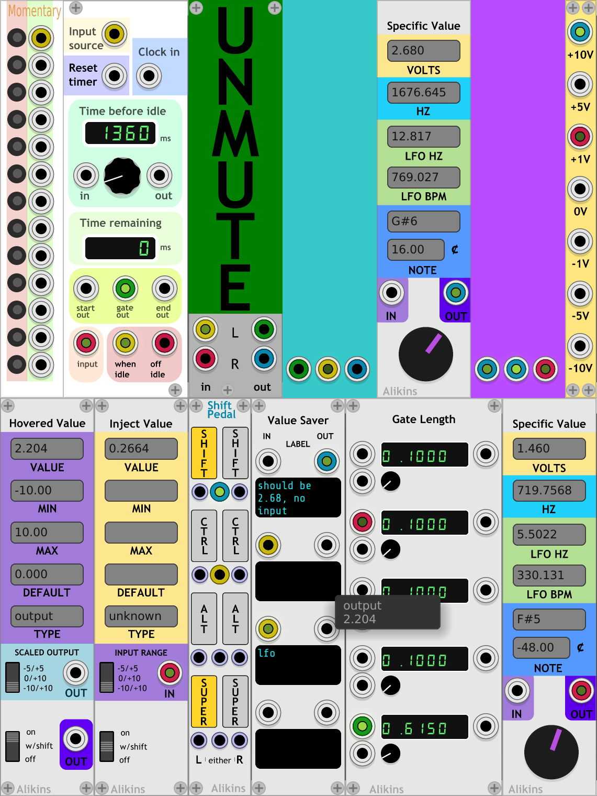
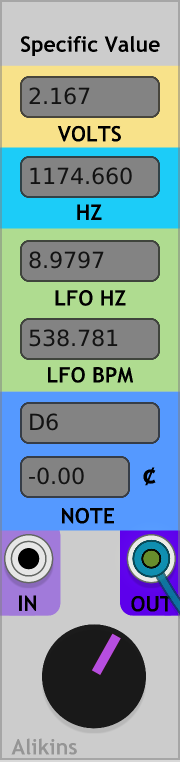
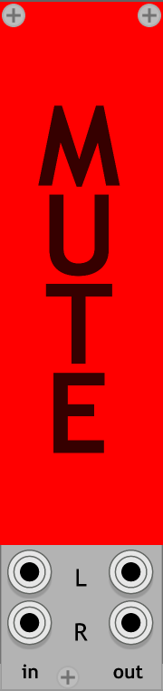
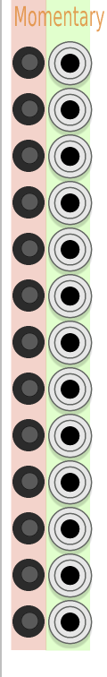
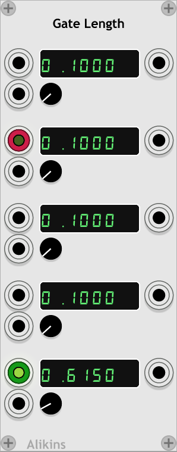

# VCV Rack plugin

Plugins for use with VCV Rack virtual module synthesizer (https://github.com/VCVRack/Rack)

## Modules

### Specific Value

#### What

A controller module for outputting a specific voltage
with displays and text input fields for:

- CV voltage,
- frequency (hz)
- note name ('C3' etc)
- note detune (cents)
- LFO (bpm)
- LFO (hz)

A specific value can be chosen with the knob widget
or can entering values into any of the text fields.

Can also be used as a 'meter' displaying all of
the above info for CV voltages fed into the IN
input. This includes animation of the controller
dial.

##### Note Input

A specific note can be entered into the note text
field.

The note format includes a note a letter and a
positive or negative 'octave'.

Examples of valid formats include:

- `C4`   (C in the 4th octave)
- `c3`   (note names can be upper or lower case)
- `F#2`  (sharps are indicated by a'#' in the second field)
- `Ab0`  (flats are indicated by a 'b' in the second field).
          Note that flats are currently converted to the equivalent sharp for display)
- `C-2`  (The C six octaves below C4)

For notes that are slighty sharp or flat from a A440 tuning, the
Cents display shows how the amount of detuning.

##### LFO values

The LFO fields show the hz and bpm (beats per minute) corresponding to
the current voltage, based on the standard at
https://vcvrack.com/manual/VoltageStandards.html#pitch-and-frequencies

##### HZ

The HZ fields shows the hz corresponding to the current voltage for a
VCO, based on the standard at https://vcvrack.com/manual/VoltageStandards.html#pitch-and-frequencies

##### Using the text fields

Values can be typed into the text fields
directly.

Left and Right arrow keys move the text cursor
as normal when editing text.

To select all text to replace, use Ctrl/Command + 'a',
or doubleclick on the field.

Up and Down arrow keys change the value as follows:

| Key or mouse         | Modifier     | Action                             |
| -------------------- | ------------ | ---------------------------------- |
| Up arrow key         |              | increment                          |
| Up arrow key         | Shift        | increment by "large" amount        |
| Up arrow key         | Ctrl/Command | increment by "small" amount        |
| Down arrow key       |              | decrement by default amount        |
| Down arrow key       | Shift        | decrement by "large" amount        |
| Down arrow key       | Ctrl/Command | decrement by "small" amount        |
| Esc                  |              | "undo" and reset to original value |

To change the value using the mouse, click on a field and 'drag' it up
to increment and drag it 'down' to decrement. To change the value in
larger steps, hold 'Shift' while dragging. To use small steps, hold
the mod key ('Ctrl' or 'Command') while dragging.

The default, "large", or "small" increment depends on which field
is being used.

| Field           | default  | mod (small) | shift (large)  |
| --------------- | -------- | ----------- | -------------- |
| Volts           | 0.01 V   | 0.1 V       | 0.001 V        |
| Frequency (hz)  | 1.0  hz  | 10.0 hz     | 0.1 hz         |
| LFO (hz)        | 0.01 hz  | 0.1 hz      | 0.001 hz       |
| LFO (bpm)       | 1.0  bpm | 1.0 bpm     | 0.1 bpm        |
| Note            | 1 step   | 1 octave    | 1 cent         |
| Cents           | 0.1 cent | 1.0 cent    | .01 cent       |

### Hovered Value

#### What

Hovered Value detects the widget or port that your cursor
is hovered over and displays and outputs that value.

#### Why

Use for figuring out what the range or value of an on screen
widget.

If an LFO has multiple outputs, hover the cursor over each one
to sample the output.

Use in combo with 'Specific Value' to quickly determine what
note each of the outputs or controls is set to.

This module was inspired by a question and discussion on the
Facebook 'VCV Rack Official User Group':

   ["Hi Folks, Just wondering, is it possible to see control parameter values in VCVRack?"](https://www.facebook.com/groups/vcvrack/permalink/286752278651590/)

##### Virtual circuit bending

Simulate virtual circuit bending by hovering over any widget on
screen and using it's CV output. Hook up the output to your clock
bpm and wiggle the cursor across the screen.

Think of it as the Rack equilivent of using a Radio Shack Telephone
Pickup to listen to a Sony Discman.

Tap into the machine and read it's mind. Investigate which
modules have real resonance.

Worship the glitch.

#### Outputs

There are two outputs. The lower purple 'OUT' output
will send the raw param widget value. Note that this
output may send values outside the normal -10V/+10V
range.

The second output (light blue in 'Scaled Output' section')
scales the output signal to one of three voltage ranges:
-5V/+5V (BI), 0V/+10V (UNI), or -10V/+10V.

#### Tooltips

By default, 'Hovered Value' will how a tooltip showing the value
above the hovered widget.

On the right click context menu, there is an option to disable
this.

#### The On Switch

The bottom left 3way switch determines when the module runs.

The default is 'w/shift'. To read the value from a param,
hold down 'Shift' key while hovering.

The 'On' option always reads the value from the currently
hovered widget.

#### Cautions To Be Ignored

The 'out' output is currently not clamped or limitied and may produce
values outside of the -10/+10 V range.

The values of the hovered widget are sampled at the gui display rate,
not at the audio or sound engine rate. This is typically ~60hz, so
audio signals that are tapped will be reproduced with 'character'.

### Inject Value

#### What

Inject Value is used to control the currently hovered widget with CV.
Where 'Hovered Value' can read a param vaule, 'Inject Value' can write/change it.

The 'IN' port accepts a CV input and that value is sent to the currently hovered
widget. This allows CV control of param widgets, even if the hovered module doesn't
provide a CV input.

#### Use

Hook up a CV source (like the output of a LFO) to the 'IN'
and set 'INPUT RANGE' approriately (0/+10V for a 'UNI' LFO).

Select how/when 'Inject Value' is enabled. For example, choosing
'W/ SHIFT' on the bottom 3way switch.

Then move the cursor over any paramater widget like a knob,
slider, or switch and hold down 'Shift'. The hovered widget
will move to match the 'IN' value.

The input values are automatically mapped to the range of
values supported by the hovered widget.

Note this can control widgets that normall don't have
CV control. For example, the 'X SCL' knob on a Fundamental
Scope module.

#### Cautions To Be Ignored

For widgets that normally expect a subset of possible values
(like switch widgets for example), 'Inject Value' can end up
setting the params to unexpected values. For a switch, this could
be a float between 0.0 and 1.0, 1.512 for example. Some modules
get a little confused if a param value is not exactly an
expected value, so be cautious changing switch values with
continuously variable inputs.

The values of the hovered widget are sampled at the gui display rate,
not at the audio or sound engine rate. This is typically ~60hz, so
audio signals that are tapped will be reproduced with 'character'.

### Shift Pedal

#### What

'Shift Pedal' allows the 'Shift', 'Ctrl', 'Alt/Option',
or 'Super/Windows/Command' keys to be used to generate gates.

For example, using the 'Shift' key to send a gate to control
the sustain pedal param of a VST in Host.

#### How

For each modifier key supported, either the 'left', 'right'
or 'either' can be used to control the gate output.

The 'left' modifier key will send a gate to the 'left' output port under
each key in the ui.

The 'right' modifier key will send a gate to the 'right' output port under
each key in the ui.

Pressing either the 'right' or 'left' version of the modifier keys will
also send a gate from the middle 'either' output port.

#### Notes

The interaction with using the Core 'Midi-1' with the 'Computer Keyboard'
drive is not great. The 'Computer Keyboard' driver ignores keyboard input
if a modifier key is held, so using QWERTY midi input and then holding
shift doesn't work as may be expected.

### Value Saver

#### What

The last know value of a signal sent through 'Value Saver' will
be remembered.

If you patch an input through it, it will remember and output the last value
read from the input, even after the input is disconnected. Or on patch open,
if the input value is a steady 0.0f it will output the value it was saved with.

Intended to help with cases like a Midi-1 CV output after module load but before
anything is sent.

A label field is provided for each input for labeling what those
inputs are used for.

### IdleSwitch

#### What

An 'idle loop' inspired module for detecting when an input
is idle and turns on a gate until it sees activity again.

If no input events are seen at "Input Source" within the timeout period
emit a gate on "Idle Gate Output" that lasts until there are input events
again. Then reset the timeout period.

Sort of metaphoricaly like an idle handler or timeout in event based
programming like GUI main loops.

The timeout period is set by the value
of the "Time before idle" param.

##### Input event

An "Input event" is a gate or trigger (or a CV or audio signal
that looks sufficently like a gate or trigger).

After a input event, the Idle Gate Output will remain on until
an input event is seen at Input Source. When there is an input event, the Idle
Gate Output is turned off until the expiration of the "Time before idle" or
the next "Reset idle".

##### Reset timer

If there is a "Reset timer" source, when it gets an event, the timeout period
is reset. But unlike an "Input event", a "Reset timer" event does does not
reset the idle status.

After "Reset time" event, the "Idle Gate Output" will remain on until
an input event is seen at Input Source. When there is an input event, the Idle
Gate Output is turned off until the expiration of the "Time before idle" or
the next "Reset idle".

To use the eventloop/gui main loop analogy, a "Reset idle" event is equilivent to
running an idle handler directly (or running a mainloop iteration with no non-idle
events pending).

##### Clock input

If a cable is hooked to the "Clock Input" then the pulse from the clock
will determine with the idle time expires. When there is a clock pulse,
if there were no input events since the previous clock pulse that is
considered idle.

The "Time before idle" display will reflect the time since the last
clock pulse. The "Time remaining" display will always show 0 for now,
at least until it can predict the future.

##### Time input and output

The "Time input" expects a CV output between 0 and 10V. The voltage
maps directly do the number of seconds for the idle timeout.
Eg. a 5.0V CV to "Time input" sets "Time before idle" to 5000ms (5.0 seconds)

The "Time output" sends a CV output between 0 and 10V indicating
the "Time before idle" value.

The "Time output" can be used to connect one or more IdleSwitch modules
together so they share the same "Time before idle".

In "Clock input" mode, the "Time Output" will correspond with the
"Time before idle" display until the time is over 10s, then the
"Time output" will max out at 10V.

##### Gate Output and idle start and end trigger outputs

Once the idle timeout has expired, the "gate output" output
will go high (+10V) and stay high until there are new input
source events. ie, it turns on when there is no actively for
the "Time before idle" length of time.

The "start out" output will send a +10V trigger at the start
of idle, at the start of the "gate out" gate.

The "end out" output will send a +10V trigger at the end of
idle, at the end of the "gate out" gate. This also corresponds
to the same time as when a new "Input source" event is detected.

"start of" trigger == "we have gone idle"
"end of" trigger == "we got input source events (activity) and am no
longer idle.

##### Switched input and output

The "Input" is switched between "When idle" and
"Off idle" outputs based on idle state.

The "Input" port on the bottom left can be any input.

The "Input" will be routed to the "When idle" output if idle.
Otherwise, the "Input" is routed to the "Off idle" output.

Note the "Input" does not have to be related to the input connected
to the "Input source". "Input source" typically needs to be triggers
or gates, but "Input" can be any signal.

#### Why

Original intentional was to use in combo with a human player and midi/cv keyboard.
As long as the human is playing, the IdleSwitch output is 'off', but if they go
idle for some time period the output is turned on. For example, a patch may plain
loud drone when idle, but would turn the drone off or down when the human played
and then turn it back on when it stopped. Or maybe it could be used to start an
drum fill...

The "Reset idle" input allows this be kind of synced to a clock, beat, or sequence.
In the dronevexample above, the drone would then only come back in on a beat.

And perhaps most importantly, it can be used to do almost random output and
make weird noises.

### ColorPanel

A CV controlled RGB/HSL color "blank" panel.

Supports selectable input ranges (0V to 10V or -5V to 5V) via right click context menu
The color input mode is also selectable via the context menu.

Module is resizable.

### BigMuteButton

A big mute button.

Use just before output to the audio interface module.

When clicked, will mute the output output. Will unmute on next
click.

Easier/quicker than adjusting mixer levels, or system volume, or finding
the tiny mute button on mixers.

### MomentaryOnButtons

A set of GUI buttons that send a +10V output while pressed.

### Gate Length

Change the length of a gate between 0 and 10 seconds.
Length of gate is CV controllable.

This module was inspired by the question and discussion at:
Facebook 'VCV Rack Official User Group':

   ["Okay , Rackheads... ;) Looking for a module that can "stretch" the length , extend the duration , of a gate/ trigger pulse."](https://www.facebook.com/groups/vcvrack/permalink/161960391130780/)

### Reference Voltages

Output some useful reference voltags: -10V, -5V, -1V, 0V, 1V, 5V, 10V

## License

BSD 3-clause. See LICENSE.txt
