# BogaudioModules

Modules for [VCV Rack](https://github.com/VCVRack/Rack), an open-source Eurorack-style virtual modular synthesizer:

  - [Oscillators](#oscillators)
  - [LFOs](#lfos)
  - [Envelopes and Envelope Utilities](#envelopes)
  - [Mixers, Panners and VCAs](#mixers)
  - [Effects and Dynamics](#effects)
  - [Sequential Switches and Sequencers](#sequencers)
  - [Visualizers](#visualizers)
  - [Pitch CV Utilities](#pitch)
  - [Other Utilities](#utilities)
  - [Miscellaneous](#misc)

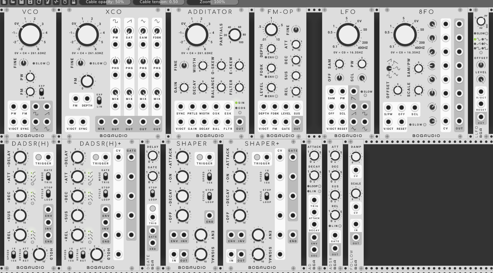

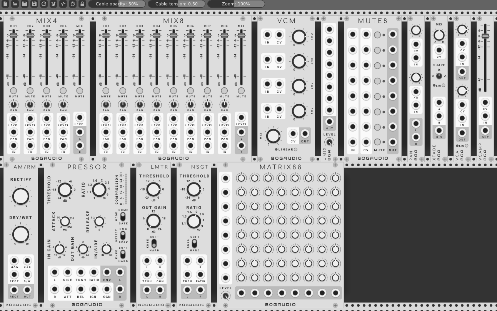

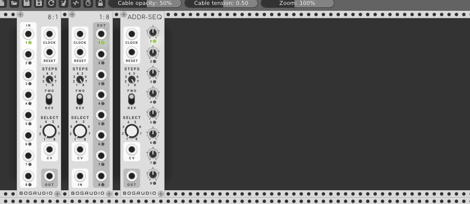


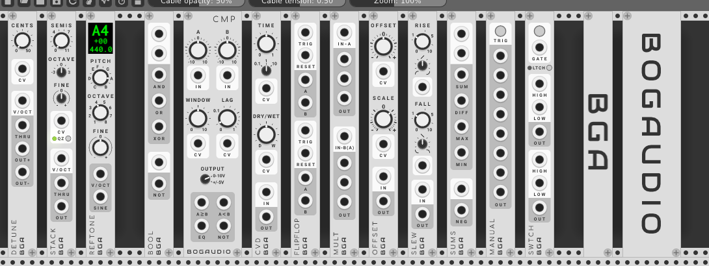


## Builds/Releases

Mac, Linux and Windows builds of the latest version are available through [Rack's Plugin Manager](https://vcvrack.com/plugins.html).  Find release notes on the [releases page](https://github.com/bogaudio/BogaudioModules/releases).


## Building

You'll need to be set up to build [VCV Rack](https://github.com/VCVRack/Rack) itself.  Switch to the `plugins/` directory there, then:

  ```
  git clone https://github.com/bogaudio/BogaudioModules.git
  cd BogaudioModules
  make
  ```

The master branch of this module currently builds against Rack's 0.6.* branches.


## Modules

### <a name="oscillators"></a> Oscillators

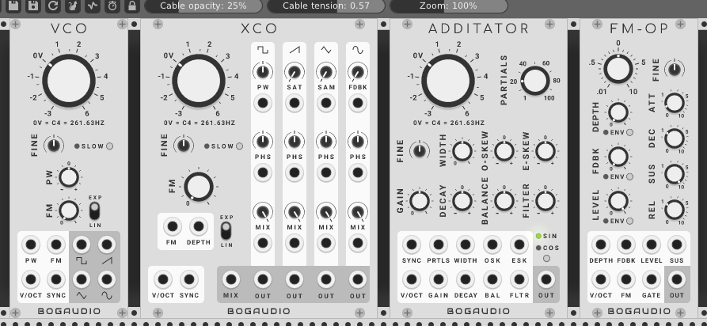

#### VCO

A standard VCO featuring:
  - Simultaneous square, saw, triangle and sine wave outputs.
  - Traditional exponential and linear through-zero FM.
  - Pulse width modulation of the square wave.
  - Hard sync.
  - Slow (LFO) mode.
  - Antialiasing by a CPU-efficient combination of band limiting and oversampling.

The main frequency knob is calibrated in volts, from -4 to +6, corresponding to notes from C0 to C6.  The default "0V" position corresponds to C4 (261.63HZ).  The knob value is added to the pitch CV input at the V/OCT port.  With CV input, the pitch can be driven as high as 95% of the Nyquist frequency (so, over 20KHZ at Rack's default sample rate).  The FINE knob allows an additional adjustment of up to +/-1 semitone (1/12 volt).  In slow mode, the output frequency is 7 octaves lower than in normal mode with the same knob/CV values.

#### XCO

Includes all the features of VCO, adding:
  - An onboard wave mixer with output at the MIX port.
  - For each wave type:
    - A wave modifier (pulse width for square; saturation for saw; a sample-and-hold/step-function effect for triangle; FM feedback for sine).
    - A phase knob/CV controlling the phase of the wave in the mix.
    - A mix knob/CV to control the level of the wave in the mix (waves are output at full level at their individual outputs).  The knob/CV response is linear in amplitude.
  - A CV input for FM depth.

#### ADDITATOR

An additive ("sine bank") oscillator, where the output is the sum of up to 100 individual sine/cosine waves (partials).  Various parameter knobs/CVs allow control over the number, frequencies and amplitudes of the partials:
  - PARTIALS: sets the partial count.
  - WIDTH: sets the spacing of partials in frequency; at the default position each successive partial is pitched an octave higher than the one before.
  - O-SKEW: adjusts the spacing of odd-numbered partials up or down relative to WIDTH.
  - E-SKEW: adjusts the spacing of even-numbered partials up or down relative to WIDTH.
  - GAIN: Sets the level of the output by adjusting an internal amplitude normalization parameter.
  - DECAY: applies a positive or negative tilt to the amplitude decay of the partials; at the default position, amplitudes decrease proportionally with increasing frequency.
  - BALANCE: cuts the amplitudes of the odd or even partials.
  - FILTER: manipulates the partial amplitudes to simulate low or high-pass filter effects.

#### FM-OP

A sine-wave oscillator and simple synth voice designed to allow patching up the classic FM "algorithms", via multiple copies of FM-OP (each copy being one operator in the algorithm).  Features:
  - Linear through-zero FM response.
  - CV-controllable FM depth (of the external FM signal at the FM input).
  - CV-controllable FM feedback.
  - CV-controllable output level.  The LEVEL knob and CV have a linear-in-decibels (exponential in amplitude) response; a context-menu setting makes this linear in amplitude.
  - An on-board ADSR, controlled by the GATE input, with selectable routing to output level, feedback and depth, with CV control over the sustain level.
  - A main frequency knob calibrated for setting the frequency as a ratio of the frequency dictated by the V/OCT input - assuming a single V/OCT CV is routed to multiple FM-OPs, this allows the relative frequency of each operator to be set via ratios.


### <a name="lfos"></a> LFOs

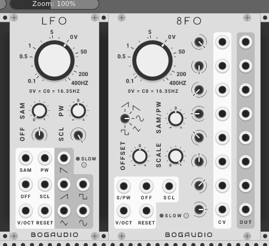

#### LFO

A standard LFO featuring:
  - Simultaneous ramp-down, ramp-up (saw), square, triangle and sine wave outputs.
  - Knob and CV control of the pulse width of the square wave.
  - A CV-controllable "sample" modifier, which turns the output into a step function, as might be produced by patching the unmodified output through a sample-and-hold.
  - Onboard CV-controllable offset and scale of the output voltages.
  - Reset (hard sync) input.
  - Slow mode.

LFO tracks pitch CVs at the V/OCT input seven octaves lower than a normal oscillator: with a 0V input, the output frequency is note C-3 (2.04HZ).  The frequency knob is calibrated in linear volts (the small ticks), and its value is added to the input V/OCT.  With no input, the frequency range is from approximately 0.1 to 400HZ; with CV the frequency may be driven up to 2000HZ or down to arbitrarily low values.  In slow mode, the output frequency tracks the controls 11 octaves lower than in normal mode.

*NOTE ON FREQUENCIES:* Previous to release 0.6.14 (April 2019), LFO tracked 0V as C0 or 16.35HZ (and 8 octaves lower in slow mode). Patches created with older versions will continue to have the old behavior.  New instances of LFO added to patches will have the new behavior.  The behavior can be toggled, in either case, on the context (right-click) menu.

#### 8FO

An LFO with outputs at 8 different phases.  The phases may be set by knobs and CVs; by default they are 0, 45, 90, etc, degrees from the fundamental.  Otherwise, functionality is the same as with LFO, excepting that the wave shape is selectable, and all outputs are of the same (phase-shifted) wave.

#### LLFO

A 3HP LFO, with selectable waveform.  The features are a subset of LFO, with the addition of a sixth 10%-pulse waveform (since there is no pulse width control).


### <a name="envelopes"></a> Envelopes and Envelope Utilities

#### DADSRH

DADSRH (Delay Attack Decay Sustain Release Hold) augments a standard ADSR with a delay stage and a self-gating (hold) mode.


Features:
  - When the MODE switch is set to GATE, DADSRH is a more-or-less standard ADSR envelope generator, with an additional pre-attack delay stage.  The envelope is controlled by a gate CV at the trigger port, or by holding the TRIGGER button.
  - When MODE is TRIG, a trigger CV or press of the TRIGGER button will start a normal DADSR cycle, but controlled by an internal gate CV.  The internal gate persists for the time set by the HOLD knob.
  - The envelope is output as a 0-10 signal at port ENV.  Its inverse (actually, 10 - ENV) is output at INV.  When a release stage completes, a trigger is output at END.
  - When MODE is TRIGGER, the CYCLE switch controls whether the envelope loops or not upon completion of a release stage.
  - Toggles allow selection of linear, exponential or inverse-exponential shapes for the attack, decay and release stages.
  - The RETRIG switch controls the retrigger behavior (when a new gate or trigger happens while the envelope is running): ATT immediately attacks from the current envelope value (this is the typical behavior with many ADSRs), while RST causes a full reset of the envelope (restarting it at the delay stage).

#### DADSRH+

DADSRH+ is a DADSRH, with the addition of CV inputs for each knob, and gate outputs for each stage (a stage's gate output will be high for the duration of the stage).

#### DGATE

A trigger-to-gate utility, with gate duration up to 10 seconds, and an optional pre-delay of up to 10 seconds.  A trigger pulse is output at END when a delay/gate cycle ends.  If the STOP/LOOP switch is set to LOOP, or if the trigger is high when the cycle ends, the cycle repeats.

#### SHAPER

SHAPER emulates the function of the Envelope Generator section of the classic [EMS VC3](https://en.wikipedia.org/wiki/EMS_VCS_3) and related synths.  It combines an envelope with a VCA.  Unlike an ADSR, the envelope stages are Attack, On, Decay and Off -- with linear movement in the attack and decay stages, this produces a signature trapezoidal envelope shape.

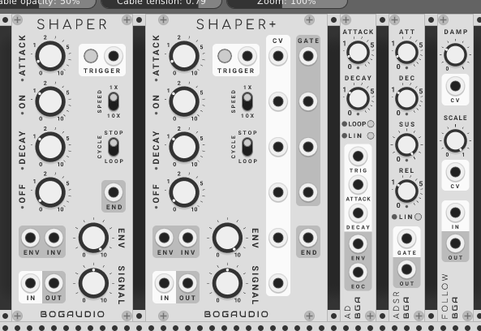

Features:
  - The ATTACK, ON, DECAY and OFF knobs specify times from nearly zero to 10 seconds.  The Speed switch allows these times to be multiplied by 10.
  - The trapezoid envelope is output as a 0-10 control signal at port ENV, subject to attenuation by the ENV knob.  (INV outputs the inverse envelope.)
  - Audio input at port IN is sent through the internal VCA -- controlled by knob SIGNAL and the envelope -- to port OUT.
  - A trigger CV at the TRIGGER port, or a press of the TRIGGER button, will start the envelope cycle.  When the off stage completes, a trigger is sent out at port END.  If the CYCLE switch is set to LOOP, the envelope restarts immediately.

#### SHAPER+

SHAPER+ is a SHAPER, with the addition of CV inputs for each knob, and gate outputs for each stage (a stage's gate output will be high for the duration of the stage).

#### AD

An AD (attack-decay) envelope generator in 3HP.  The attack, decay and release knobs are exponentially scaled with durations up to 10 seconds.  The attack and decay times have CV inputs expecting +10V inputs; if a CV is present, the corresponding knob attenuates it.

When a trigger voltage is received at the TRIG input, the envelope cycle begins, ignoring further triggers until it completes.  When the cycle completes, a trigger is output at EOC, and the cycle retriggers if the TRIG voltage is high.  If LOOP mode is enabled, the envelope cycles continuously regardless of the TRIG input.

By default, the attack and decay envelope segments have an analog-ish curve; in linear mode (LIN button), the segments are linear.

#### ADSR

A standard ADSR (attack, decay, sustain, release) envelope generator in 3HP.  The attack, decay and release knobs are exponentially scaled with durations up to 10 seconds.  The sustain knob is linearly scaled, setting the sustain level from 0 to 10 volts.  Lights below each stage knob indicate which stage is active.

By default, the attack, decay and release envelope segments have an analog-ish curve; in linear mode (LIN button), the segments are linear.

#### FOLLOW

An envelope follower, a utility that converts its input to a CV proportional to the level of the input's amplitude.  The conversion is by the Root Mean Square method.  The DAMP knob and CV (+10 volts) affect how many input samples are used to calculate the output -- higher DAMP values effectively slow down and smooth out the response.  The SCALE knob and CV (+10 volts) simply scale the output.

With DAMP at the minimum setting and SCALE at half, the module is an effective wave rectifier (that is, it outputs the absolute value of the input).


### <a name="mixers"></a> Mixers, Panners and VCAs

#### MIX4

A four-channel mixer/panner with performance mutes.

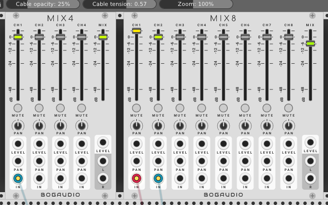

Features:
  - Four input channels with decibel-calibrated level faders.
  - Level fader for the output mix.
  - CV control over channel and output levels; expects +10 volt CV; CV is attenuated by the corresponding slider when in use.
  - CV-controlled stereo panners; expects +/-5 volt CV; CV is attenuverted by the corresponding knob when in use.
  - Stereo outputs; if only one is patched, the output mix is mono.
  - Performance mutes (buttons) per channel.
  - Right-click a mute buttons solos that channel (un-mutes that channel and temporarily mutes all others).  Right or left click will un-solo, restoring the old state.  Multiple channels can be "soloed" at once.
  - Fader handles contain lights indicating the signal level out of that channel or the entire mix.
  - Output saturates (soft clips) to +/-12 volts, where the clipping effect becomes noticeable above +/-10 volts.

#### MIX8

An eight-channel version of MIX4 with the same features.

#### VCM

A four-channel mixer in 10HP.


Features:
  - Four input channels and mono mix output with knob and CV control over level.  CVs expect +10 volts; when CV is in use, it is attenuated by the knob.
  - Linear mode makes the knob/CV response linear in amplitude (this is good dialing in a CV mix); when off and by default the response is linear in decibels (and therefore exponential in amplitude).

By default, the output is hard clipped at +/-12 volts (this is a standard in Rack).  A context menu option allows this limit to be disabled.

#### UMIX

A 3HP unity mixer, usable with CV (e.g. combining triggers) or audio.  Up to 8 inputs are summed to the output.  Saturation (soft clipping) is applied to the output at +/-12 volts; the LEVEL knob allows attenuation of the mix before the saturation is applied.

The context (right-click) menu has an option to average, rather than sum, the inputs.

#### MATRIX88

An 8x8 channel matrix mixer.  Each input can be sent with an independent level to each of the eight output mixes.

*Note that the matri knobs are attenuvertors, and default to zero.*  That means there will be no output, regardless of the inputs, until some knobs are changed to non-zero values.

Saturation (soft clipping) is applied to each output at +/-12 volts; the LEVEL knob allows attenuation of the mix before the saturation is applied.

#### MUTE8

MUTE8 provides 8 independent manual or CV-controlled mutes. Each channel is muted if its button is toggled on or if there is a positive voltage at its CV input.  Otherwise the input is passed to the output.

As with MIX4 and MIX8, a right-click on a mute button will solo that channel (pass that channel through while muting all others).  Right or left click clears this.

#### PAN

A stereo panner with dual inputs channels.  Each channel's panner may be controlled with a +/-5 volt CV; when CV is in use, it is attenuverted the corresponding knob.  Output saturates (soft clips) to +/-12 volts.

#### XFADE

A crossfader (or two-channel mixer, or way to patch a dry/wet knob into any signal chain).  The MIX knob sets the relative strength of inputs A and B.  MIX may be controlled with a +/-5 volt CV; when CV is in use, it is attenuverted the knob.

The SHAPE knob affects the attenuation curves of the two channels as MIX changes:
  - At the center position, SHAPE at produces a standard crossfader behavior.  A and B are attenuated by half; moving MIX to A or B brings that channel to full input level while cutting the opposite channel.  The attenuation is such that if the same signal is patched to both A and B, the same signal is produced at the output regardless of the setting of MIX.
  - With SHAPE at the full counter-clockwise (left) position, there is no output when MIX is centered; moving MIX to A or B brings that channel to full level.
  - With SHAPE at full clockwise (right) position, both channels are at full (unattenuated) level when MIX is centered; moving to A or B cuts the opposite channel.

Linear mode (LIN button) makes the level attenuation response of MIX linear in amplitude (useful when processing CV); otherwise and by default the response is linear in decibels (and therefore exponential in amplitude).

#### VCA

A two-channel voltage-controlled attenuator.  (An attenuator can only reduce a signal.)

Each channel's level may be controlled with a +10 volt CV; when CV is in use, it is attenuated by the corresponding knob.

In linear mode (the LIN button), the knob/CV response is linear in amplitude (useful when processing CV); otherwise and by default the response is linear in decibels (and therefore exponential in amplitude).

#### VCAMP

A voltage-controlled amplifier, capable of adding 12 decibels gain to the input.  (12 decibels gain is the same as multiplying the input by 4.)

The level may be controlled with a +10 volt CV; when CV is in use, it is attenuated by the corresponding slider.  The slider's toggle has a light indicating the output signal level.  The output saturates (soft clips) to +/-12 volts, where clipping becomes noticeable above +/-10 volts.

### <a name="effects"></a> Effects and Dynamics


#### AM/RM

AM/RM is a ring- and amplitude-modulation effect and CV-controllable variable wave rectifier.

  - With the default knob settings, the unit is a proper ring modulator: the MOD (modulator) and CAR (carrier) inputs are multiplied and the resulting wave is sent to the output.  MOD is passed unchanged to the RECT output.
  - As RECTIFY goes from 0 to fully clockwise, the negative portion of the MOD input is progressively folded to positive, until at the full value the wave is fully rectified.  The modified input is output at RECT; the modified input is multiplied with the carrier input and sent to the output.
  - The DRY/WET control mixes the otuput of the mod/carrier multiplication with the unmodified carrier input.

The RECT inputs expects a bipolar (+/-5V) CV, which is added to the RECTIFY knob.  The D/W input works the same for the DRY/WET knob.

Note: AM/RM is calibrated to expect +/-5V, 10V peak-to-peak signals (i.e. the output of a typical oscillator).  A modulator signal with a negative value in excess of -5V will be affected by the rectifier circuit even if the RECTIFY is zero.  To avoid this effect, you may need to attenuate a hot signal you wish to use as the modulator.

#### PRESSOR

PRESSOR is a stereo [compressor](https://en.wikipedia.org/wiki/Dynamic_range_compression) and [noise gate](https://en.wikipedia.org/wiki/Noise_gate) with many controls and a sidechain input.  A compressor attenuates signals louder than a threshold level; a noise gate attenuates signals quieter than a threshold level.

The module's signal path has two main components: a detector, and the compressor/gate.  The detector -- effectively an envelope follower -- analyzes the inputs (including the sidechain input, if in use), producing a control signal which is used to control the compressor/gate.  The detector signal is also output at ENV.

The various controls and ports work as follows:
  - The MODE switch sets whether the module works a compressor (COMP) or noise gate (GATE).
  - THRESHOLD sets the threshold in decibels.  The default 0dB setting corresponds to the 10V peak-to-peak output level of a standard oscillator.  The TRSH input expects a unipolar (+10V) input; if in use this is attenuated by the knob.
  - RATIO sets the degree of attenuation applied to a signal.  In compressor mode, higher settings attenuate the signal more as the detector output goes above the threshold; at the maximum setting, the compressor becomes a limiter.  In gate mode, higher ratios more completely attenuate inputs below the threshold.  The RATIO CV input is unipolar (+10V), attenuated by the knob
  - The COMPRESSION meter provides a visual indication of the amount of attenuation being applied to the input at any given moment, and is proportional to the CV output at ENV.
  - ATACK and DECAY control lag times in the the movement of the detector signal as the input changes.  Each has a corresponding unipolar (+10V) CV attenuated by the corresponding knob.
  - The DECTECT switch toggles the detector between RMS and peak level analyzers; RMS averages the input over a short window whereas PEAK uses the instantaneous level.
  - KNEE toggles between a slightly softer or harder response as the attenuation turns on or off as the signal crosses the threshold.
  - IN GAIN attenuates (up to -12db) or amplifies (up to +12db) the left and right inputs.  (It does not apply to the sidechain input.)  The modified input is sent to the detector and the compressor/gate.  The IGN CV input expects a bipolar (+/-5V) signal which is added to the knob position.
  - OUT GAIN applies up to 24db of amplification to the left and right outputs, after the compressor/gate circuit does its work.  The outputs are subject to saturation (soft limiting at +/-12V).  The IGN CV input expects a bipolar (+/-5V) signal which is added to the knob position.
  - IN/SIDE controls the input to the detector, as a mix/crossfade between the left/right inputs (which are processed by IN GAIN, then summed), and the sidechain input.

Several of the settings can take fairly extreme values (e.g. OUT GAIN); this allows the module to be used as a distortion effect.

#### CLPR

CLPR is a compact (6HP) [clipper](https://en.wikipedia.org/wiki/Clipping_%28audio%29).  Its controls behave the same as the corresponding controls on PRESSOR.

In contrast to LMTR, CLPR chops a signal at a voltage threshold corresponding to the selected amplitude; this distorts the signal.

#### LMTR

LMTR is a compact (6HP) [limiter](https://en.wikipedia.org/wiki/Dynamic_range_compression).  Its controls behave the same as the corresponding controls on PRESSOR.

In contrast to CLPR, LMTR does not distort the signal (or not much); it just reduces the amplitude of the signal to keep it below the threshold.

#### NSGT

NSGT is a compact (6HP) [noise gate](https://en.wikipedia.org/wiki/Noise_gate).  Its controls behave the same as the corresponding controls on PRESSOR.

### <a name="sequencers"></a> Sequential Switches and Sequencers

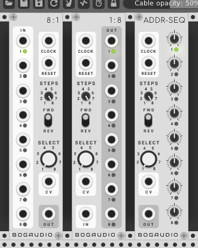

#### 8:1

8:1 is a sequential switch and voltage-addressed switch (multiplexer) at once -- it routes 8 inputs to 1 output according to either a clock or CV input (or both).

As a sequential switch, a trigger at the clock input advances the input selection -- which input is routed to the output.  Like a sequencer, it can be reset with a trigger at RESET, the number of inputs to cycle through may be set with the STEPS knob, and the direction is set with the FWD/REV switch.

As a multiplexer, it routes an input to the output under control of the SELECT knob and CV.  A 0-10V CV, divided into 8 equal divisions of 1.25V, controls the input selection.  This value is summed with the knob setting; for example, setting the knob to 4 and inputting a 2.6V CV will send input 7 to the output.  When the knob-plus-CV value exceeds 8, it wraps around.

Both functions may be used simultaneously: the SELECT+CV value is added to the sequential/clocked value, wrapping around.  Note that the STEPS value only affects the sequential value; for example, using a clock input and setting STEPS to 2 will yield an alternation between two adjacent inputs, but this pair can be selected with the SELECT knob or CV.

#### 1:8

1:8 is the opposite of 8:1 -- it routes a single input to 1 of 8 outputs.  The control circuit behavior (CLOCK, SELECT, etc) is the same.

#### ADDR-SEQ

ADDR-SEQ is an 8-step sequencer where the step values are set by 8 bipolar knobs able to dial in voltages from -10 to 10V.  It has the same clocked or voltage-addressed control circuit as 8:1 and 1:8.

### <a name="visualizers"></a> Visualizers

#### ANALYZER

A four-channel spectrum analyzer.


Features:
  - Range setting: smoothly scrolls the displayed frequency range, from just the lower 10% at full counter-clockwise, to the entire range (up to half the sampling rate) at noon, to the upper 20% at full clockwise.
  - Smooth setting: controls how many analysis frames will be averaged to drive the display.  A higher setting reduces jitter, at the expense of time lag.  For convenience, the knob setting is time-valued, from zero to half a second (internally this is converted to an integer averaging factor based on the sample rate and other settings).
  - Quality setting: changes the FFT window size.  Higher settings yield finer frequency resolution, at a higher CPU cost.  The levels and sizes are: GOOD (1024 samples), HIGH (2048 samples) and ULTRA (4096 samples).  If Rack's sample rate is 96khz or higher, the sizes are doubled.
  - Window setting: sets the window function applied to the input to the FFT.  The options are Kaiser, Hamming and none/square.  The default, Kaiser, is probably best for most purposes.
  - Each channel has a THRU output, which passes the corresponding input through unchanged.
  - On the context (right-click) menu, the display vertical (amplitude) range can be set to extend down to -120dB (the default is -60dB).

#### ANALYZER-XL

An eight-channel, 42HP version of ANALYZER, with edge-to-edge-screen type of design.  Options corresponding to ANALYZER's panel controls are available on the context (right-click) menu.

#### VU

A stereo signal level visualizer/meter.  The L channel is sent to both displays if if nothing is patched to R.  Inputs to L and R are copied to the L and R outputs.

### <a name="pitch"></a> Pitch CV Utilities

Utilities that process pitch CVs (1 volt / octave), for controlling the pitch of oscillators.

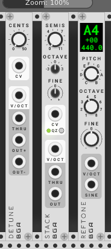

#### DETUNE

A 1V/octave pitch processor, for controlling a detuned oscillator pair.  A reference pitch in raised and lowered by the number of cents (hundredths of a semitone) specified by the knob and CV, and output at OUT+ and OUT-.  The input pitch is output at THRU.

#### STACK

A 1V/octave pitch processor for stacking oscillators.  The SEMIS, OCTAVE and FINE knobs determine an interval (up or down) to apply to the input pitch and send to OUT.  The input pitch is sent unmodified to THRU, for ease of chaining multiple STACKs to control multiple oscillators, e.g. to create chords.

The CV input expects +/-5 volts; the value modifies the interval set by the knobs in the amount of one semitone per tenth volt.  If QZ (quantize) is active, the CV-controlled interval is quantized to the nearest semitone.  This specialized CV is output at the THRU port, with a value set by the knobs and CV in, when there is no input pitch.

#### REFTONE

A tuner that outputs a selectable (Western, chromatic) pitch as CV (1v/octave, for controlling an oscillator) or as a pure sine tone.  The base pitch is selected with the PITCH and OCTAVE knobs, while the FINE knob allows the output to be fine-tuned up or down a full semitone.  The LED-style display indicates the selected pitch, octave and fine tuning (in cents), and the corresponding frequency (in hertz).


### <a name="utilities"></a> Utilities

Various utilities.

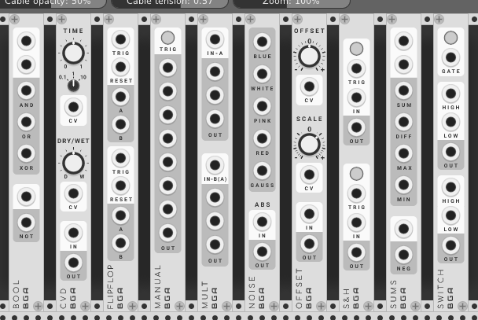

#### BOOL

A boolean logic utility.  Inputs are considered true if the input voltage is greater than 1.  The top section takes two inputs and computes AND, OR and XOR at the outputs.  The lower section computes the negation of its input.  Output is 5 volts if an output is true, 0 otherwise.

#### CMP

CMP is window comparator utility.  It takes two inputs, A and B, which normal to 0V.  Each is summed with the value of its corresponding offset knob and clipped to +/-12V.  The four outputs indicate the relative values of A and B:

 - A>B will output high if A is greater than or exactly equal to B.
 - A<B will output high if A is less than B.
 - EQ will output high if the difference between A and B are less than or equal to the window voltage.
 - NOT will output high if EQ is low.

The WINDOW knob specifies the window voltage.  LAG specifies a time of up to one second by which a change in the output will lag a change in the inputs states; if the input state switches back before the lag expires, the output does not change. WINDOW and LAG each take a unipolar (+10) voltage, each of which is attenuated by the corresponding knob.

The OUTPUT switch sets the high and low voltage values for the outputs: 0V low/+10V high, or -5V low/+5V high.

#### CVD

A simple delay designed for use with CV (though it works fine with audio).  Use it to delay triggers or gates, create a flip-flop that resets itself after a time, make a sequence run for a while then stop, to double up an envelope, or what have you.

The large TIME knob sets the delay time, as scaled by the small knob (up to 0.1, 1 or 10 seconds); TIME takes a +10 CV, attenuated by the knob.  Reducing time truncates the internal delay buffer.  The DRY/WET knob sets the mix of the original and delayed signals at the output, with a +/-5 CV input.

#### FLIPFLOP

A boolean memory utility with two independent channels.  A high voltage at TRIGGER will cause the state of a channel to change from A to B.  A subsequent trigger will flip it back.  Output is 5 volts at whichever of A and B is selected, 0 otherwise.  A trigger voltage at RESET sets the channel back to state A.

#### MANUAL

A manual trigger/gate with 8 outputs.  A constant high value is sent from each output for as long as the TRIG button is held.  

Manual may be set to output a trigger pulse on patch load (akin to a Max/Msp or Pd loadbang).  This is off by default; enable clicking "Trigger on Load" on the module's context (right-click) menu.

#### MULT

A 3 HP multiple (signal duplicator).  There are two 1-to-3 channels.  There is also a 1-to-6 mode: if nothing is patched to the second channel's input, the input to the first channel is copied to all six outputs.

#### NOISE

A noise source, in types blue (f), white, pink (1/f), red (aka rown, 1/f^2) and Gauss (normal with mean 0 and variance 1).

Additionally, NOISE has an absolute value circuit.  Patch audio into ABS to get positive CV.  For example, patch white noise into ABS to get uniform values in the range 0 to 10.

#### OFFSET

An offset and scaler.  The OFFSET and SCALE knobs have CV inputs.  With an input signal, output is `(input + offset) * scale`.  With no input connected, the output is constant in the value of `offset * scale`.

By default, the output is capped at +/-12 volts (this is a standard in Rack).  A context menu option allows this limit to be disabled.

#### S&H

A dual sample-and-hold and trigger-and-hold.  Sampling may be triggered by CV (on the rising edge of a trigger or gate) or button press.  If nothing is connected to an IN port, sampling for that channel is from an internal white noise source (range 0-10V).

Each channel can be toggled into track-and-hold mode.  In this mode, when the input at GATE is high, or the button is held, the input is copied to the output.  When the gate goes low, the input is sampled and held until the next gate.

#### SLEW

A slew limiter - when the input changes rapidly, the output changes less rapidly, lagging the input.

The rising and falling slew rates and shapes are set independently.  The RISE and FALL time knobs are calibrated to set the time the output would need to catch up to a 10V change in the input.

The RISE and FALL shape knobs affect the movement of the output as it catches up to the input (the shape it would draw on a scope). The shapes vary between log, linear and exponential curves.

#### SUMS

An arithmetic logic utility.  The top section outputs the sum, difference, maximum and minimum of its input signals (unpatched inputs send a 0-volt signal into each computation).  The lower section negates (reverses the sign of) its input.

By default, the output is capped at +/-12 volts (this is a standard in Rack).  A context menu option allows this limit to be disabled.

#### SWITCH

A signal-routing module with two through channels.  If the button is held or the GATE input is high, the HIGH input for each channel is routed to the corresponding OUT.  Otherwise, each LOW input is routed to each OUT.

If LTCH (latch) mode is enabled, a button click or trigger pulse at GATE will toggle the output to HIGH; a second click or trigger resets it to LOW.

### <a name="misc"></a> Miscellaneous


#### BLANK3

A 3HP blank panel.

#### BLANK6

A 6HP blank panel.

## Other Notes

#### <a name="resumeloop"></a> Loop Behavior on Patch Load

Modules Shaper, Shaper+, DADSRH, DADSHR+ and DGATE can each be set to loop.  As of release 0.5.3, these modules will automatically being running (looping) when the patch loads if they were looping when the patch was saved.  (Previously, they would require a trigger to resume looping.)

This behavior can be disabled on a per-module basis by right-clicking the module and unchecking "Resume Loop on Load".

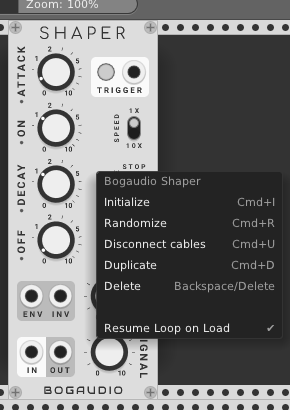


## Issues and Feedback

Bug reports and feedback are welcome: please use the [issue tracker](https://github.com/bogaudio/BogaudioModules/issues).


## Acknowledgements

Uses [FFTReal](https://github.com/cyrilcode/fft-real) under the DWTFYWT Public License.
