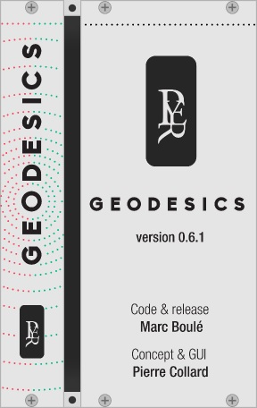
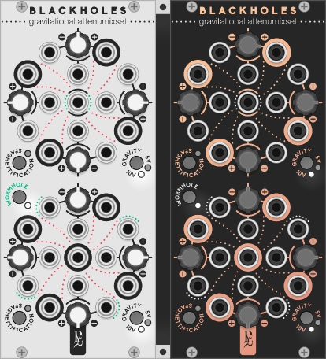
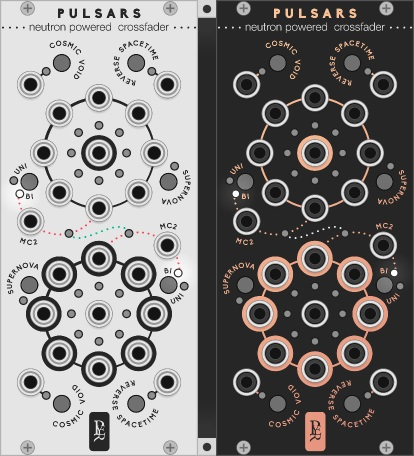
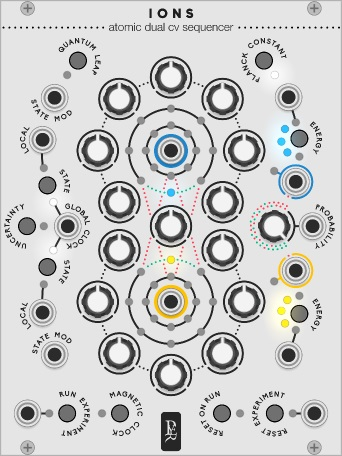
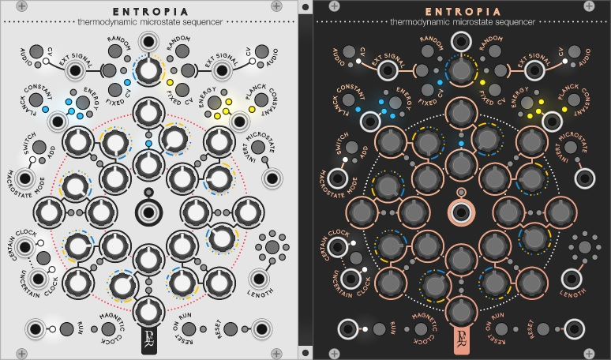

# A Modular Collection for VCV Rack by Pyer and Marc Boulé

This page shows a very brief overview of the modules. For more information, including videos of the modules in use, please see the [Geodesics Website](https://www.pyer.be/geodesics.html). The modules are available in the [plugin manager](https://vcvrack.com/plugins.html) of [VCV Rack](https://vcvrack.com). 

* [Overview](doc/geodesics-overview0.6.6.pdf) (version 0.6.6)

* [User manual](doc/geodesics-usermanual0.6.6.pdf) (version 0.6.6)

* [What's new](doc/geodesics-whatsnew0.6.6.pdf) in version 0.6.6

* ([What's new](doc/geodesics-whatsnew0.6.5.pdf) in version 0.6.5)

## License

Based on code from the Fundamental plugins by Andrew Belt and graphics from the Component Library by Wes Milholen. See ./LICENSE.txt for all licenses.

# Modules 

Each module comes with two panel options, namely White Light and Dark Matter.

* [Black Holes](#blackholes): Gravitational Voltage Controled Amplifiers.

* [Pulsars](#pulsars): Neutron Powered Rotating Crossfader.

* [Branes](#branes): Colliding Sample and Hold.

* [Ions](#ions): Atomic Duophonic Voltage Sequencer.

* [Entropia](#entropia): Thermodynamic Microstate Sequencer.

For sequencer modules, more detailed information on how to set up clocks, resets and run states can be found in the Impromptu Modular [manual](https://github.com/MarcBoule/ImpromptuModular#on-resets-clocks-and-run-states-).

## Black Holes 

A black whole attracts everything that gravitates around to its center, even audio and CV signals... [BLACK HOLES](doc/geodesics-blackholes0.6.6.pdf) is 8 vcas in two groups of 4, it’s also two mixers with 4 channels each.

## Pulsars 

A pulsar is a star turning on itself and emitting very high and precise frequencies on its spinning axis. [PULSARS](doc/geodesics-pulsars0.6.6.pdf) is a rotating 8 to 1 and 1 to 8 selector with crossfade in between each signal. It can be used to create cross fade mix of audio, complex wave tables with CV, standard sequential switch or extreme effects when turning at audio range speed.

## Branes 

Branes are multidimensional object involved in the ekpyrotic universe theory that describes two parallel universes colliding to create our world... [BRANES](doc/geodesics-branes0.6.6.pdf) is 2 groups of seven S&H driven by the same trigger source. Two of them receive added trigger clocks for polyrhythmic effects.

## Ions 

An Ionic bond describes two atoms that exchanges electrons. [IONS](doc/geodesics-ions0.6.6.pdf) is a two voices sequencer. While each voice has its own sequence, they can exchange their sequences as easily as an electron can jump from one atom to another.

## Entropia 

Entropy is a measure of disorder in a system: many microstates of atoms that create a rich and complex macrostate. [ENTROPIA](doc/geodesics-entropia0.6.6.pdf) is an 8-step sequencer with two values per step, and a probability to play one of the two values. Both values can be a defined sequence of voltages, a range controlled random source, or an external source.