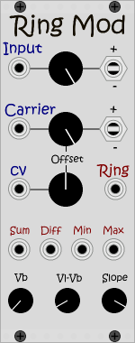

# VCVRack-plugin-JE [](https://travis-ci.org/eres-j/VCVRack-plugin-JE)
Modules for [VCVRack](https://github.com/VCVRack/Rack).

<p align="center">


</p>

## Modules

### Ring Modulator
Mainly based on the work described in [A simple digital model of the diode-based ring-modulator](http://recherche.ircam.fr/pub/dafx11/Papers/66_e.pdf)
  - Audio inputs:
    - Modulator -> Attenuation -> Polarity (+/both/-)
    - Carrier -> Attenuation -> Polarity (+/both/-) -> Offset CV -> Offset
  - Audio outputs:
    - Ring modulation
    - Sum = Carrier + Modulator
    - Diff = Carrier - Modulator
    - Min = Sum < Diff ? Sum : Diff
    - Max = Sum > Diff ? Sum : Diff
  - Diode characteristics:
    - Vb = Forward bias voltage
    - Vl = Voltage beyond which the function is linear
    - Slope = Slope of the linear section

### Simple Wave Folder
Mainly based on the work described in [Virtual analog model of the Lockhart wavefolder](http://smc2017.aalto.fi/media/materials/proceedings/SMC17_p336.pdf)
  - Input gain CV
  - Input gain
  - DC CV
  - DC
  - Output gain CV
  - Output gain
  - Audio input
  - Audio output
  - Resistor
  - Load resistor

## Building from sources

Clone this repository into the Rack's plugins directory then build using Make:

``` bash
cd Rack/plugins/
git clone https://github.com/eres-j/VCVRack-plugin-JE.git
cd VCVRack-plugin-JE
git submodule update --init --recursive
make -j
```
