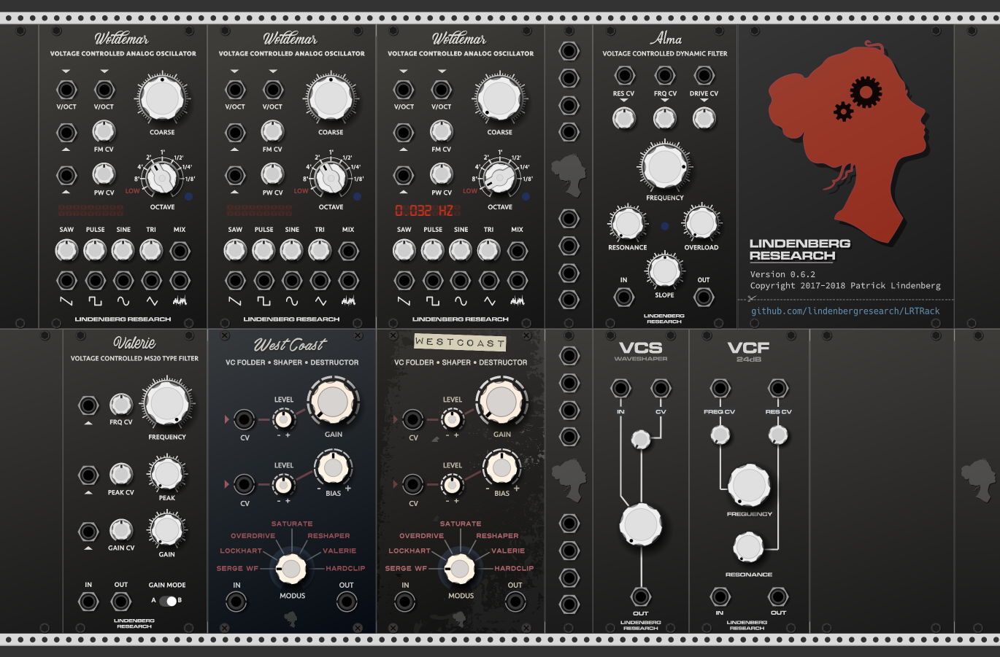

# Lindenberg Research Tec. - VCV Rack modules
LRT Rack modules is a collection of modules made for [VCV Rack](https://vcvrack.com) virtual modular system.

Copyright (C) 2017-2018 by Lindenberg Research / Patrick Lindenberg

## 1. Installation

You can obtain the latest release via the VCV Rack package manager, or download and install it manually:

https://github.com/lindenbergresearch/LRTRack/releases

Just download for you architecture and unzip in your _**Rack**_ folder located in your documents.

## 2. Build from source

_**NOTE:**_

You have to install a C++ environment including a compiler and other commandline tools.
For further information about this, check the documentation found here: [VCV Rack GIT](https://github.com/VCVRack/Rack)

The current master has been migrated to 0.6.0dev! So you have to install the correct version
of Rack in order to get it running. I suggest to fetch a clean 0.6.xx version of Rack via git and build
all from scratch.

You can build the latest release from source, to do so use the following steps:

Clone git to local machine (into Rack/plugins):

        git clone https://github.com/lindenbergresearch/LRTRack.git

After that you should have the latest sources. If you want to build some release, you **HAVE**
to switch to the corresponding TAG! For every released version a TAG exists, **be aware that if you check out the current master it could be
possible that it contains errors or unfinished modules... it is a current workstate!**

To view all tags use:

        git tag

To checkout to a specific tag simply use:

        git checkout <TAG>

Build from sources:

        make dist

If the release could be successfully compiled you can find a zipped file under:

        'dist/LindenbergResearch-xx.xx.xx-<arch>.zip'.

Where xx.xx.xx is filled with the version of the release and <arch> with the system you are on (win/mac/lin).

## 3. Bugs, requests and other issues

Bug reports, change requests, genius ideas and other stuff goes here: [ISSUES](https://github.com/lindenbergresearch/LRTRack/issues)
Thanks to all people who helped to improve the modules and created releases for other architectures in the past! :)

