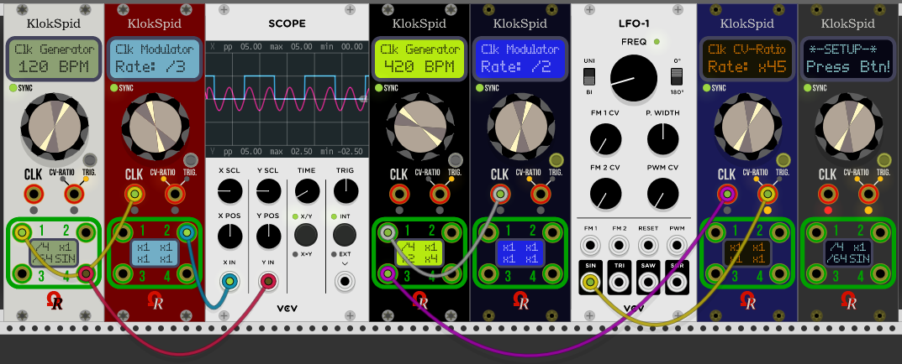

# Ohmer Modules for VCV Rack

### ***MANUALS:***

[RKD / RKD with "Break" User's Guide (PDF)](./res/Manuals/RKD%20User's%20Manual.pdf) (still under construction).

------

Flagship of *Ohmer Modules* is **KlokSpid** (pronunciation of "clock speed"), a modern "CPU-controlled"-style clocking module, designed for any rack requiring BPM-based clock sources and/or clock modulators (clock multipliers and dividers).

Available as six models, can be changed anytime you want, from context-menu (right-click menu).

**Classic** (default beige), **Stage Repro** and **Absolute Night** models embed LCD dot-matrix displays (DMD) and silver parts (button and screws). The Absolute Night model embeds a yellow-backlit LCD DMD, though.

**Dark "Signature"**, **Deepblue "Signature"** and **Carbon "Signature"** models embed a plasma-gas dot-matrix displays, and luxury golden button and screws, instead.

All Ohmer Modules having jacks (KlokSpid, Metriks, Splitter 1x9, also valid for QuadPercs, from [OhmerPrems](https://github.com/DomiKamu/OhmerPrems)) embed mandatory **golden connectors**, due to expected *high-level quality standards* concerning all of our modules.

Basically, KlokSpid module provides two modes:

- **Standalone BPM-clock generator**, covering all possible BPM from 1 to... 960 (beats), selectable only by encoder (no CV). The small button (at the right side of module) may be used as toggle, to start or stop BPM clocking (current state is reflected by "SYNC" LED: green while running, red when stopped). However, each output jack may receives a predefined clock ratio, and jack #4 (when set at x1) may delivers LFO waveform (based on displayed BPM).
- **Clock modulator** (sometimes designed as *clock multiplier or divider*) covers a lot of predefined ratios (or rates), from 1 to 10 (all), 12, 15, 16, 24, 32 and 64, when the ratio (rate) is set manually (via encoder). However, the ratio is ***voltage-controllable*** (thanks to **CV-RATIO/TRIG.** input jack) to reach any multiplier or divider value you'd like, including "exotic" ratios (like x37 or /59), from 1 to 64.

Clocking mode is automatically selected by an internal sensor (and module's firmware), in fact, depending the **CLK** input jack is connected, or not.

If connected (patched), KlokSpid module works as ***clock modulator*** (multiplier or divider), otherwise, it works as standalone BPM-based ***clock generator***.

As clock modulator, generated signals are always sent to **four identical** outputs (like a "1x4" multi), to avoid splitter/multiples usage behind module (or multiples patch cables connected on the same jack).

However, while KlokSpid works as clock generator, several options (determinable via module's SETUP) permits to select a specific multiplier or divider for any output jack, and output a specific LFO waveform to output jack #4 such sine, inverted sine, triangle, inverted triangle, sawtooth or inverted sawtooth (sometimes called *down sawtooth*). From module's SETUP, this feature is **Out. #4 LFO**. (disabled by default), but can be enabled only if jack #4 ratio is set as "x1" (ratio take priority over LFO).

Voltages sent to all outputs is, by default, defined to **+5V**, but, in case you'll need another voltage, it can be changed to either **+2V**,  **+10V**, or **+11.7V**.

Output signal duration is mainly *gate-based*, by default as **Square** waveform (aka gate 50%) of BPM pulse, if working as standalone BPM-clock generator, or current multiplied/divided frequency (as soon as the source frequency is stable / established by the module - indicated by SYNC" LED - green means source frequency is stable). This factory setting covers major usages about a clocking device, but of course, other duration can be selected, in fact depending your needs (e.g.: to control longer sustains for ADSR envelope generators, to hold longer playing sample, etc.). Shortest durations are mostly designed to control a sequencer or to trigger a drum module.

The right-side input jack labeled both **CV-RATIO** and **TRIG.** is versatile: when KlokSpid module is working as clock multiplier/divider, this jack can accept CV to control clocking ratio (any integer value from /64 to x64), via **-5V/+5V bipolar** voltage (default), or optionally 0V/+10V unipolar. At the other side, when KlokSpid module is working as standalone BPM-clock generator, this jack becomes a "trigger" input, and provides, in this case, one of these features:

- as BPM-reset (most common usage) to keep separate KlokSpid modules, as clock generators, perfectly synchronized (default) between each other. Also all waveforms generated by KlokSpid become "in phase" after a reset. Obviously, all related BPM-clock generators must have exactly the same BPM!
- to toggle BPM "start/stop" state, exactly like a "remote" does (optional, can be defined via SETUP).

<u>**TIP:**</u> two small orange LEDs belong this jack reflect, when lit, the current jack role: CV-RATIO, or TRIG.

Please note both **CLK** and **TRIG.** input jacks will trigger at +1.7V (or above), on rising edge. Low voltage for "retrigger" is +0.2V (or below), on falling edge.

One of interesting feature offered by KlokSpid module is an embedded SETUP program (like personal computer does), in order to customize some settings. To enter the module's SETUP mode, simply **press and hold** the small button for approx. 2 seconds, until the message **- SETUP -** is displayed, confirming the module's SETUP now is running. Press the button (like indicated) to go to first setting: *CV Polarity*.

Setting's name is displayed on first line, its current value is displayed on second line.

During SETUP operation, you'll can notice the module continues to work, except you can't alter, via encoder, the current ratio (or BPM), because the encoder becomes... the value selector (to select another value, for current displayed setting, simply turn the knob clockwise or counter-clockwise). Any setting you're currently editing is reflected, in real-time, by the module, it may be useful, for example, to experiment different output durations, voltages, CV polarity behaviors...

To advance to next setting, just press the button.

Note: as long as you don't touch the encoder, the current value (for related parameter) remains unaffected.

The last setting is SETUP-exit "decision" (you'll can use encoder to change, then press button):

- **Save/Exit**: all changes made during SETUP operation are saved (this option is always default).
- **Canc./Exit**: settings prior entered SETUP are fully restored (meaning changes made are ignored).
- **Review...**: return to first setting (CV Polarity) and browse all settings again!
- **Factory**: restore initial settings (same as fresh added module in rack), aka "reset to factory".

**<u>TIP:</u>** while SETUP is running, **long press/hold** on button does an **immediate** "Save/Exit", it's a kind of "shortcut", or quick way to quit SETUP, as soon as you consider the current settings are fine, useful to avoid browsing all remaining settings until SETUP-exit decision!

Obviously, all settings you've defined via SETUP are automatically saved along your ".vcv" patch file (including "autosave.vcv"). Also, all current settings are transferred "on-the-fly" when you duplicate (clone) the module, even during SETUP operation (in this situation, new clone isn't running SETUP mode, however, because cloning assumes an "automatic Save/Exit" for its clone!)

#### **Other Ohmer modules:**

**RKD (Rotate Klok Divider)**, inspired by 4ms Company's **RCD** module (with limited permission).

**RKD with "Break"**, its big Brother, inspired by 4ms Company's **RCDBO** module (with limited permission).

**RKD with "Break"** is mainly a (4 HP) RKD module, and an additional panel (4 HP too, alongside RKD) providing six deported switches. By this way, it's more comfortable to change module's settings "on-the-fly", without need to access PCB to change jumpers. ***Both modules provide exactly the same features!***

**Metriks**, a 8 HP measurement module: voltmeter, frequency counter (incl. BPM meter and Note Tuner) and "Peak Counter". Press ***MODE*** button to select measurement mode (voltmeter, frequency counter, peak counter). Depending current mode, the encoder have different features: to select number of displayed decimals (from voltmeter), to select BPM meter or note tuner (from frequency counter), and to choose threshold voltage (trigger) from peak counter (also used by frequency meter). **Working fine, but still in development (frequency meter parts can be enhanced a bit, rounding values in particular).**

**Splitter 1x9**, a classic "multi" 1-in to 9-outs, voltage limited into -11.7V/+11.7V bounds (hard clipping, indicated by a red LED near input jack, lit when the incoming signal must be clipped).

**Set of blank panels** (without logo) to fill any holes in your rack: 1 HP, 2 HP, 4 HP, 8 HP, 16 HP and 32 HP. Please note the 2 HP blank panel have its own context-menu, in order to change screws number and arrangement, anytime you want!

## Releases

Releases for Windows, MacOS and Linux platforms may (or will) be available either from VCV's [Plugins](https://vcvrack.com/plugins.html) page, and/or from [my GitHub "releases" page](https://github.com/DomiKamu/Ohmer-Modules/releases).

## License Clauses

All Ohmer Modules are free, source code is provided.

Source code licensed under **BSD 3-Clause** by Dominique Camus. Some graphic materials can't be used for derivative works without my permission.

About RKD modules, the "4ms Company" doesn't endorse any support or responsability about this conversion, anyway. These modules follow guidelines given by "4ms Company", including respect of non-usage of company logo, brand name, and trademarked modules names (RCD, Rotating Clock Divider, RCDBO, and RCD Breakout). Both RKD modules use exclusively 100% homemade C++ code (Open Source), have some variations regardling some graphicals and technical specifications, and provide additional features, like different panel colors and segment-LED displays (instead of silkscreen prints) showing dividers for every output jack, in real-time.

**Small donations are welcome!** if you appreciate my stuff. Please be sure they will serious motivation for me to develop another modules - by this way, I'll can buy "delivered at home pizzas" while I'm working for you! ;) More seriously, donations permits me to buy commercial modules, or making donations, too!

https://www.paypal.me/DominiqueCAMUS

Feature requests, suggestions, and bug reports are welcome on GitHub repository.

### Current release: v0.6.4 (April 28th, 2018):

- Bugfixes and enhancements are described in details into [CHANGELOG.TXT](doc/CHANGELOG.txt).

### Thanks to:

- **Andrew Belt** (and development team) for his fantastic VCV Rack software!
- **Artur Karlov** about KlokSpid source code merge tip (source maintenance is more easy, BTW).
- **Dale Johnson** (author of Valley's *Topograph* & *Dexter* modules), for GUI-change on the fly and *framing*.
- **Michael Struggl** , for similar suggestion (about Audible Instruments' Tidal, using similar feature).
- **Gerhard Brandt**, about Prime numbers & Fibonacci tables for RKD / RKD+BRK modules.
- 4ms Company, for their (conditional) permission about their RCD / RCDBO modules partial conversion.
- **Builders** for MacOS & Linux (particular mention to Clément Foulc for MacOS builds, and to Zulu Echo Romeo-Oscar for Linux builds).
- Many enthusiast users!
- Generous contributors, for donations, coding tips & optimizations, enhancements and features ideas!
- Our existing (and growing every day) communities around VCV Rack.

### Who am I?

My name is Dominique CAMUS, 54 years old French guy, my job is networks and systems administrator (but actually, unemployed), living [Chartres](https://en.wikipedia.org/wiki/Chartres) (world-famous about its wonderful cathedral) located 100 km southwest of Paris, France. Mine hobbies are mainly C.M. experimentations (as curious guy I am), playing keyboard (only live performance, at home in my living room, using M-Audio CODE61 MIDI controller and sometimes, Liine Lemur on iPad 3), flight simulation (Prepar3D v4, flying mainly Boeing 737 and 777 airliners), Kerbal Space Program, videogame emulators (for sure, I'm a nostalgic guy ;), pinball games, homemade developments, friends, swimming pool...

### Enjoy!