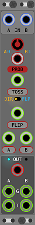

# Heads & Tails  
... is a set two 4HP A/B switches with a random component.

## Details
Based on an idea by Joop van der Linden ([@joopvdl](https://github.com/joopvdl)) to combine a bernoulli gate with an audio path.  
__Heads__ routes either input A or B to its output.  
__Tails__ routes its input to either output A or B.  
Routes can be changed manually by clicking the labels or remotely by using the CV trigger inputs.

### Random Route Changes
__TOSS__ changes the route based on the outcome of a coin toss.  
In __DIR__ mode the route is directly chosen by the outcome while  
in __FLP__ mode the outcome decides whether the current path is changed or not.  
The __PROB__ knob and CV influence the chance of the toss result being heads or tails.  

### Direct Route Changes  
__FLIP__ - switches routes from one to the other  
__A__ - sets route to A  
__B__ - sets route to B  

### Gate and Trigger Outs  
__G__ outs are high when their route is active.  
The active __T__ out passes the triggers of any route change event.  

## Changes  
__0.6.0__ - ui tweaks, name change  
__0.5.8__ - initial version  

