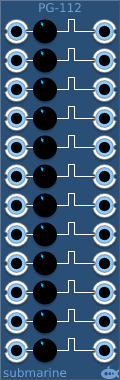

# Pulse Generators
### [Part of the Digital Suite](DS.md)
#### PG-112 Pulse Generators

## Basic Operation

The PG-112 provides 12 Pulse Generators. It is designed to take digital signals, but it will happily accept analog signals. Each pulse generator triggers on the rising edge of the input signal, and generates a positive pulse on the output which fall back after a defined length of time. A control knob allows you to control the length of the pulse. The default length is 10ms, but it can be adjusted from 10&#x3bc;s to 100s.

## Signal Range

The voltage range of the digital gates can be configured from the context menu. The device will output at the full range of the configured settings. The inputs will measure a logical high signal anywhere above the midpoint of the configured range.

