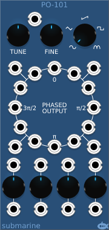
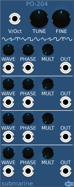

# Phase Oscillators
#### PO-101 Phased VCO
#### PO-102 Phased LFO

## Basic Operation

The PO-101 and PO-102 devices are digital oscillators which offer a choice of 5 waveforms and provide 20 outputs at different phases. The pitch can be adjusted using the TUNE and FINE knobs, and the associated CV input.

16 fixed phase outputs are provided, dividing the cycle into 12 and 8 equal parts. In addition 4 further adjustable phase outputs are provided. The phase of these outputs can be controlled using a control knob, and/or an associated CV input.

#### PO-204 Phase Modulation Engine

## Basic Operation

The PO-204 does not offer the wealth of fixed phase outputs, instead it offers a greater level of control over 4 output signals from the same oscillator. Each of the 4 outputs can be adjusted independantly while remaining in tune with the master tuning controls. This can be used in conjunction with envelope generators to produce a Yamaha style FM [sic] synthesiser.

## Phase

The phase of the output can be adjusted using the PHASE control knob and associated CV.

## Waveform

The waveform of the output can be adjusted using the WAVE control knob and associated CV. The PO-204 has 5 basic waveforms and the WAVE control allows you to blend anywhere between any pair of the basic forms.

## Frequency multiplier

The output frequency can be multiplied by an integer value from 1 to 16 using the MULT control knob.
