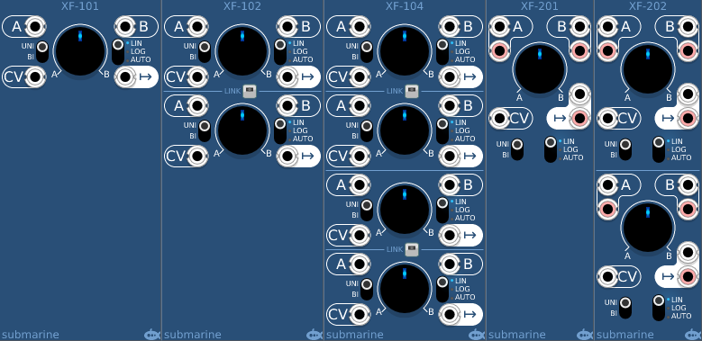

# Equal Power Cross-Fader
#### XF-101 Single Monophonic Cross-Fader
#### XF-102 Dual Monophonic Cross-Fader with LINK option
#### XF-104 Quad Monophonic Cross-Fader with LINK option
#### XF-201 Single Stereophonic Cross-Fader
#### XF-202 Dual Stereophonic Cross-Fader

## Basic Operation

The cross-fader takes two input signals A and B and the knob sweeps the output from 100% A through a mix of the two 
to 100% B.  The CV input can be used instead of the knob and takes either a -5/+5V bipolar signal or a 0/+10V unipolar signal. The fade knob does not operate when the CV input is connected.

## Gain Profiles
The cross-fader has two gain profiles for the fade. A linear profile which offers 50% of each signal at the halfway point. And a logarithmic profile which offers approximately 70% at the halfway point. The preferred choice of profile is generally dependant on the correlation of the A and B signals. 

## Auto Profile Selection
The cross-fader also offers an automatic mode which makes use of an internal correlation calculator to determine whether to use the linear or the logarithmic profile. Selecting automatic mode, the AUTO led will light, and either the LIN or LOG led will also light to indicate which profile is currently being auto-selected. If the AUTO led goes red, this indicates that the A and B signals have a negative correlation, this carries the risk of the signals destructively interfering in the mix, which would result in a loss of signal volume. This can often be resolved by inverting either the A or the B signal (but not both). The auto-selector features built in hysteresis to prevent fibrillation.

## LINK option
The XF-102 and XF-104 modules feature a LINK button. When LINK is enabled, a pair of monophonic cross-faders are linked to form a single stereo cross-fader. The A, B and OUTPUT connections of the first cross-fader form the left signal channel, while the A, B and OUTPUT connections of the second cross-fader form the right signal channel. All other controls on the second cross-fader are disabled when in link mode. Signal correlation for auto profile selection is only carried out on the left signal.

The XF-201 and XF-202 modules are always stereo devices. The right signal connections are distinguished by red sockets. 
