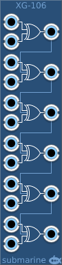

# Logical XOR Gates
### [Part of the Digital Suite](DS.md)
#### XG-106 XOR Gates

## Basic Operation

The XG-106 provides 6 two-input XOR gates. It is designed to take digital signals, but it will happily accept analog signals. 

## Signal Range

The voltage range of the digital gates can be configured from the context menu. The device will output at the full range of the configured settings. The inputs will measure a logical high signal anywhere above the midpoint of the configured range.

## Normalling

Any output not connected will be normalled into a third input on the gate below. In this way multi-input gates can be created up to a maximum of 12 inputs. 

An input not connected will be ignored.
