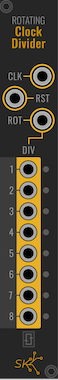

# Rotating Clock Divider



A ** Rotating Clock Divider** accepts a CV input as a _gate_, and creates a number of
_beats_ based on input triggers.  Each time a _beat_ occurs (when a CV value
goes from under `1.7` to `1.7` or above), a value of `1.7` is output for one
half of that _beat_.  Whenever a trigger occurs on the `ROT` input, the outputs
are shifted by one.

The outputs are based on the division of each row, from `1` to `8`: if the
current count is divisible by the output, it is triggered.  Each trigger of `ROT`
will change this by one, but the initial state is as follows:

```
    1  2  3  4  5  6  7  8
/1  x  x  x  x  x  x  x  x
/2     x     x     x     x
/3        x        x      
/4           x           x
/5              x         
/6                 x      
/7                    x   
/8                       x
```
