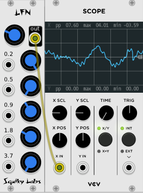
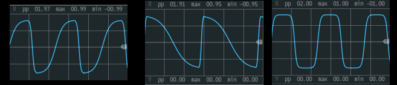
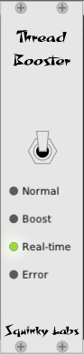
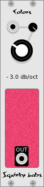
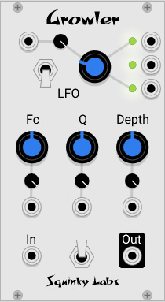
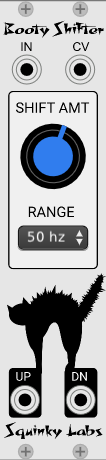
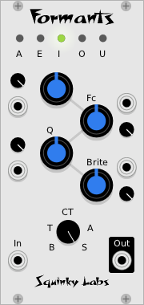

# Table of contents

[Chebyshev Waveshaper VCO](../docs/chebyshev.md) Click on link to go to Chbeyshev manual.

[Functional VCO-1](#fun) Is an improved version of the Fundamental-VCO1.

[LFN](#lfn) Is a random voltage generator made by running low frequency noise through a graphic equalizer.

[Chopper](#chopper) Is a tremolo powered by a clock-synchable LFO. The LFO is highly programmable to give a range of waveforms.

[Thread Booster](#booster) reduces pops and clicks in VCV Rack by reprogramming VCV's audio engine.

[Colors](#colors) is a colored noise generator. It can generate all the common **"colors"** of noise, including white, pink, red, blue, and violet.

[Growler](#growler) is a "vocal animator." It imparts random vocal timbres on anything played through it. The pseudo-random LFOs all have discrete outputs.

[Booty Shifter](#shifter) is an emulation of the legendary Moog/Bode frequency shifter.

[Formants](#formants) is a programmable bank of filters that can synthesize various vowel sounds and morph between them.

[Attenuverters](#atten)

[CV ranges](#cv)

The [release notes](release-notes.md) describe recent changes to our modules.

# Functional VCO-1 

Functional VCO-1 works just like its namesake. The control layout is familiar, the sound is the same, but it uses about 1/4 as much CPU as the original.

We believe VCV's Fundamental VCO is an unsung hero. It's one of the few VCOs that never has audible aliasing artifacts. You can sync it, and modulate all its inputs, but the sound never falls apart.

We "forked" the code to Fundamental VCO-1 and modified it a little bit to make it much more CPU efficient. Now you may use a lot more of them without pops, clicks, and dropouts.

If you would like the details of how we did this, you can [find them here](../docs/vco-optimization.md).

# LFN Low Frequency Noise Generator 

LFN stands for Low Frequency Noise. Technically it is a white noise generator run through a graphic equalizer at extremely low frequencies. People may find it easier to think of it as a random voltage source with unique control over the output.

The top knob, which is unlabeled, sets the "base frequency" of LFN.

The five other knobs, and the CV inputs beside them, control the gain of the graphic equalizers sections. Beside each EQ gain knob is a label indicating what frequency range that knob controls.

For example, it the base frequency is 1.0, the EQ sections will be at 1Hz, 2Hz, 4Hz, 8Hz, and 16Hz. If the base frequency is 0.2, The EQ sections will be at 0.2Hz, 0.4Hz, 0.8Hz, 1.6Hz, and 3.2Hz.

But instead of thinking about frequencies like 1Hz, which are a little difficult to imagine, think of the knobs as mixing very slow random voltages, with less slow ones. For example if LFN is driving a pitch quantizer into a VCO, turn all the knobs down to zero except the first, lowest, one. This will make a series of pitches slowly rising and falling. Then bring in a little of the faster channels. The pitch will still be slowly rising and falling, but will also quickly move up and down by smaller steps.

A good way to learn what makes LFN tick is to set it slow and watch it on the scope. At the same time run it straight into a VCO. Experiment with different mixes of the slow knobs and the fast ones.

As you would expect from Squinky Labs, the CPU usage of LFN is very low. In fact it is one of our leanest modules yet. So feel free to use as many instances as you like.

# Chopper tremolo / programmable LFO 

In its simplest use, Chopper produces a very wide range of **tremolo** effects. The built-in LFO can produce a wide range of waveforms that cover many of the waveforms produced by the tremolo circuits built into **vintage guitar amplifiers**.

The LFO is sent to an output so that it may modulate other modules.

There is also a **clock synchronizer** and multiplier.

To use Chopper as a tremolo, send a signal to the *in* jack, and listen to the *out* jack. Leave the *clock* control at the default *int* setting. Most of the knob settings will now affect the tremolo effect.

## Chopper LFO

To understand all the LFO settings, it helps to watch the outputs on a scope.

The LFO starts as **skewed** sawtooth. In the middle position it is a symmetric triangle wave, at one end a positive sawtooth and at the other a negative sawtooth. The signal is sent to the **saw** output.

The skewed saw then goes to a **waveshaper**. As the shape control is increased the LFO is gradually rounded and then flattened. The shaped LFO is send to the *lfo* output, and used internally to modulate the audio input.

LFO Controls:

* **Shape** Flattens the LFO waveform.
* **Skew** Dials in the amount of asymmetry in the LFO.
* **Depth** Shifts and scales the LFO.

When used as a tremolo effect, you will hear **more tremolo** when these controls are turned up.

## Chopper clock

The LFO in Chopper may be synchronized with the ckin signal. There is a built-in **clock multiplier**. To use the synchronization, patch a clock to the ckin, and select x1 from the **clock** knob. To run at a multiple of the input clock, select x2, x3, or x4.

When Chopper is being synched, the **Phase** control sets the phase difference between the external clock and the synchronized LFO. This may be used to "dial in" the tremolo so that it sounds exactly on the beat (or off the beat).

There is also an internal LFO that is controlled by the **Rate** control. Set the clock control to *int* to use the internal clock.

# Thread Booster

Thread booster raises the priority of VCV Rack's audio rendering thread. In many cases this decreases the annoying pops, ticks, and dropouts that many users are experiencing.

Many users have reported that Thread Booster helps significantly. Others have reported that it does not help at all. No one has reported a detrimental effect.

For a deeper dive into the Thread Booster, you should read [this document](./thread-booster.md).

Thread Booster has a UI that lets you boost the priority of the audio thread. There are three arbitrary settings: normal, boosted, and real time. When the switch is in the bottom position, the plugin does nothing; the audio thread keeps its default priority. In the boost (middle) position, it sets the thread priority to the highest priority non-real-time setting. In the real-time position it attempts to set it to the highest possible priority, or near it.

If setting the priority fails, the red error light lights up, and the priority stays where it was last.

To use Thread Booster, just insert an instance into VCV Rack, then adjust the boost switch. In general we recommend the "real time" setting, if it is available on your computer.

Once Thread booster is in your session, it will boost all the audio processing - it doesn't matter if other modules are added before or after - they all get boosted.

Linux users - you must read [the detailed document](./thread-booster.md) to use this module.

Note to users who downloaded the original version of Thread Booster: we've improved it a bit since then, especially on Linux and Windows.

# Colors variable slope noise generator

Colors is a colored noise generator. It can generate all the common **"colors"** of noise, including white, pink, red, blue, and violet. It can also produce all the colors in between, as it has a **continuously variable slope**.

Colors has a single control, "slope." This is the slope of the noise spectrum, from -8 dB/octave to +8 dB/octave.

The slope of the noise is quite accurate in the mid-band, but at the extremes we flatten the slope to keep from boosting super-low frequencies too much, and to avoid putting out enormous amounts of highs. So the slope is flat below 40hz, and above 6kHz.

## Things to be aware of

When the **slope** changes, Color needs to do a lot of calculations. While this is normally not a problem, it’s possible that quickly changing the slope of many instances of Colors could cause pops and dropouts.

The slope control does not respond instantly. If you turn the knob, you will hear the change, but if you were to modulate the CV very quickly you might notice the slowness.

# Growler

**Growler** is a re-creation of the Vocal Animator circuit invented by Bernie Hutchins, and published in Electronotes magazine in the late 70's. It continuously morphs between different vaguely voice like tones.

**To get a good sound:** run any harmonically rich signal into the input, and something good will come out. Low frequency pulse waves and distorted sounds make great input.

The controls do pretty much what you would expect:

* **LFO** controls the speed of the modulation LFOs.
* **Fc** controls the average frequency of the multiple filters.
* **Q** controls the sharpness of the filters.
* **Depth** controls how much of the modulation LFOs are applied to the filters.

## How Growler works

There are four **bandpass filters**, roughly tuned to some typical vocal formant frequencies: 522, 1340, 2570, and 3700 Hz. The filters are run in parallel, with their outputs summed together.

The first three filter frequencies are modulated by an LFO comprised of **4 triangle wave LFOs** running at different frequencies. They are summed together in various combinations to drive each of the filters.

Each **CV input stage** is the same: a knob that supplies a fixed  offset and a CV input that is processed by an attenuverter. The processed CV is added to the knob voltage. See below for more on [Attenuverters](#atten) and [CV ranges](#cv).

The **LFO** Rate control shifts the speed of all 4 LFOs while maintaining the ratio of their frequencies.

The **Fc** control moves the frequencies of the first three filters, but not by equal amounts. The lowest filter moves at 1V/Oct, but the middle two move less. The top filter is fixed at 3700 Hz.

The **Q** control does just what it says - controls the Q (resonance) of the filters.

The **Modulation Depth** controls how much of the summed LFOs get to each filter. Again, the lower filters move farther, and the top filter is fixed.

The smaller knobs next to the main knobs are **attenuverters**, which scale control voltages. For more on attenuverters, [see below](#atten)

There are three LFO outputs next to the blinking LFOs. These may be used to modulate other modules, or as semi-random voltage sources.

**Bass boost** switch. When it’s in the up position (on) there should be more bass. This is done by switching some or all of the filters from bandpass to lowpass.

LFO **Matrix** switch. This is the unlabeled switch in the LFO section. When it’s down (default position) the LFOs are closely correlated. In the middle we try to make them a little bit more independent. When it’s in the up position the LFOs will often go in different directions.

# Booty Shifter frequency shifter 

**Booty Shifter** is a frequency shifter inspired by the Moog/Bode frequency shifter module.

The name "Booty Shifter" is a nod to the classic analog module, as well as to a black cat named Booty.

Booty Shifter  will take an audio input and shift the frequencies up or down. This is not like a pitch shift where harmonics will remain in tune; it is an absolute frequency shift in Hz, so in general **harmonics will go way out of tune.** It is similar to a ring-modulator, but less extreme and more versatile.

## Getting good sounds from Booty Shifter

Feed in music and shift the frequency a good amount.

Feed in **speech or radio** and shift it.

Feed the CV from a **sequencer** to sequence the mayhem.

Shift **drums** up or down a little bit to re-tune them without the usual pitch-shifting artifacts.

Small shifts in conjunction with delays can make a chorus-like effect to thicken music.

## Inputs and outputs

* **IN** is the audio input.
* **CV** is the pitch shift control voltage. -5V will give minimum shift, +5 will give maximum.
* **DN** is the down-shifted output.
* **UP** is the up-shifted output.

## Controls

**RANGE** sets the total shift range in Hz. For example, the 50 Hz setting means that the minimum shift is 50 Hz down, and the maximum is 50 Hz up.

Range value **Exp is different**. Here minimum shift is 2 Hz, maximum is 2 kHz, with an exponential response. As of version 0.6.2 the response is an accurate 1 Volt per Octave.

Shift **AMT** is added to the control voltage, with a range of -5..5.

## Oddities and limitations

If you shift the frequency up too far, it will alias. There is no anti-aliasing, so if the highest input frequency + shift amount > sample_rate / 2, you will get aliasing. Of course the Bode analog original did not alias.

If you shift the input down a lot, frequencies will go **below zero and wrap around**. Taken far enough this will completely **reverse the spectrum** of the input. This was a prized feature of the Bode original.

As you shift the input down, you may start to generate a lot of subsonic energy. A **High Pass filter** may clean this up.

The down shift **frequency fold-over**, while true to the original, does cause problems when trying to pitch drum tracks down a lot. High pass filtering the input before it is down-shifted can control this.

# Formants vocal filter 

Like the **Vocal Animator**, this is a filter bank tuned to the formant frequencies of typical **singing voices**. Unlike Growler, however, the filters do not animate on their own. In addition, the filters are preset to frequencies, bandwidths, and gains that are taken from **measurements of human singers**.

One of the easiest ways to **get a good sound** from Formants is to use it like a regular VCF. For example, control Fc with an ADSR. Then put a second modulation source into the vowel CV - something as simple as a slow LFO will add interest.

Use it as a **filter bank**. Just set the knobs for a good sound and leave it fixed to add vocal tones to a pad. Again, modulating the vowel CV can easily give great results.

Try to synthesize something like **singing** by sequencing the vowel CV of several formants. Leave the Fc in place, or move it slightly as the input pitches move.

Controls:

* **Fc** control moves all the filters up and down by the standard one "volt" per octave.
* **Vowel** control smoothly interpolates between 'a', 'e', 'i', 'o', and 'u'.
* **Model** control selects different vocal models: bass, tenor, countertenor, alto, and soprano.
* **Brightness** control gradually boosts the level of the higher formants. When it is all the way down, the filter gains are set by the singing models in the module, which typically fall off with increasing frequency. As this control is increased the gain of the high formant filters is brought up to match the F1 formant filter.

The **LEDs across the top** indicate which formant is currently being "sung".

## About Attenuverters 

The small knobs next to the bigger knobs are **attenuverters**.  They scale and/or invert the control voltage inputs next to them. When they are turned all the way up the full CV comes through. As they are turned down less CV comes through. Straight up none passes. As they are turned down further the CV comes back, but inverted.

Sometimes we use attenuverters with a *linear taper*, and sometimes we use an *audio taper*. If you find that on a particular module you do not like the response of the attenuverters, please log a github issue.

## Control voltage ranges 

Our modules usually expect a control voltage range of **-5 to +5**. The associated offset knobs will also add -5 to +5. After attenuverters are applied to CV the knob value is added. After all that, the result is usually clipped to the -5 to +5 range.
