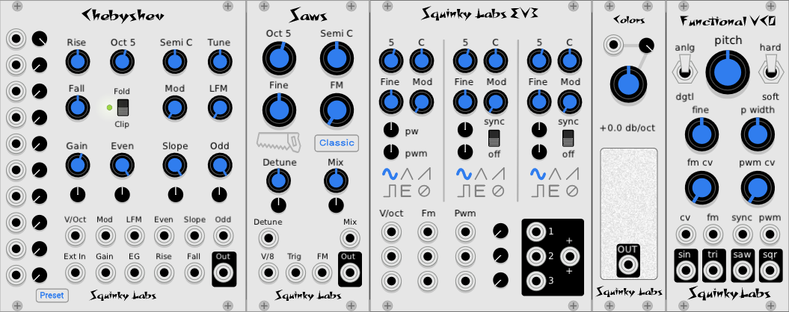
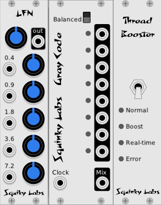

# The Squinky Labs modules for VCV Rack

Below are short descriptions of our modules with links to more detailed manuals.

The [release notes](release-notes.md) describe recent changes to our modules.

# Things that make sound

[EV3](./ev3.md) is three VCOs in a single module. Each of the three VCOs is a clone of Befaco's EvenVCO, with oscillator sync added. Like EvenVCO, it sounds good, uses little CPU, and has very little aliasing distortion.

[Colors](./colors.md) is a colored noise generator. It can generate all the common **"colors"** of noise, including white, pink, red, blue, and violet. And all the colors in between.

[Chebyshev Waveshaper VCO](../docs/chebyshev.md) can make sounds like no other VCO. It contains a VCO, ten polynomial wave-shapers, and one clipper/folder. Among other things, it is a harmonic oscillator.

[Functional VCO-1](./functional-vco-1.md) Is an improved version of the Fundamental VCO-1. Like Fundamental VCO-1, it will never alias, no matter what you throw at it. It is one of the few VCOs that can do sync, FM, and PWM without aliasing. Functional VCO-1 improves on Fundamental by lowering the CPU usage dramatically.

# Things that process sound

[Shaper](./shaper.md). Yet another wave shaper. But unlike most, this one has almost no aliasing distortion. And a few new shapes that sound nice.

[Chopper](./chopper.md) Is a tremolo powered by a clock-synchable LFO. The LFO is highly programmable to give a range of waveforms. A built-in clock multiplier enables easy rhythmic effects.

[Growler](./growler.md) is a "vocal animator." It imparts random vocal timbres on anything played through it. The pseudo-random LFOs all have discrete outputs.

[Booty Shifter](./shifter.md). An emulation of the legendary Moog/Bode frequency shifter. It is great for "warping" sounds run through it.

[Formants](./formants.md) is a programmable bank of filters that can synthesize various vowel sounds and morph between them easily.

# Other things

[Gray Code](./gray-code.md). Think of it as a semi-random clock divider. Or not. Gray codes have the cool property that only one bit changes at a time. Having only one “thing” change at a time can be interesting for music, so we are hoping you will find some good things to do with it.

[LFN](./lfn.md) is a random voltage generator made by running low frequency noise through a graphic equalizer. The equalizer gives a lot of easy control over the shape of the randomness.

[Thread Booster](./booster.md) reduces pops and clicks in VCV Rack by reprogramming VCV's audio engine.