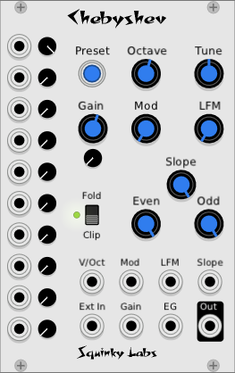

# Chebyshev
Our waveshaper VCO.

## Description of the module

Chebyshev polynomials have been used to generate complex tones since the early days of computer music. This special math discovered by Mr. Chebyshev enables digital generation of waveforms with any overtone structure using very little computer power. In addition, it is easy and computationally inexpensive to vary the spectrum over time.

Eventually, this form of synthesis fell out of favor, as FM could provide a wider variety of timbres with acceptable CPU usage. Now, however, the distinctive sound of this form of synthesis provides another unique source of sounds for VCV Rack users.

The magic of the Chebyshev polynomials is that if a sine wave with amplitude one is put into a Chebyshev polynomial, the output will still be a sine wave, but multiplied in pitch by an integer.

In our implementation we include the first ten Chebyshev polynomials to generate the first ten harmonics of the harmonic series. These are then mixed together based on knob settings and control voltages to give an output tone with complete control over ten harmonics.

Many of the controls in this module allow different ways of mixing together these ten harmonics. In addition external signals may be shaped by the waveshaper, with folding or clipping applied.

Like all our modules, Chebyshev's CPU usage is quite low.

## Some tips

It can be a great help learning this module if you patch the output to a Scope module and a frequency analyzer. As you adjust the controls it will be clearer what is going on.

Also, note that we will repeat that when set up normally, each Chebyshev waveshaper is producing a different harmonic of the VCO output. Because of this, we will refer to these as "harmonic levels" and "waveshaper levels" interchangeably.

And - each waveshaper is a perfect harmonic only when driven by a pure sine at exactly 1Vp-p.

## Signal Flow

First there is a sine wave VCO. It has the controls you would expect, as well as a through-zero linear FM input, which allows a minimal  DX7-style FM.

The VCO output then goes to a wave folder/clipper with gain controls. This allows for some distortion effects, and keeps the signal in a range that will keep the next stage happy.

The output of the folder/clipper then goes to ten parallel Chebyshev waveshapers. The outputs of these are then mixed together through a specialized mixer.

When everything is set in a typical manner, each of the Chebyshev waveshapers will be  outputting a pure sine wave at an integer multiple of the fundamental frequency. Thus, each one will be a discrete harmonic.

## Description of the controls

### VCO

The controls in the upper right are all for the sine wave VCO.
Octave transposes the pitch in even octaves.

* **Tune** raises or lowers the pitch by up to a perfect fifth.
* **Mod** controls the modulation (exponential FM) depth of the signal patched to the Mod jack.
* **LFM** controls the linear FM depth of the signal patched to the LFM jack.
* **V/Oct** input is where the main control voltage is patched.

Mod and LFM perform different functions. Mod, like the CV input, is an exponential control. If an LFO is patched into the Mod input and the Mod depth is adjusted for a vibrato of one semitone, that vibrato will be one semitone regardless of the base pitch. But if an audio rate signal is patched into the Mod input you will tend to get “clangorous” sounds with inharmonic overtones.

LFM, on the other hand, allows through-zero linear FM. While this is not very good for vibrato it does create complex timbres where the harmonics are in tune, and that "in tuneness" will remain as the mod depth is changed. Exponential FM at audio rates can also be tuned, but the tuning will disappear  as the mod depth changes, making it impossible to to generate dynamic harmonic sounds.

### Folder/Clipper

Chebyshev polynomials are poorly behaved if they see more than one (volt) at their input. So we use a folder/clipper to make sure this doesn’t happen.

The controls and CV of the Folder/Clipper:

* **Fold/Clip** switch. In clip mode, it is a simple hard clipper. In fold mode it’s a waveform folder.
* **Clip LED**. The LED will be green when there is signal, and red when the folder/clipper engages.
* *Gain*. Controls how hard the folder/clipper is driven. Gain knob and CV are combined.
* **Gain trim**. The small knob below the **gain** knob is an attenuator for the **gain** CV. New in 0.6.9.
* **EG**. Also combines with the gains.
* **Ext In.** When a signal is patched here it replaces the internal VCO, allowing any signal to be run through the waveshaper.

Note that while you can get some cool effects with clipping and folding, they will tend to cause audible aliasing at higher frequencies. Use with care.

In classic waveshaping synthesis an ADSR or similar would be connected to the EG input. By dynamically changing the level of the sine wave hitting the waveshapers a dynamic timbre will be generated.

The output of the folder/clipper drives the Chebyshev waveshapers. The last group of controls all work together to determine how the waveshapers are mixed together.

### Waveshaper controls

There are a lot of controls that work together to determine how the waveshapers are mixed. When configured normally, that means these controls determine the ratios of all the harmonics of the VCO.

The **small knobs** running up the left side individually control each waveshaper/harmonic, with fundamental on top, and harmonic 10 on the bottom.

The input jacks next to them allow the levels of each harmonic to be voltage controlled.

The **Preset** button toggles all ten harmonics between some good starting points, and also resets the Gain to be exactly 1.

The **Even** control increases/decreases the level of all the even harmonics together.

The **Odd** control increases/decreases the level of all the odd harmonics together.

The **Slope** control will apply a gradual roll-off of the upper harmonics. When it is all the way down the roll-off is 18 decibels per octave. When it is all the way up it’s flat.

Note that the level of the fundamental is not affected by either the Even or Odd control.

The Odd, Even, and Slope controls may be thought of as subtractive. When they are all the way up, they have no effect, and you get the mix you would expect from the individual harmonic levels. When you turn these controls down they will reduce the levels of the corresponding harmonics.

The **Preset** button toggles between two or three settings. It will always have a setting where the fundamental is full and all other harmonics off, and a setting where all harmonics are up full. In addition, if you started with your own setting of the harmonics, the preset button will eventually take you back there, but with the master gain set back to one.

## Several patching ideas

### Arbitrary waveform VCO

Turn the Odd, Even, and Slope controls all the way up. Then the level of each harmonic is controller its own volume control. Mix the harmonics to get a pleasing sound, then use as a static timbre, or run it into a VCO.

Or start with the individual harmonics all the way up, manipulate Even/Odd/Slope to start sculpting the harmonics.

Don’t forget the Preset button - it’s your friend here.

### Dynamic Waveshaping

Use the built-in VCO. Adjust the harmonic mix to something nice and bright. Then connect an ADSR to the EG input. The ADSR will more or less control the brightness. Make sure the the clip LED is just on the edge of clipping when the EG input is at max.

At very low levels the output will be primarily fundamental. At max level it will be determined by the waveshaper mix controls. The timbre will go from dull to bright as the EG input increases, but the evolution of the timbre will not be completely even, and definitely will be different than what you would get modulating a VCF with an ADSR.

The evolution of timbres often sounds "brassy," like a brass instrument. Brass synthesis was indeed a common use of waveshaping synthesis before the era of affordable sampling and physical modelling.

### Voltage controlled filter slope

Most conventional VCFs allow a filter of a specific shape to be modulated up and down in frequency. A variable slope VCF lets the shape of the filter be modulated. Modulating the filter slope can be more "natural" sounding.

In the case of Chebyshev we don’t have a filter, but by controlling the harmonic levels directly we can mimic one. Set up a nice bright sound, patch an ADSR into the Slope input, and try out a simulated variable slope filter.

### Voltage control of spectrum

The possibilities for timbral variation seem limitless if you take the time to patch controls signals into the harmonic level CV inputs. Use all the usual suspects here - clocks, LFOs, shift registers, sequencers.

### FM oscillator

The inclusion of the LFM input allows a simple form of FM synthesis - one operator FM.

Use an external sine VCO, and patch it into the LFM input on Chebyshev. Turn up the LFM knob. Use the Preset button to turn up the fundamental and turn off the other waveshaper outputs.

In FM speak, the external VCO is the modulator and the VCO in Chebyshev is the carrier. The result should be consonant if the frequency of the carrier is a small integer multiple of the modulator frequency. For example, set the modulator an octave lower than the carrier.

Once again, as the modulation is increased more harmonics will be present, so use an external ADSR and VCA to modulate the level of the modulator sine before it’s patched into Chebyshev.

Of course FM will work alongside the waveshapers, so feel free to go crazy with all the knobs. But don’t be disappointed if the results are harsh and strange.

### Process external signals

Run something other than a sine wave into Ext In, then process your signal with the folder and/or the Chebyshev waveshapers. Again, the output of the waveshapers can be pretty unpredictable as the input signal becomes more complex.

## A note about Aliasing

In the standard configuration there will be little, if any, aliasing. Since the highest harmonic is 10X the fundamental, the Chebyshev module can’t even start to alias until the fundamental gets to 2kHz.

That said, there is no anti-aliasing in this module. The wavefolder can easily alias. Normally the LFM will not alias very much, but with high modulation depth and high pitches it will alias quite a lot.

We have an informational article that talks more about aliasing [here](./aliasing.md).