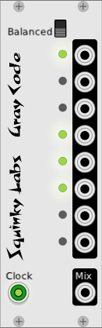

# Gray Code: eclectic clock divider

## About Gray Code

A cool feature of gray codes is that only one bit changes at a time. Having only one “thing” change at a time can be interesting for music, so we are hoping you will find some good things to do with it.

WikiPedia has a very good [article on gray codes](https://en.wikipedia.org/wiki/Gray_code)

Our Gray Code module has only one control. It selects between standard gray code and balanced gray codes. With a standard gray code, the lower bits change much more often than the high bits. You can see it counting up. With the balanced gray codes, all the bits change more or less the same amount, but of course no two ever change at the same time.

Each bit of the 8-bit gray code comes out to an output jack. The LED beside the output shows when it goes high and low.

There is an additional output that adds up all the bits with a binary weighting, kind of like a DAC.

The external clock input must be driven with a clock - there is no internal clock.

Now let your imagination run wild!

## Extra info

While the output of this module can seem random, especially in balanced mode, it is not random at all. This can sometimes make it difficult to get multiple Gray Codes running at the same time and have them counting independently.

For example, If you connect two instances to the same clock source, they will be independent, as the second instance was connect a little later than the first. But if you save the patch and reload it, both will start at the same time and have the same output.

While the outputs of Gray Code can be used to modulate almost anything, there are times when thee sharp rise and fall times can make pops and clicks. In this case using a lag generator in between will make these go away. And when set to a long enough time the lag units can make the outputs almost triangular, opening up another world of modulation possibilities.

Since Gray Code will generate a lot of independent modulation sources, it can save a lot of panel space in patches that require a lot of  modulation.