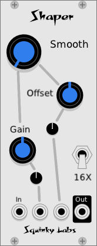
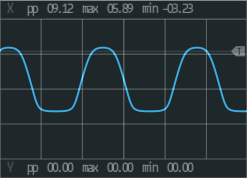
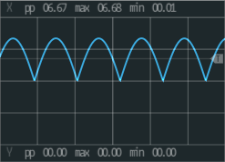
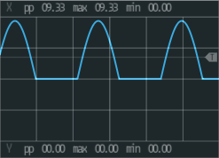
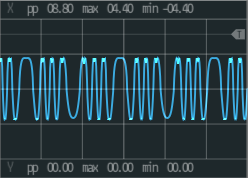

# Shaper precision waveshaper

## Overview
Shaper is a waveshaper offering many different shape options. Some of these shapes are commonly found in other wave shapers, and some are unique to Shaper. It can be used to modify the waveforms from a VCO, or to add distortion to some other sound. And, as usual, the creative user may use for "left field" uses, such as shaping control voltages.

A unique feature of Shaper is that it has very little aliasing, whereas most we have seen have a lot of aliasing. The other special thing about Shaper is that it has a few shapes that are good for "soft overdrive".

Shaper also has switchable high-pass filters on the outputs, to prevent accumulation of DC. Asymmetric waveshapes frequently contain DC, which should be removed. If not removed there will likely be loud thumps when the results are run through a VCA. The filters in Shaper are four-pole butterworth filters at 20 Hz.

## Controls

*Shape* – this is the big unlabeled knob. It selects from the different shapes that Shaper can produce. The name of the selected shape is to the right of the knob.

*Gain* – boosts the input signal, which tends to cause more shaping, distorting, and mangling. Controlled by the gain knob, and the gain CV. There is an attenuator on the gain CV.

*Offset* – shifts the signal before it hits the waveshaper. In general that will increase the level of even harmonics in the output. Many of the shapes will output no even harmonics at all if the offset is zero. Like the gain, the offset is controlled by a knob, and a CV with attenuator. The offset is bidirectional, so there is no offset when the knob is straight up and the CV is zero.

*AC/DC* - clicking on this button switches between AC coupled and DC coupled outputs. When the switch is in the AC setting, highpass filters are engaged on the output to remove DC. In the DC setting, the filters are bypassed.

*Oversampling* - The switch with the labels 16X, 4X, and 1X controls the amount of oversampling. This is how Shaper keeps aliasing under control.

## About Oversampling

The switch with the labels 16X, 4X, and 1X controls the amount of oversampling which determines how much aliasing Shaper will introduce. Waveshapers by their nature generate a lot of harmonics at high frequencies, and these tend to "fold back" into the audio range as aliasing. Oversampling reduces this effect by doing all the processing at a higher sample rate, then removing the frequencies that are too high, and reducing the sample rate back down. The more oversampling, the less aliasing.

At 16X, Shaper is oversampling by a factor of 16. So for a 44,100 sampling rate, Shaper would be working at 705kHz! This is the oversampling rate used by Fundamental VCO-1 and Functional VCO-1. At this setting it is very difficult to hear or measure any aliasing at all, although it is present in tiny amounts.

In general we recommend 16X, but there are several reasons you might want to set it lower. Firstly, you may actually want aliasing. When using Shaper as an extreme mangler the extra grit and digital nasties may fit perfectly. The other reason is CPU usage. Although Shaper at X16 does not use a large amount of CPU, it uses a lot less at 4X or 1X. It’s pretty much proportional to the setting. At 16X Shaper does 16 times as much work as at 1X.

If you are using one of the gentler settings of Shaper, 4X may have completely inaudible aliasing also. With some settings, however, we can measure significant aliasing at 4X. If you have plenty of CPU, just leave it at 16X or 1X. But if you are running out of CPU 4X can be a very workable and smooth sounding alternative.

Lastly, when using Shaper for control voltages aliasing won't be a problem, so the 1X setting is the most common setting for shaping low frequency control voltage.

## About AC/DC

As we mentioned earlier, it is usually bad to have high levels of DC in your audio signals:

* If the volume is changed quickly with an ADSR/VCA, very loud thumps and pops will surely occur.
* If there is a lot of DC in the final output to your sound card or wave file, the dynamic range will be reduced.
* Other processing modules like compressors may not work correctly if there is a lot of DC in the signal.

On the other hand, if you are using Shaper to process control voltages, it is essential that the DC be preserved.

Like most waveshapers, the first version of Shaper did not have highpass filters, and hence would output a lot of DC. The second version had the filter to block DC, but they were always on, making it bad for CV processing. This third version of Shaper finally gives the user a choice.

## Typical Uses

### Classic wave shaping

In the most common use case, the waveshaper is connected directly to the output of a VCO. This gives a large number of different sounds from the VCO. Extreme settings are often used, with folding being a classic example.

Is the Folder shape is selected, modulating the gain or offset inputs will cause dramatic timbre shifts, so often a patch will modulate the gain with an ADSR or map it to a MIDI control.

When using Shaper this way DC should be removed, so leave the switch in the AC position. 16X and 4X oversampling are both good setting to start with, as 1X will generate a huge amount of aliasing. If your ears are sensitive to aliasing you might prefer the 16X setting.

Make sure to check out the relevant videos, below, to learn more about this patch.

### Distortion

In the second use case, as a distortion/overdrive effect, often less extreme settings are used. This can add a very noticeable distortion, or just a subtle "warming" or "thickening".

It's best to avoid the "crazy" shapes like folding, and use shapes like "Soft", "Emitter Coupled", or even "Clip".

When using Shaper this way DC should be removed, so leave the switch in the AC position. The 4X oversampling is a good setting to start with, as the more gentle distortions don't tend to generate enough aliasing to require 16X. 1X might even be fine in many cases. Let your ears and your CPU meter be your guide here.

### Shaping control voltages

In the third common use case, the wave-shaper is used to modify a low-frequency control voltage like an LFO or ADSR. These CVs might then control any number of parameters.

When using Shaper to modify control voltages the DC blocking filters must be turned off, so switch them to the DC setting. Oversampling is also unnecessary here, so set it to 1X to save CPU.

If you have never tried processing a CV with a waveshaper, be sure to watch the video on that, below.

## Some notes on the different shapes

**Update**: Since we added dc-blocking high pass filters to Shaper, the outputs may not look exactly like the images below. For example, the hard clipper now looks like this:

To see the shapes best it can be instructive to switch to DC coupled.

### Smooth

Smooth is inspired by the asymmetrical distortion curve of a vacuum tube triode. It is by no means a model of a tube at all, but the shape is similar.
Smooth uses gentle curves, and wants to be used more as a distortion or thickener  that a full on mangler.

With the Smooth setting, the offset control doesn’t actually control the offset; it controls the amount of asymmetry in the output. So, like a normal offset it will bring in even harmonics, but the way the even harmonics come in at different levels is unique.

Where normally there are the least even harmonics when the knob is in the middle, with Smooth there are no even harmonics when it’s all the way down.

### Clip

Classic hard clipping. With the gain high the output will be a square wave.
Clip is not very useful for shaping a VCO output, since most VCOs already put out a square wave. But it is useful for generating a lot of distortion. It is similar to some guitar fuzz-boxes.

### Emitter Coupled

Models the saturation of an emitter coupled pair amplifier input, as was found in the classic 3080 “OTA” chip that was used in many analog synthesizers and some phase shifters. Even when driven hard, Emitter Coupled will not distort as much as some of the other shapes, and definitely won’t mangle a sound.

### Full Wave

A very simple shape, but one that has some unique characteristics. This is just the absolute value function we learned about in school. Its unique characteristic is that while it generates a lot of distortion harmonics, it does not compress the dynamic range of music played through it.

It is called Full Wave because this is an idealized version of the shape that will come out of a full wave rectifier circuit.

While the full wave shape is usually too harsh and "buzzy" to use as an overdrive/distortion, it does make a nice mangler.

### Half  Wave

Has much in common with the full wave shape, but its radical asymmetry guarantees that a lot of even harmonics will be in the output.

Unlike most of the shapes, both of the rectifier shapes have the same harmonic content regardless of the gain setting. So here it only functions as a volume control.

### Fold

The "wavefolder" is a legendary and classic synthesizer module. Both Buchla and Serge offer wavefolder modules, and they were (and remain) very popular. The wavefolder we have implemented in Shaper is not an attempt at an emulation of those classics, but is a mathematically simple folding of the input.

One thing all wavefolders have in common is that the sound changes quite a bit as the gain increases, sounding something like a filter sweep, or even more like the sweep of a synched VCO. So one of the first things to try is modulating the gain input with an envelope or other modulation source.

Like the analog classics that inspired it, Shaper's wavefolder has little or no aliasing. Wavefolding generates a huge amount of high harmonics, so a digital implementation that does not deal with the aliasing is going to sound different from Shaper (or an analog module).

That said, musicians can undoubtedly find uses for the fully aliased version. We encourage you to try at 16X and at 1X.

### Fold 2

Whereas “Fold” is a standard wavefolder, Fold2 is a little bit different. It is asymmetric no matter what offset is fed into it. It also generates more high harmonics than any other shape.

### Crush

Crush simulates bit reduction by using a continuous voltage quantizer. As the gain is turned up it will pass 16 bits, down to 8 bits, and finally one bit.

## More Info

Here is a nice video showing what can be done shaping control voltages: [Patchení s Nikol - Waveshaping CVs with Timber](https://www.youtube.com/watch?v=k9BmPWx5y2A)

This video is about wavefolders after the VCO, and demonstrates the swept technique we discussed above [Random*Source Serge Wave Multipliers: Wavefolding (LMS: Eurorack Expansion Preview)] (https://www.youtube.com/watch?v=_NfLt89sHuA)

We have an informational article that talks more about aliasing. It goes into some specifics about Shaper, but also has some useful general information: [Aliasing Story](./aliasing.md).