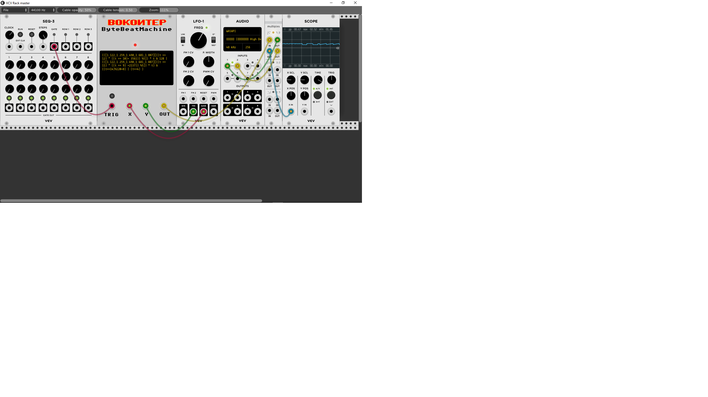

# BokontepByteBeatMachine

javascript bytebeat on VCVRack
Now you can burn countless cpu cycles by creating 8 bit oscillators with javascript! Built with duktape and caffeine drinks!

Demo video here:
[](http://www.youtube.com/watch?v=AQctoH3ucmQ)

Some kind of manual
===================

    
BokontepByteBeatMachine is an 8bit, 8000 Hz javascript oscillator. You can enter a javascript expression in the textbox 
(better write it in a text editor if is more than one line and paste it there), right click on the context menu and select initialize (or just press CTRL+I)
to compile the expression. If the expression is compiled successfully the red led over the textarea with the javascript turns to red.
If there is an error in compiling the statement the red led flashes. If the expression is successfully compiled, when a trigger is received on the trigger input, or if you
press the button above the trigger input the expression is evaluated and eventually outputted as an 8bit unsigned integer (0-255), 
which in turn is converted to the -5.0 .. 5.0 values that VCVRack works with. 
The javascript expression can contain javascript functions, bit and arithmetic operations and 3 variables. t, X and Y (look out for case sensitivity t is lower case, X and Y upper case).
t is the current time. X and Y are 8 bit unsigned ints coming from the X and Y inputs. Each value from the inputs with a value between -5.0 and 5.0 is mapped to an integer between 0 and 255.
This works at a glorious 8000 samples per second so there you have it, a bytebeat oscillator in javascript!
You can also use the trigger led button over the trigger input to test the oscillator.
A few things to try.

The simplest thing to try is just putting t as the expression. This produces a kind of stepped saw.
Or you can try my personal favorite (([1.122,1.259,1.498,1.681,1.887][((t >> 12) ^ ((t >> 10)+ 3561)) %5]) * t & 128 | (([1.122,1.259,1.498,1.681,1.887][((t >> 11) ^ ((t >> 9) +2137)) %5]) * t) & ((t>>14)%120+8) | (t>>4) )
I call the above snippet ΚΙΝΕΖΙΚΑ ΠΑΡΑΘΥΡΑ (chinese windows if this is greek to you)  
If you want to learn more about bytebeat you can start here:
https://www.reddit.com/r/bytebeat/  
http://countercomplex.blogspot.gr/2011/10/algorithmic-symphonies-from-one-line-of.html  
http://countercomplex.blogspot.gr/2011/10/some-deep-analysis-of-one-line-music.html  


Some more technical mumbo jumbo
===============================
BokontepByteBeatMachine is built using the opensource duktape javascript engine. The expression you enter on the textbox is actually turned into a javascript function before
compilation so if you enter just the t, internally a function is constructed like this:  

```
function f(t,X,Y)
{
	return (t);
}
```

The function is compiled and then repeatedly executed. That's it. Each time a trigger is received t is reset to 0. For more insights on how this works just look at the source code.

A small disclaimerish note on audio quality
===========================================
This plugin produces sound with a lot of unpleasant frequencies due to low bit rate and aliasing. This is by design in this case. 


Legal stuff aka license
=======================
This code is left on the public domain. Do as you please with it.


Peace,

ВОКОИТЕР 2018

Oh, and if you like this don't forget to check out my music and my ramblings on  
http://bokontep.blogspot.gr 


