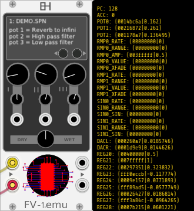

# FV-1.emu
The [Spin Semi FV-1 DSP chip](http://www.spinsemi.com/products.html) emulating [VCV Rack](https://github.com/VCVRack) Module.

#### Installation | Download
* Get it from [VCV Plugin Manager](https://vcvrack.com/plugins.html#EH)

#### HowTo | Knowledge

* [DSP Basics](http://www.spinsemi.com/knowledge_base/dsp_basics.html)
* [Audio Effects](http://www.spinsemi.com/knowledge_base/effects.html)
* [Programming the FV-1](http://www.spinsemi.com/knowledge_base/pgm_quick.html)
* [The FV-1 Architecture overview](http://www.spinsemi.com/knowledge_base/arch.html)
* [FV-1 Instructions and Syntax](http://www.spinsemi.com/knowledge_base/inst_syntax.html)
* [Coding Examples](http://www.spinsemi.com/knowledge_base/coding_examples.html)
* [Algorithm development Support Forum](http://www.spinsemi.com/forum/viewforum.php?f=4)
#### PDF | Datasheets
* [CheatSheet](http://www.spinsemi.com/knowledge_base/cheat.html)
* [SPINAsmUserManual.pdf](http://www.spinsemi.com/Products/datasheets/spn1001-dev/SPINAsmUserManual.pdf)
* [AN-0001.pdf](http://www.spinsemi.com/Products/appnotes/spn1001/AN-0001.pdf)

#### Effects | DSP Programs
* [OEM Programs by Keith Barr](http://www.spinsemi.com/get_spn.php?spn=oem1.zip&prodnum=SPN1001)
* [Free DSP Programs](http://www.spinsemi.com/programs.php)

