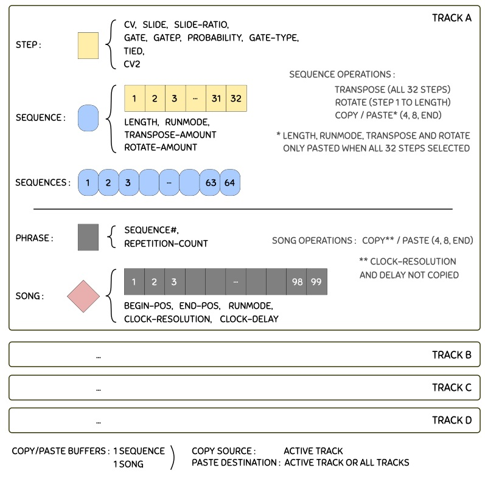
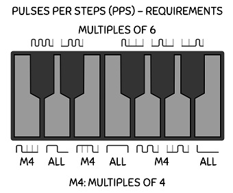

Modules for [VCV Rack](https://vcvrack.com), available in the [plugin manager](https://vcvrack.com/plugins.html).

Version 0.6.16

[//]: # (!!!!!UPDATE VERSION NUMBER IN MAKEFILE ALSO!!!!!   120% Zoom for jpgs)


# Modules <a id="modules"></a>

Each module is available in light (Classic) or dark (Dark-valor) panels, selectable by right-clicking the module in Rack.

* [Tact/Tact1](#tact): Touch-like controller modules with variable CV outputs and rates of change.

* [TwelveKey](#twelve-key): Chainable one-octave keyboard controller.

* [Clocked](#clocked): Chainable clock module with swing, clock delay and pulse width control.

* [Foundry](#foundry): 4-track phrase sequencer with 32 steps per sequence, 64 sequences per track, 99 phrases per song/track.

* [PhraseSeq16](#phrase-seq-16): 16-phrase sequencer with 16 steps per sequence, with onboard keyboard and CV input for easy sequence programming.

* [PhraseSeq32](#phrase-seq-32): 32-phrase sequencer with 32 steps per sequence, with onboard keyboard and CV input for easy sequence programming (can be configured as 1x32 or 2x16).

* [GateSeq64](#gate-seq-64): 32-phrase gate sequencer with 64 steps per sequence and per-step gate probability control, perfect for adding controlled randomness to your drum patterns (can be configured as 1x64, 2x32 or 4x16).

* [BigButtonSeq](#big-button-seq): 6-channel 64-step trigger sequencer based on the infamous BigButton by Look Mum No Computer.

* [BigButtonSeq2](#big-button-seq2): 6-channel 128-step gate and CV sequencer based on BigButtonSeq.

* [Semi-Modular Synth 16](#sms-16): Internally pre-patched all in one synthesizer for quickly getting sounds and learning the basics of modular synthesis.

* [WriteSeq32/64](#write-seq): Multi-channel 32/64-step sequencers with CV inputs for easy sequence programming.

* Four-View: Small chord viewer module that shows the note names of up to 4 CVs. Sharp or flat notation is selectable in the right-click menu.

Details about each module are given in the links above, and a feature comparison table is given below for the sequencers. Feedback and bug reports (and [donations!](https://www.paypal.me/marcboule)) are always appreciated!

| \-		      			| WriteSeq32/64 	| PhraseSeq16	| PhraseSeq32	| GateSeq64			| Foundry		| BigButton1/2 	|
| ----------- 				| ----------- 		| ----------- 	| ----------- 	| ----------- 		| -----------	| -----------  	|
| Configuration\*			| 3x32 / 4x64		| 1x16 			| 1x32, 2x16 	| 4x16, 2x32, 1x64  | 4x32 			| 6x64 / 6x128	|
| Clock inputs				| 1 / 2				| 1				| 1				| 1					| 4				| 1				|
| Outputs					| CV+gate			| CV+2gates		| CV+2gates		| Gate				| CV+gate+ CV2	| Gate / Gate+CV|
| Patterns per track/ channel| 1        		| 16 			| 32			| 32				| 64			| 2 (banks)		|
| Song length				| - 				| 16			| 32 			| 64 				| 99			| - 			|
| Seq. repetitions			| - 				| FWD 2,3,4		| FWD 2,3,4		| FWD 2,3,4			| 0 to 99		| -				|
| Gate types				| 2 				| 12			| 12			| 8					| 12			| 1				|
| Probability				| No 				| Global		| Global		| Per step			| Per step		| No			|
| Slide						| No 				| Global		| Global		| -					| Per step		| - / No		|
| Sequence play				| - 				| Yes			| Yes			| Yes				| No			| -				|
| Edit while runnning		| Gates only 		| Yes 			| Yes			| Yes				| Yes			| Yes			|

\* Configuration is noted as follows: Channels/Tracks x Sequence-Length. The distinction between channels and tracks relates to clock inputs: when channles are separately clockable they are referred to as tracks.

## Known issues <a id="known-issues"></a>
For sequencers and clock modules, it is advisable to have a core audio module added to your patch and assigned to a sound device in order for the timing and response delays in the user interface to be of the proper duration. This is a [known artifact](https://github.com/VCVRack/Rack/issues/919) in VCV Rack.


## License

Based on code from the Fundamental and Audible Instruments plugins by Andrew Belt and graphics from the Component Library by Wes Milholen. See ./LICENSE.txt for all licenses (and ./res/fonts/ for font licenses).


## Acknowledgements
Impromptu Modular is not a single-person endeavor:

* Thanks to **Nigel Sixsmith** for the many fruitful discussions and numerous design improvements that were suggested for the modules, for the concept proposal and development of GateSeq64, for detailed testing/bug-reports, and also for the in-depth presentation of PhraseSeq16 and TwelveKey in Talking Rackheads [epsiode 8](https://www.youtube.com/watch?v=KOpo2oUPTjg), as well as PhraseSeq32 and GateSeq64 in [episode 10](https://www.youtube.com/watch?v=bjqWwTKqERQ) and Clocked in [episode 12](https://www.youtube.com/watch?v=ymfOh1yCzU4). 
* Thanks to **Xavier Belmont** for suggesting improvements to the modules, for testing/bug-reports, for the concept design of the SMS16 module, and for graciously providing the dark panels of all modules. 
* Thanks to **Steve Baker** for many fruitful discussions regarding the BPM Detection method in Clocked, testing and improvements that were suggested for that module. 
* Thanks to **Omri Cohen** for testing and suggesting improvements to the modules, and for the [PhraseSeq16/32 tutorial](https://www.youtube.com/watch?v=N8_rMNzsS7w), the [advanced gate mode tutorial](https://www.youtube.com/watch?v=B2w0_h5oN6M) and the [Foundry tutorial](https://www.youtube.com/watch?v=56w_mlNlKE4).
* Thanks to **Latif Karoumi** for [testing](https://www.youtube.com/watch?v=5PZCXvWlFZM) and suggesting improvement to the modules, particularly the advanced gate modes in the GateSeq64 and PhraseSeq sequencers.
* Thanks also to **Pyer (Pierre Collard)**, **Alfredo Santamaria**, **Nay Seven**, **Alberto Zamora**, **Clément Foulc**, **Espen Storø**, **Wouter Spekkink**, **Jakub Mudrák**, **Georg Carlson**, **Jean-Sébastien Monzani**, **John Melcher**, **Paul Piko**, **Joop van der Linden** for suggesting improvements to the modules, bug reports and testing.


## General Concepts <a id="general-concepts"></a>

Many Impromptu Modular sequencers feature a CV input for entering notes into the sequencers in a quick and natural manner when using, for example:

* a physical midi keyboard connected via the Core MIDI-1 module in VCV Rack;
* a software midi keyboard (such as [VMPK](http://vmpk.sourceforge.net/)) via the Core MIDI-1 module (a software midi loopback app may be required); 
* a keyboard within VCV Rack such as the Autodafe keyboard or [TwelveKey](#twelve-key). 

Such sequencers have two main inputs that allow the capturing of (pitch) CVs, as follows: The edge sensitive **WRITE** control voltage is used to trigger the writing of the voltage on the **CV IN** jack into the CV of the current step. Any voltage between -10V and 10V is supported, and when a sequencer displays notes via a built-in keyboard or a display showing note letters, non-quantized CVs are mapped to the closest note but are correctly stored in the sequencer.

When **AUTOSTEP** is activated, the sequencer automatically advances one step right on each write. For example, to automatically capture the notes played on a keyboard, send the midi keyboard's CV into the sequencer's CV IN, and send the keyboard's gate signal into the sequencer's Write input. With Autostep activated, each key-press will be automatically entered in sequence. An alternative way of automatically stepping the sequencer each time a note is entered is to send the gate signal of the keyboard to both the write and ">" inputs. 

A concept related to AutoStep, which is called "**AutoSeq** when writing via CV inputs", can be used to automatically change to the next sequence when a write operation reaches the end of the current sequence. Without this, the writing operations loop back over to the start of the current sequence (default behavior). This can be used to turn the sequencers into very long stepped CV recorders (1024 steps in the case of PhraseSeq32 and GateSeq64).

Many modules feature an **Expansion panel** to provide additional CV inputs for the module (available in the right-click menu of the module). The expansion panel is added to the right side of the module, thus it is advisable to first make room in your Rack for this (4 to 7 HP depending on the module).

Many sequencers feature a **SEQ# CV input**, which can be used to select the active sequence for editing; in all PhraseSeq and GateSeq sequencers it can even be used to externally control the playing order of the sequences. Three different modes are available for this input in the right click menu under **Seq CV in**. 
* 0-10V: a 0 to 10V input is proportionally mapped to the 1 to N sequence numbers (1 to 16 in the case of PhraseSeq16, for example);
* C4-D5# (or other note intervals): CV levels corresponding to the note voltages are mapped to the 1 to N sequence numbers;
* Trig-Incr: the input is trigger sensitive and moves to the next sequence number every time a trigger is received. A reset can be used to move back to the first sequence.

All edge sensitive inputs have a threshold of 1V. In all sequencers, the duration of the gates normally corresponds to the pulse width (high time) of the clock signal. When sequencers offer an **Advanced gate mode** and this mode is activated, the pulse width of the clock signal has no effect on the sequencer.

In all sequencers, clicking **Randomize** in the right-click menu of the module will only serve to randomize the content (CVs, gates, slides, etc., as applicable) of the current sequence. For sequencers with a song mode, no song content is randomized when in SONG mode.

### On resets, clocks and run states... <a id="clk_rst_run"></a>

Impromptu sequencers implement two particular mechanisms related to resets and clocks in order to ensure proper reset behavior and correctly played first steps/beats.

* **1ms-clock-ignore-on-reset**: A rising edge on the reset input repositions all play heads to the start of their respective sequences or songs. However, when such a reset also resets the clock module, a rising edge can sometimes be produced on the sequencer's clock input. Because of routing delays though other modules (ex.: separate clock dividers), this clock edge can sometimes arrive at the sequencer *after* the reset signal. In order to not count this clock as a true clock event, which would effectively skip the first step in the sequencer, all incoming [clock edges are ignored during 1ms after the reset](https://vcvrack.com/manual/VoltageStandards.html#timing) was received. The clock is also ignored during 1ms when the module is initialized or powered up (which is treated as an implicit reset).

* **Gate retriggering on reset**: When resetting a running clock that is driving a sequencer, particularly when the pulse width of the clock is non-negligible in length, pressing the reset while the gate and clock are high can lead to a continuous gate, thereby not triggering a sound module (drum module for example). Therefore, all gate outputs are forced low during 1ms after the reset edge, to ensure any trigger-sensitive targets are effectively triggered. In order for this to function properly, the incoming clock pulses should be at least 2ms in duration.

The following recommendations should also be followed in order to ensure proper reset and first-step behavior in Impromptu sequencers. In all cases, it is assumed that a reset cable is connected from Clocked to the sequencer.

* No run cables are used.

	1. (**GOOD**) Clocked and sequencers are set to their default settings. In this configuration, the sequencer's run state is not controlled by Clocked. When the clock is stopped, the gates may remain active causing ADSR-VCA chains to remain active, thereby continually playing a tone. In these cases, the sequencer's run state can be manually turned off; it should then be manually turned back on again *before* the clock is to be restarted. In patches with mutliple clock rates, restarting the sequencer *after* the clock may cause the different parts to become unsynchronized.
	
	1. (**GOOD**) Default settings, but activating the option "*Reset when run is turned off*" in Clocked. This causes both the clock generator and the sequencer to restart when stopping the clock, and is equivalent to stopping the clock and manually pressing reset in case (i). 
	
	1. (**BAD**) Default settings, but deactivating the option "*Outputs reset high when not running*" in Clocked. In this setup, with both the clock and sequencer running, the following operations will result in a missed first step: stop the clock, press reset, start the clock again.

* Run cables are used.

	4. (**BEST**) Clocked and sequencers are set to their default settings. In this configuration, stopping the clock using its run button pauses the playback of both the clock and the sequencer, and restarts it from the same point when the clock is started again. When stopped (paused), no gates remain active, and in certain sequencers the monitoring of entered notes can even be provided. 

	1. (**GOOD**) Default settings, but activating the option "*Reset when run is turned off*" in Clocked. This causes both the clock generator and the sequencer to restart when stopping the clock, and is equivalent to stopping the clock and manually pressing reset in case (iv). 

	1. (**BAD**) Default settings, but activating the option "*Reset on Run*" in the sequencer. Although this may seem ok at first glance, the following operations may result in a shortened first step: with everything running, stop the clock, then start it again. The reason for this inconsistent behavior is because the clock has paused while the sequencer has not paused, thus when the sequencer restarts on its first step, it may not play for the expected duration.
	
	1. **Note**: The option "*Outputs reset high when not running*" in Clocked can also be deactivated without consequence when run cables are used, and should be set for optimal use of the other modules in the patch.

When Clocked is used with sequential switches or other non-Impromptu sequencers, and first steps are not playing correctly upon reset, the following guidelines may be of help:

1. The option "*Outputs reset high when not running*" should ideally be in its defaut state in Clocked (i.e. checked), but ultimately the user should experiment with both settings to see which one works best for the setup and modules being used.

1. The reset and clock signals coming from Clocked should preferrably not pass through any other module and should be connected directly to the sequencer or sequential switch.

1. If a clock (or reset) signal must be routed through another module (for example, a separate clock divider, a switch, etc.), both the reset and clock signals should be similarly delayed (possibly by using utility modules), such that a reset does not arrive at the sequencer or switch *before* any clock edges that are produced as a result of that reset event.

Further information for developpers is available in a short summary of the [code structure used in Impromptu sequencers](README_SeqCode.md), relating to clocks, resets and run states.


## Tact/Tact1 <a id="tact"></a>


A touch-like controller module with dual CV outputs and variable rate of change. With a fast rate of change, the controller offers an alternative to knobs for setting parameters, and with a slow rate of change it can be used to automate in-out fades, for example, freeing the performer to work elsewhere in the patch. Tact-1 is a single channel version of Tact with fewer options. 

* **RATE**: Transition time of CV, from 0 (instant transition) to 4 seconds per volt. Transition time is the inverse of slew rate. This knob can be turned in real time to affect the rate of change of a transition already under way. An option in the right click menu called **Rate knob x3** can be used for even slower transitions, in which case a full transition from 0 to 10V (or vice versa) will last 2 minutes instead of 40 seconds in the default setting.

* **LINK**: Both controls are linked and will be synchronized to the same value. Useful when controlling stereo sounds. Only the left side controls have an effect in this mode; however, both touch pads can be used to change the single CV (which is sent to both output jacks).

* **STORE**: memorize the current CV to later be recalled when a trigger is sent to the Recall CV input.

* **RECALL and ARROW Inputs**: CV inputs for setting the CVs to their stored/top/bottom position. These are edge sensitive inputs with a 1V threshold.

* **SLIDE**: determines whether the recall operation is instantaneous or transitions according to the current rate knob's setting.

* **ATTV**: Typical attenuverter to set the maximum CV range output by the module. At full right, a 0 to 10V CV is produced, and at full left, a 0 to -10V CV is produced.

* **EXP**: Produces an exponential slide (top position) instead of a linear slide (bottom position).

* **EOC**:  EOC is an end-of-cycle trigger that is emitted when a slide is completed (to signal its end); this can be used for more automation, for example, by triggering or chaining other operations when a fade in/out completes. The EOC triggers upon the end of any slide event, whether the end position is at the top/bottom or not.

A 0V CV is initially stored in the CV memory and the slide switches are in the off position, thereby allowing the Recall to act as a **Reset** by default. An option in the right-click menu, called **Level sensitive arrow CV inputs** can be activated to control the duration of the transition. When this option is turned on, the input must be continuously held above 1V for the transition to progress, and when the input goes back under 1V, the transition will stop at its current level.

([Back to module list](#modules))


## TwelveKey <a id="twelve-key"></a>


A chainable keyboard controller for your virtual Rack. When multiple TwelveKey modules are connected in series from left to right, only the octave of the left-most module needs to be set, all other down-chain modules' octaves are set automatically. The aggregate output is that of the right-most module. To set up a chain of TwelveKey modules, simply connect the three outputs on the right side of a module to the three inputs of the next module beside it (typically to the right).

For a brief tutorial on setting up the controller, please see [this segment](https://www.youtube.com/watch?v=KOpo2oUPTjg&t=874s) or [this segment](https://www.youtube.com/watch?v=hbxlK07PQAI&t=4614s) of Nigel Sixsmith's Talking Rackheads series.

* **CV**: The CV output from the keyboard or its CV input, depending on which key was last pressed, i.e. an up-chain key (from a module to the left) or a key of the given keyboard module.

* **GATE**: Gate output signal from the keyboard or its gate input.

* **OCTAVE -/+**: Buttons to set the base octave of the module. These buttons have no effect when a cable is connected to the OCT input.

* **OCT**: CV input to set the base octave of the module. The voltage range is 0V (octave 0) to 9V (octave 9). Non-integer voltages or voltages outside this range are floored/clamped. 

* **OCT+1**: CV output for setting the voltage of the next down-chain TwelveKey module. This corresponds to the base octave of the current module incremented by 1V.

([Back to module list](#modules))


## Clocked <a id="clocked"></a>


A chainable master clock module with swing, clock delay and pulse width controls, with master BPM from 30 to 300 and all mult/div ratios up to 16, including 1.5 and 2.5, and with additional ratios spanning prime numbers and powers of two up to 64. The clock can produce waveforms with adjustable pulse widths for use with envelope generators or sequencers that use the clock pulse to produce their gate signals. The clock can also be synchronized to an external clock source.

For a tutorial on Clocked regarding chaining, clock multiplications and divisions, swing and clock delay features, please see Nigel Sixsmith's [Talking Rackheads episode 12](https://www.youtube.com/watch?v=ymfOh1yCzU4). It is also recommended to see the section above on [resets, clocks and run states](#clk_rst_run).

* **RESET**: Restart all channels' time keeping. The clock outputs are held high when a stopped clock is reset (instead of low). This is required so that when controlling sequential switches (which are assumed to also be reset on the same event) will not get triggered and moved to step 2 when the clock is started again. The right-click menu option "*Outputs reset high when not running*" can be turned off, to allow the outputs to be held low when resetting a stopped clock.

* **RUN**: The run button functions as a pause/play button. When turned off, the clock outputs are held in their current states. When run is turned on again, the clock engine resumes where it left off, such that when using multiple outputs with different clock ratios, a large patch with multiple sequencers playing at different speeds will not be out of sync. This effectively makes for proper pausing behavior in multi-track and multi-clock patches. For sequencers with RUN inputs, it may be beneficial to connect the RUN output of Clocked to the RUN input of the sequencers. In the case of the Phrase Sequencers (see below), this will ensure gates are not kept high while stopped, and will also allow feedback of the notes that are entered when programming a stopped sequencer.

* **SWING**: The clock swing is loosely based on the [Roger Linn method](https://www.attackmagazine.com/technique/passing-notes/daw-drum-machine-swing/). For a given clock, all even clocks pulses are offset forward/backward according to the setting of the Swing knob; at 0 (top) everything is aligned as normal. At -100, all even clocks would coincide with odd clocks preceding them, and at +100 they would line up with subsequent clock pulses). The knob thus goes from -99 to +99 such that no beats are missed. In its extreme positions, the timing is tighter than 99 percent of a clock period (the 99 value is only a rough indication). 

* **PW**: Pulse width is dependent on the swing knob, but can be used to control the general duration of the clock pulse. In the worst-case knob settings, the pulse width is guaranteed to be a minimum of 1ms, with a minimum 1ms pause between pulses. 

* **DELAY**: Clock delay can be used to offset a sub-clock relative to the master clock, and is expressed in fractions of the clock period of the given sub-clock. Using the right click menu, the delay value can also be displayed in notes where one quarter note corresponds to a clock period. 

In place of a detailed explanation of these three main controls, it is recommended to connect the outputs to a scope or a logic analyzer, such as the Fundamental Scope (pictured above) or the SubmarineFree LA-108, to observe the effects of the different controls.

PW and Swing CV inputs are aso avaialable in the **expansion panel** (see right-click menu). These inputs are 0-10V signals, and when using these inputs, the corresponding knobs should be in their default position. When this is the case, no-swing and normal-pulse-width correspond to 5V on the CV inputs.


### External synchronization <a id="clocked-sync"></a>

By default, the clock's BPM input is level sensitive and follows [Rack standards for BPM CVs](https://vcvrack.com/manual/VoltageStandards.html#pitch-and-frequencies). Synchronizing Clocked to an external clock signal can be done by selecting a mode other than "CV" with the MODE buttons located below the BPM input jack. The possible synchronization settings are: P2, P4, P8, P12, P16, P24, where the number indicates the number of pulses per step of the external clock source.

When using a chain of Clocked modules, all modules must have the same mode setting. The LED next to the mode buttons will light up when the sync mode is enabled; however, when no cable is connected to the BPM input jack, a regular clock is produced according to the BPM knob's value.

When using external clock synchronization, Clocked syncs itself to the incoming clock pulse, and will stay synchronized, as opposed to just calculating the BPM from the external source. This means that it will not drift (or that it will drift in time with the incoming pulses if they drift), and it should stay perfectly synchronized over time; it also allows for latency compensation. Here are a few points to keep in mind when using clock synchronization.

1. Clocked can not be manually turned on in clock sync mode, it will autostart on the first pulse it receives.
1. Clocked will automatically stop when the pulses stop, but in order to detect this, it take a small amount of time. To stop the clock quickly, you can simply send a pulse to the RUN CV input, and if the clock is running, it will turn off.
1. The external clock must be capable of sending clocks at a minimum of 2 pulses per quarter note (PPQN) and should not have any swing.
1. Clocked does not perform any interval averaging and tries to sync to the incomming pulses as rapidly as possible. This may sometimes cause the BPM setting to fluctuate widely before reaching a perfect lock.
1. For low clock BPMs, synchronization may take some time if the external clock changes markedly from the last BPM it was synchronized to. Making gradual tempo changes is always recommended, and increasing the PPQN setting may also help. An other method consists in priming Clocked with is correct BPM first, to let it learn the new BPM, so that all further runs at that BPM will sync perfectly.
1. When sending a clock from a DAW or other source external to Clocked in Rack, best results are obtained when sending this clock through an audio channel as opposed to midi clocks.

([Back to module list](#modules))


## Foundry <a id="foundry"></a>


A 4-track phrase sequencer with 32 steps per sequence, 64 sequences per track, 99 phrases per song. A phrase is a sequence number and a repetition count. Each track holds one song and can be independently clocked and edited. The SEL and ALL buttons allow the selection and simultaneous editing across multiple steps and tracks respectively. 

CVs can be entered into the sequencer via CV inputs when using an external keyboard controller or via the built-in controls on the module itself. When notes are entered with the **right mouse button** on the built-in keyboard (instead of the left mouse button), the sequencer automatically moves to the next step. Holding ctrl while right-clicking also copies the current note (or gate-type) over when moving to the next step. Right-click defaults are also supported on the three main knobs.

Although this sequencer has many similarities to [PhraseSeq32](#phrase-seq-32), many differences must also be kept in mind for existing PhraseSeq users. Notably:

* No editing can be performed when attached is turned on.
* Song phrases are now in a separate display/knob instead of in the steps at the top left.
* The Copy/Paste ALL setting was replaced with an CUST setting (more details are given below).
* The sequence repetitions are no longer in the run modes (formerly FW2, FW3, FW4), but are instead specified in the phrases. This allows the repetition of any run mode up to 99 times.
* Only the song can be run. For example, when attached is turned off and the main switch is in SEQ mode, changing the sequence number will have no effect on the running sequencer; instead, it allows the selected sequence to be edited while the song is playing, a feature not offered in PhraseSeqs. Thus, the SEQ CV input (now located in the expansion panel) is only used for editing sequences (in other PhraseSeqs, the SEQ CV input can be used to actually control the playing of the phrases). The song BEG and END positions can be easily moved around in order to play only the part of the song being working on (even a single sequence if desired).


the inability to directly play a sequence, it was a design choice given the multitrack nature of Foundry. If we were to have the previous behavior of the PhraseSeq, when we would move to a give sequence in one track, the same sequence number may not even be defined in another track, so those would play garbage. There is only one edit head that controls editing on all trakcs. I tried it with four editing heads, and it was hell! Also, , but agree that it might take some getting used to. It was also a personal design criteria of mine that this sequencer allow the editing of individual sequences while the song is playing, something not possible in the PS series.

The following block diagram shows how the different sequencer elements are hierarchically related.
 


Here are some further details on the different functions of the sequencer. For an overview of the sequencer's functionality, please see Omri Cohen's [Foundry tutorial](https://www.youtube.com/watch?v=56w_mlNlKE4). It is also recommended to see the section above on [resets, clocks and run states](#clk_rst_run).

* **CLK**: The clock inputs for each track. When the input is unconnected in a track, the track automatically uses the clock source of the preceding track (indicated by arrows above each clock input). It is good practice that the clock for track A be connected as directly as possible to the main clock source, and when a chained series of clock modules are used, the clock input of track A should be connected to a clock output from the *first* clock module of the chain.

* **SEQ / SONG**: This is the main mode switch for the sequencer. It is used to determine whether a sequence or the song are to be edited (attach must be turned off for editing, see next item).

* **ATTACH**: The sequencer has one edit head, and four run heads. When attach is turned on, the sequencer is in view-only mode, and no editing can be performed. In this case the effect of the SEQ/SONG switch is limited to either hiding or showing the phrase number. When attach is turned off, editing becomes possible. In this case the edit head can be positioned to at any given step/sequence/phrase for editing, according to the SEQ/SONG switch.

* **BEG / END**: The BEG and END buttons set the endpoints of the song, such that when working on a long song, we can more easily work on a section of it, which is more practical.

* **LEN / REP**: Sequence lengths can be set by clicking the button when in SEQ mode, and then either turning the main knob below the main display or clicking the desired length directly in the steps (the second method is the recommended way since the display will automatically return to its default state afterwards). The sequences can have different lengths. When in Song mode, the same button instead serves to set the number of repetitions of the current phrase. To skip the give phrase when the song plays, set the number of repetitions to 0.

* **RUN MODE**: Used to set the run mode of the selected sequence when in SEQ mode, or of the song (selected track) when in SONG mode. The modes are: FWD (forward), REV (reverse), PPG (ping-pong, also called forward-reverse), PEN (pendulum, like PPG but the first and last steps are not played twice), BRN (Brownian random), RND (random), TKA (use the step/phrase run positions of track A). The TKA mode can be used to ensure chord notes are randomized together across tracks. The TKA mode reverts to FWD in track A, since it is undefined.

* **CV2**: These secondary CV outputs can be used for accents, velocities or any other auxiliary control voltage. CV2 is a 0V to 10V control voltage by defaut, but by checking the Bipolar option in the right-click menu, they can be -5V to 5V outputs. Three modes are available in the right click menu:
    * Volts: direct control of the CV2 output voltages, with 0.05V resolution;
    * 0-127: midi-like numbered levels, mapped to 0V to 10V or -5V to 5V on the CV2 outputs;
    * Notes: same as 0-127 but rescales the CV2 outputs to semitones.
	
* **CV IN and CV2 IN**: These inputs can be used for programming the sequencer from external sources. The CV2 IN inputs are located in the expansion panel (see right click menu). When a trigger is sent to the WRITE input, the states of the inputs is written into the sequencer at the current step/sequence. Unconnected inputs are ignored. When planning a project, all sequences that are to hold chords must have the same sequence numbers across all tracks. AUTOSTEP automatically moves to the next step in the sequence when a write occurs. The TRACK CV input has been extended to allow ALL tracks to be selected, and unless all tracks are selected, writing via CV inputs is now only done in the currently selected track. A button located in the expansion panel allows the writing of CV IN only, CV2 IN only, or both.

* **CLK RES / DELAY**: Settings for clock resolution and clock delay. The clock resolution allows [advanced gate types](#advanced-gate-mode-ps) to be used, and functions similarly to that found in the PhraseSequencers. In Foundry however, when using only one clock source, clock resolution also effectively functions as a clock divider, provided the gate types required are compatible with the multiple chosen; clock resolution can thus be used to slow down the clocks of certain tracks compared to others. Clock delay is used to delay the clock of a track by a given number of clock pulses (0 to 99). When clock resolutions above 1 are used, the clock can be delayed by fractions of a step. For example, with a clock resolution of 4 and a clock delay of 1, a track will be delayed by one quarter of a step. A reset must be performed in order for a new clock delay value to take effect. Clock delay should not be used in conjuction with the TKA run modes in sequences and songs.

* **SEL and ALL**:  The SEL and ALL buttons allow the selection and simultaneous editing across multiple steps and tracks respectively; however, since there is currently no undo feature in the sequencer; patches should be saved often. The number of steps selected by SEL is specified using the 4/8/CUST switch. Selecting an arbitrary range of steps for editing can be done using the custom (CUST) setting, and functions similarly to custom step selection in copy-paste (described next).

* **COPY-PASTE**: Copies part or all of a sequence to the sequence buffer when the main switch is set to SEQ, or copies part or all of a song to the song buffer when the main switch is set to SONG. In order to copy paste all steps/phrases, the cursor must be in the first step/phrase. Since there is only one sequence buffer, there is currently no way to copy sequence #1 of all tracks to sequence #2 of their respective tracks, for example, in a single operation. This must be repeated manually in each track. The number of steps/phrases that are to be copied is determined by the 4/8/CUST switch. 
	* 4/8: automatically copies 4/8 steps (in SEQ mode) or 4/8 phrases (in SONG mode) starting in the current edit position. 
	* CUST: copies a user-selectable (custom) number of steps/phrases. The CUST setting, when properly used, allows insert and delete to be performed more efficiently. Using the CUST setting with SEL allows an arbitrary range of steps to be selected: when SEL is turned on, clicking steps to the right of the current position will reduce the length of the selection to the number of steps desired; when SEL is not used, CUST automatically selects all steps from the edit head (cursor) to the end. In SONG mode, copying a custom range of phrases is also a two step process: first move to the start phrase, then press COPY once, and then move to the end phrase and press COPY once more to copy that range of phrases.

* **SEQ# input**: This CV input is located in the expansion panel. Please see [general concepts](#general-concepts) above.

* **TRACK input**: This CV input is located in the expansion panel, and allows the selection of the track number. A 0-10V CV is linearly mapped to the following track selections: A, B, C, D, A\*, B\*, C\*, D\*, where the star denotes that any change will be done across all tracks. This applies to the CV and CV2 inputs as well (see "CV IN and CV2 IN" above).

* **TIED**: Please see [PhraseSeq16](#phrase-seq-16)'s section on [tied steps](#tied-ps).

* **GATEP**: Activates the use of probability in the current step's gate. The probability controls the chance that when the gate is active it is actually sent to its output jack. The probability for the step can be set using the CV2/p/r section (press the button below CV2 until the yellow LED below the "p" lights up). The probability ranges from 0 to 1, where 0 is no chance to fire and 1 is 100% chance to fire (the default is 0.5 for 50% chance). 

* **SLIDE**: Portamento between CVs of successive steps. Slide can be activated for a given step using the slide button. The slide duration of the step can be set using the CV2/p/r section (press the button below CV2 until the red LED below the "r" lights up). The slide ratio can range from 0 to 1, where 1 is the duration of a clock period (the default is 0.1). 

* **TRAN/ROT**: Transpose all 32 steps, or rotate steps 1 to LENGTH. These numbers are stored in the sequencer for each sequence. Resetting the values of a given sequence can be done by copy-pasting an unused sequence (sequence 64 typically, for example) over into the current sequence. If all 64 sequences were used, simply press paste after closing and restarting Rack as an uninitialized sequence is automatically held in the sequence copy-paste buffer upon power-up.

* **AUTOSTEP**: For information on this switch, please see [general concepts](#general-concepts) above.

* **Reset on Run**, **AutoSeq**: For information on these settings in the right-click menu, please see [general concepts](#general-concepts) above.

([Back to module list](#modules))


## PhraseSeq16 <a id="phrase-seq-16"></a>


A 16 phrase sequencer module, where each phrase is an index into a set of 16 sequences of 16 steps (maximum). CVs can be entered via a CV input when using an external keyboard controller or via the built-in keyboard on the module itself. If you need a 256-step sequence in a single module, this is the sequencer for you! With two separate gates per step, gate 2 is perfect for using as an accent if desired. When notes are entered with the **right mouse button** instead of the left button, the sequencer automatically moves to the next step. Holding ctrl while right clicking also copies the current note/gate-type over when moving to the next step.

The following block diagram shows how sequences and phrases relate to each other to create a song. In the diagram, a 12-bar blues pattern is created by setting the song length to 12, the step lengths to 8 (not visible in the figure), and then creating 4 sequences. The 12 phrases are indexes into the 4 sequences that were created. (Not sure anyone plays blues in a modular synth, but it shows the idea at least!)


Familiarity with the Fundamental SEQ-3 sequencer is recommended, as some operating principles are similar in both sequencers. It is also recommended to see the section above on [resets, clocks and run states](#clk_rst_run). For an in depth review of the sequencer's capabilities, please see Nigel Sixsmith's [Talking Rackheads episode 8](https://www.youtube.com/watch?v=KOpo2oUPTjg) or Omri Cohen's [PhraseSeq tutorial](https://www.youtube.com/watch?v=N8_rMNzsS7w).

* **SEQ / SONG**: This is the main switch that controls the two major modes of the sequencer. Seq mode allows the currently selected sequence to be played/edited. In this mode, all controls are available (run mode, transpose, rotate, copy-paste, gates, slide, octave, notes) and the content of a sequence can be modified even when the sequencer is running. Song mode allows the creation of a series of sequence numbers (called phrases). In this mode, the run mode and length of the song and the sequence index numbers themselves can be modified (whether the sequence is running or not); some of the other aforementioned controls are unavailable and the actual contents of the sequences cannot be modified.

* **SEQ STEP / SONG PHRASE**: Step/phrase selection is done by directly clicking the 16 steps at the top. When the **Reset on run** option is not active (in the right-click menu), and song mode is selected, after stopping the sequencer it will restart playing the song where it left off when it was stopped, provided no steps were clicked. When stopped, clicking a step will position the run head at that point and the song will restart at that point when turned on again. 

* **ATTACH**: Allows the edit head to follow the run head (Attach on). The position of the edit head is shown with a red LED, and when running, the position of the run head is shown with a green LED. When in Seq mode, the actual content of the step corresponding to the edit head position (i.e. note, oct, gates, slide) can be modified in real time, whether the sequencer is running or not. The edit head automatically follows the run head when Attach is on, or can manually positioned by clicking the steps when Attach is off.

* **LEN / MODE**: Sequence lengths can be set by clicking the button once, and then either turning the main knob below the main display or clicking the desired length directly in the steps (the second method is the recommended way since the display will automatically return to its default state afterwards). The sequences can have different lengths. When in Song mode, the length setting can be used to set the number of phrases in the song (the default is 4). The run modes can be set by clicking the LEN/MODE button twice starting from its initial state. Mode controls the run mode of both the sequences and the song (one setting for each sequence and one for the song). The modes are: FWD (forward), REV (reverse), PPG (ping-pong, also called forward-reverse), PEN (pendulum, like PPG but the first and last steps are not played twice), BRN (Brownian random), RND (random), FW2 (forward, play twice), FW3 (play three times) and FW4 (four times). For example, setting the run mode to FWD for sequences and to RND for the song will play the phrases that are part of a song randomly, and the probability of a given phrase playing is proportional to the number of times it appears in the song. For sequences, the FW2, FW3 and FW4 modes can be used to repeat sequences more easily without consuming additional phrases in the song. These last three modes are not available for the song's run mode however. Holding the MODE button for **two seconds** allows the selection of the clock resolution, and is the mechanism used to enable the [advanced gate mode](#advanced-gate-mode-ps).

* **SEQ#**: In Seq mode, the main display and knob determine which sequence is being edited/played. In Song mode, they determine the sequence number for the currently selected phrase in the 16 LEDs at the top of the module. 

* **SEQ# CV input**:  Please see [general concepts](#general-concepts) above.

* **TRAN / ROT**: Transpose/Rotate the currently selected sequence up-down/left-right by a given number of semitones/steps. The main knob is used to set the transposition/rotation amount. Only available in Seq mode. Transposition numbers are stored in the sequencer; however, rotation numbers are not.

* **COPY-PASTE**: Copy and paste sequences or parts of sequences in Seq mode, or parts of the song when in Song mode. When ALL is selected, the run mode and length are also copied for a sequence. More advanced copy-paste shortcuts are also available when clicking copy in Seq mode and then paste in Song mode (and vice versa); see [cross paste](#cross-paste-ps) below.

* **OCT and Keyboard**: When in Seq mode, the octave LED buttons and the keyboard can be used to set the notes of a sequence. The octave and keyboard LEDs are used for display purposes only in Song mode with attach on.

* **GATE 1, 2 buttons and probability knob**: The gate buttons control whether the gate of a current step is active or not. The probability knob controls the chance that when gate 1 is active it is actually sent to its output jack. In the leftmost position, no gates are output, and in the rightmost position, gates are output exactly as stored in a sequence. This knob's probability setting is not memorized for each step and applies to the sequencer as a whole.

* **SLIDE**: Portamento between CVs of successive steps. Slide can be activated for a given step using the slide button. The slide duration can be set using the slide knob. The slide duration can range from 0 to T seconds, where T is the duration of a clock period (the default is 10% of T). This knob's setting is not memorized for each step and applies to the sequencer as a whole.

* **TIED STEP**: See [tied steps](#tied-ps) below.

* **WRITE**, **CV IN**, **AUTOSTEP**: For information on these inputs/switches, please see [general concepts](#general-concepts) above.

* **Reset on Run**, **AutoSeq**: For information on these settings in the right-click menu, please see [general concepts](#general-concepts) above.


### Tied steps<a id="tied-ps"></a>

When CVs are intended to be held across subsequent steps, this button can be used to tie the CV of the current step to the CV of the previous step. When tied, any changes to the CV of the head note will be propagated to all consecutive contiguous tied notes automatically. Two different *gate 1 behaviors* are available and can be toggled in the right-click menu. All gate types are adjusted automatically when tying and untying notes, and in all cases, manual inspection of the gate types will reveal what has been done in the sequencer. Any change to this option will only take effect on subsequent edits in the sequencer.

* When the **Held tied notes** option is activated (default behavior), then the gate 1 output is sustained (held high) across a series of contiguous tied steps, and the initial gate type of the head note will be propagated to last step's gate type.

* When the **Held tied notes** option is deactivated, only the head note has a gate and the remainder of any following contiguous gates are turned off, but can be manually turned back on if desired.
	
The following diagram shows the effect of the Held tied notes option.	
	
```
Held tied notes activated
CV:    D# D# D# D# 
Gate:  -- -- -- -_
Step:  s1 s2 s3 s4

Held tied notes deactivated
CV:    D# D# D# D# 
Gate:  -_ __ __ __
Step:  s1 s2 s3 s4
```

Extra CV inputs are also available in the **expansion panel** (can be activated in the right-click menu). Only the bottom-most input is level sensitive, the other four are trigger inputs. The expansion CV inputs can only be used in Seq mode.


### Advanced gate mode<a id="advanced-gate-mode-ps"></a>

For a video introduction to the advanced gate mode, please see Omri Cohen's [advanced gate mode tutorial](https://www.youtube.com/watch?v=B2w0_h5oN6M). As of version 0.6.12, the keyboard mode (used to enter notes vs gate types) can be set explicitly using the two small LED buttons above the keyboard, instead of the temporary editing time that was activated when a gate was turned on (previous versions). 

Holding the MODE button for **two seconds** allows the selection of the clock resolution, in number of pulses per step (PPS). When set to a value greater than 1, which unlocks the advanced gate mode, the sequencer will skip this many clock pulses before advancing to the next step. In such cases, a multiplied clock must be supplied in order to keep the same tempo in the sequencer. In advanced gate mode, the pulse width of the clock is not used and has no effect on the gates.

In the advanced gate mode, the Gate1 and Gate2 lights will be a different color, and the onboard keyboard can be used not only to enter note values, but also to select one of the 12 types of gates for a given step. To enter gates, make sure the LED button located right above the E and F keys is activated (pressing this button multiple times alternates between gate 1 and gate 2); to enter notes again, press the LED button above the B key. Advanced gates can only be set while in Seq mode. Here are the different gate types and their minimum PPS requirements.



All PPS settings will work for the full gate (the F key) as well as triggers (the B key). Triggers are 10ms in duration. A full gate remains high during the entire step, and if the next step's gate is active, then the gate continues without interruption into that next step. When PPS requirements are not met, the sequencer will not allow invalid gate types to be entered on the keyboard. For example, if PPS is set to 6, then the 75% gate (the E key) can not be selected. Selecting a PPS value of 12 or 24 will ensure that all gate types can be used (i.e. that all PPS requirements are met irrespective of the gate type chosen).


### Cross paste<a id="cross-paste-ps"></a>

Pressing the copy button in one mode (Seq or Song), and then the paste button in the opposite mode would normally result in an invalid operation. In these cases, depending on the state of the copy-paste switch (4/8/ALL), called *type* below, the following shortcuts are performed: 

```
Cross paste from Song to Seq  
Type   Display   Result
4      RCV       Randomizes the CVs (pitches) of the current sequence
8      RG1       Randomizes all gates #1 of the current sequence
ALL    TG1       Toggles all gates #1 of the current sequence

Cross paste from Seq to Song
Type   Display   Result
4      INC       Sets the song phrases to the sequences 1, 2, ..., 16
8      RPH       Sets the song phrases to random sequences
ALL    CLR       Clears (initializes) the song (all 1s)
```

In cross paste operation, the copied content is actually irrelevant and unused.

([Back to module list](#modules))


## PhraseSeq32 <a id="phrase-seq-32"></a>


A 32 phrase sequencer module, where each phrase is an index into a set of 32 sequences of 32 steps (maximum). This sequencer is very similar to [PhraseSeq16](#phrase-seq-16), but with an added configuration switch allowing the sequencer to output dual 16 step sequences (**2x16**) instead of single 32 step sequences (**1x32**). When the 1x32 configuration is selected, only the top channel outputs are used (labeled A), and when the 2x16 configuration is selected, the top row is sent to the top outputs (CV and gates A), whereas the bottom row of steps is sent to the bottom outputs (CV and gates B). 

When running in the 2x16 configuration and in Seq mode, the following details become relevant:

1. When **ATTACH** is activated, clicking any step in a given row will attach the edit head to that row. 
1. Only the row corresponding to the edit head's position will be transposed or rotated when the **TRAN/ROT** button is used.
1. One extra run mode is also available for sequences, called **RN2**. This run mode allows the two sequences to play randomly but separately, as opposed to RND which plays them randomly but together.

Other than these characteristics, the rest of PhraseSeq32's functionality is identical to that of PhraseSeq16.

([Back to module list](#modules))


## GateSeq64 <a id="gate-seq-64"></a>


A 64 step gate sequencer with the ability to define **probabilities** for each step. A configuration switch allows the sequencer to output quad 16 step sequences, dual 32 step sequences or single 64 step sequences. To see the sequencer in action and for a tutorial on how it works, please see [this segment](https://www.youtube.com/watch?v=bjqWwTKqERQ&t=6111s) of Nigel Sixsmith's Talking Rackheads episode 10. It is also recommended to see the section above on [resets, clocks and run states](#clk_rst_run). 

When running in the 4x16 configuration, each of the four rows is sent to the four **GATE** output jacks (jacks 1 to 4, with jack 1 being the top-most jack). In the 2x32 configuration, jacks 1 and 3 are used, and in the 1x64 configuration, only jack 1 is used (top-most jack). When activating a given step by clicking it once, it will turn green showing that the step is on. Clicking the _"p"_ button turns it yellow, and the main display shows the probability associated with this step. While the probability remains shown, the probability can be adjusted with the main knob, in 0.02 increments, between 0 and 1. When a yellow step is selected, clicking the _"p"_ button again will turn it off. Clicking steps with the **right mouse button** can also be used to more quiclkly turn steps off.

This sequencer also features the song mode found in [PhraseSeq16](#phrase-seq-16); 64 phrases can be defined, where a phrase is an index into a set of 32 sequences. In GateSeq64, the song steps are shown using the entire grid of steps, overlapped with the actual sequence progression in lighter shades in the lights. The actual content of the sequences is shown in white in Song mode. Here are a few more points regarding Song mode:

1. When not running, the phrase cursor position is shown with a red light. 
1. When running, the current phrase being played is shown with a full green light and the position in the sequence is shown with a pale green light.
1. When running, clicking a phrase turns it red (the currently playing one in green is still visible), and the knob can be used to change the sequence mapped to that phrase for live song editing. After 4 seconds of inactivity, the editing disappears.

Copy-pasting ALL also copies the run mode and length of a given sequence, along with gate states and probabilities, whereas only gates and probabilities are copied when 4 or ROW are selected. More advanced copy-paste shortcuts are also available when clicking copy in Seq mode and then paste in Song mode (and vice versa); see [cross paste](#cross-paste-gs) below. The **SEQ** CV input, sequence length selection, run **MODES**, **Reset on Run** and **AutoSeq** features are all identical to those found in PhraseSeq16.

Although no **Write** capabilities appear in the main part of the module, automatically storing patterns into the sequencer can be performed using the CV inputs in the **expansion panel** (see right-click menu). The cursor is stepped forward on each write, and can be repositioned at the first step by pressing the reset button, or at an arbitrary step by simply clicking that given step. When the cursor is not flashing, clicking any step will make it appear. The Write-gate (full circle) and Write-empty (empty circle) inputs (2nd and 3rd from the bottom) can be used to enter on-gates and off-gates in succession with separate external triggers (buttons). The bottom-most input is used to move the cursor to the left, whereas the Write input at the top can be used to move the cursor to the right when Gate In and Prob are unconnected. When either of these inputs is connected, the values are used to program the sequencer gates and probabilities. The extra CV inputs only have an effect in Seq mode.


### Advanced gate mode<a id="advanced-gate-mode-gs"></a>

The advanced gate mode in GateSeq64 has some similarities to the one available in the PhraseSeq16/32 sequencers, and is covered in Omri Cohen's [advanced gate mode tutorial](https://www.youtube.com/watch?v=B2w0_h5oN6M). As of version 0.6.12, each gate type has its own LED button, instead of the two cursor type buttons that were used in the previous versions.

Holding the MODE button for **two seconds** allows the selection of the clock resolution, in number of pulses per step (PPS). When set to a value greater than 1, which unlocks the advanced gate mode, the sequencer will skip this many clock pulses before advancing to the next step. In such cases, a multiplied clock must be supplied in order to keep the same tempo in the sequencer. In advanced gate mode, the pulse width of the clock is not used and has no effect on the gates.

The PPS be a multiple of 4 for the first three gate types, while the PPS be a multiple of 6 for the last five gate types. A chosen gate type not meeting its required pulse rate will have a red LED beside it to indicate this (normally it is green). When a gate type is red, the sequencer will still emit a (possibly empty) gate pattern for that step, but with no guarantee that it will match the type that was selected. All gate types can be used when selecting a PPS value of 12 or 24.


### Cross paste<a id="cross-paste-gs"></a>

Pressing the copy button in one mode (Seq or Song), and then the paste button in the opposite mode would normally result in an invalid operation. In these cases, depending on the state of the copy-paste switch (4/8/ALL), called *type* below, the following shortcuts are performed: 

```
Cross paste from Song to Seq  
Type   Display   Result
4      RGT       Randomizes the gate states of the current sequence
8      RPR       Randomizes the probability states and values of the current sequence
ALL    CLR       Clears (initializes) the current sequence

Cross paste from Seq to Song
Type   Display   Result
4      INC       Sets the song phrases to the sequences 1, 2, ..., 64
8      RPH       Sets the song phrases to random sequences
ALL    CLR       Clears (initializes) the song (all 1s)
```

In cross paste operation, the copied content is actually irrelevant and unused.

([Back to module list](#modules))


## BigButtonSeq <a id="big-button-seq"></a>


A 6-channel 64-step trigger sequencer based on the infamous [BigButton](https://www.youtube.com/watch?v=6ArDGcUqiWM) by [Look Mum No Computer](https://www.lookmumnocomputer.com/projects/#/big-button/). Although this is not a direct port of the original module, the intent was to keep it as faithful as possible, while adding a few minor extras such as CV inputs and displays. For two-handed control of the knobs and buttons, connect the sequencer to a midi control surface using Rack's Core MIDI-CC module. To see more examples of what the sequencer can do, please see the following videos:

* [BigButton VCV Rack Module test](https://www.youtube.com/watch?v=uN2l2t5SCyE) by Alberto Zamora;

* [Small impromptu VCV jam](https://www.youtube.com/watch?v=wm5JEH5spbc) by Matt Tyas;

* [lookmom](https://www.youtube.com/watch?v=Jcdok8jJ5hQ) and [bbs](https://www.youtube.com/watch?v=j5ejGH5XgFg) by Clément Foulc.

Here are a few more details on some of the uses of the buttons. The sequencer uses has two types of pushbuttons, namely trigger buttons and state buttons. Trigger buttons react to the change in a button's state as it's being pressed, while state buttons react to the position of the push-button, i.e. pressed or not pressed.

* **CHAN**: channel select button (can be changed in real time). All state buttons will have an effect immediately when the channel is changed.

* **BIG BUTTON**: trigger-type button to set the trigger at the current step in the current channel and bank. When pressing on a step that has a trigger, nothing is done.

* **CLK**: clock input. The sequencer is always running. To stop it, the clock has to be stopped.

* **RND**: a 0 to 1 probability knob, used to randomly change the state of a step. The probability is applied to the trigger of the next step being reached at every clock pulse, in the current channel. A 0 value means no change, 1 means the state of the trigger will be toggled (useful for inverting a pattern). The RND CV input's voltage is divided by 10 and added to the value of the knob to yield the actual probability. For example, with the knob at full right, the CV input has no effect, and with the knob at full left, a value of 10V on the CV input gives a probability of 1.  

* **CLEAR**: state-type button that turns of all triggers of the current channel.

* **BANK**: trigger-type button that toggles between two possible banks (i.e. sequences) for the current channel.

* **DEL**: state-type button that clears the trigger at the current step. The button can be held to clear multiple steps.

* **FILL**: state-type button that plays continuous triggers for the given channel as long as the button is kept pressed. The fill starts on the next clock edge and continues on each clock edge while the button is held. 

* **MEM**: when the MEM button is turned off, the fills are not written to memory and are only for playback. 

* **SNAP**: the BIG and DEL buttons are quantized to the nearest beat when the SNAP button is active. Without quantization, button presses always affect the current beat (step) of the sequencer. With quantized buttons, they affect the nearest beat. For example, without quantization, pressing the big button 1 microsecond before a beat would normally record the beat in the current step and not the next one that is about to occur (which is actually the closest). For the quantization to work properly however, the sequencer must receive a stable clock of at least 30 BPM. When this is not the case, the option is automatically disabled internally. When manually advancing the clock to program a sequence in non real-time, for example, the option has no effect and the current step is always the target of a button press.

([Back to module list](#modules))


## BigButtonSeq2 <a id="big-button-seq2"></a>


A 6-channel 128-step gate and CV sequencer based on [BigButtonSeq](#big-button-seq). Familiarity with that sequencer is recommended since only the differences are discussed here. With its long sequence lengths and CV capabilities, the sequencer can be used as a CV recorder by setting the FILL CV input to a constant voltage greater than 1V and activating the MEM button, thereby sampling the CV IN port at every clock edge and committing its voltage to memory.

* **BIG BUTTON**: as well as turning on the gate of the current step, the CV IN port is also read and stored as the CV value of the given step.

* **GATE**: the clock signal's pulse is used as the gate out pulse, contrary to BigButtonSeq that emits 1 millisecond triggers.

* **CLEAR**: trigger-type button that turns of all gates and reinitialized all CVs to C4 for the current channel, contrary to BigButtonSeq where CLEAR is a state-type button.

* **S&H**: sample and hold the CV outputs using the gate outputs as the triggers for the sampling.

([Back to module list](#modules))


## Semi-Modular Synth 16<a id="sms-16"></a>


An all-in-one pre-patched semi-modular synthesizer. Based on the [Fundamental](https://vcvrack.com/Fundamental.html) modules by VCV and the [PhraseSeq16](#phrase-seq-16) sequencer (above). Please see those links for the respective manuals, while keeping in mind that not all features of the Fundamental modules were implemented in Semi-Modular Synth 16 (SMS16). A typical signal flow is internally patched by default, as shown by the interconnecting lines on the faceplate of the module. The majority of the internal connections can be overridden by any cables patched into those related jacks. 

This module can be used for quickly exploring ideas for sequences, and is also useful for those new to modular synthesis before learning how to fill the screen with cables! Also note that the final output is the low-pass output of the VCF module (Voltage Controlled Filter). The VCF is purposely placed after the VCA (Voltage Controlled Amplifier) in the signal flow, such that the VCF can be lightly saturated, producing a thicker sound, especially when the Drive knob is turned up.

Extra controls were also added to the LFO (Low Frequency Oscillator), namely **GAIN** and **OFFSET**, to be able to easily modulate any other on-board parameter. With maximum gain, the LFO produces a 10V peak-to-peak signal (i.e. 5V amplitude). The offset knob is automatically scaled such that with maximum (minimum) offset, the signal's maximum (minimum) voltage is +10V (-10V). That is, with the gain set to 0, the offset value spans -10V to +10V, and with the gain set to maximum, the offset value spans -5V to +5V. Also note that the clock LFO is automatically reset on every reset event in the sequencer.

The SMS16 also features the advanced gate mode of the PhraseSeq16. When changing the clock resolution in the SMS16, the onboard clock will automatically be scaled accordingly and no multiplied clock needs to be supplied to the module.

([Back to module list](#modules))


## WriteSeq32/64 <a id="write-seq"></a>


WriteSeq32 is a three-channel 32-step writable sequencer module. Although the display shows note names (ex. C4#, D5, etc.), any voltage within the -10V to 10V range can be stored/played in the sequencer, whether it is used as a pitch CV or not, and whether it is quantized or not. Gate states and window selection can be done by pressing the 8 and 4 LED buttons respectively located below and above the main display. Familiarity with the Fundamental SEQ-3 sequencer is recommended, as some operating principles are similar in both sequencers.

* **WINDOW**: LED buttons to display/select the active 8-step window within the 32 step sequence (hence four windows). No effect on channels 1 to 3 when the sequencer is running.

* **QUANTIZE**: Quantizes the CV IN input to a regular 12 semi-tone equal temperament scale. Since this quantizes the CV IN, some channels can have quantized CVs while others do not. 

* **Main display**: Shows the note names for the 8 steps corresponding to the active window. When a stored pitch CV has not been quantized, the display shows the closest such note name. For example, 0.03 Volts is shown as C4, whereas 0.05 Volts is shown as C4 sharp or D4 flat. Octaves above 9 or below 0 are shown with a top bar and an underscore respectively.

* **GATES**: LED buttons to show/modify the gates for the 8 steps in the current window. Gates can be toggled whether the sequencer is running or not. Two gate modes are available: standard gates (that use the clock pulse) and full gates (that hold the note across the whole step and ties it to the next one). Clicking a gate alternates between the following three states: normal, held (full), off. Right-clicking the gate can also be used to turn it off without having to cycling through the choices.

* **CHAN**: Selects the channel that is to be displayed/edited in the top part of the module. Even though this is a three-channel sequencer, a fourth channel is available for staging a sequence while the sequencer is running (or not).

* **COPY-PASTE**: Copy and paste the CVs and gates of a channel into another channel. All 32 steps are copied irrespective of the Steps knob setting.

* **PASTE SYNC**: Determines whether to paste in real time (RT), on the next clock (CLK), or at the start of the next sequence (SEQ). Pending pastes are shown by a red LED beside CLK/SEQ, and if the selected channel changes, the paste operation will be performed in the channel that was selected when the paste button was pressed. Paste operations into the staging area (channel 4) are always done in real time, irrespective of the state of the paste sync switch. To cancel a pending paste, press the Copy button again.

* **<, >**: These buttons step the sequencer one step left or right. No effect on channels 1 to 3 when the sequencer is running. A rising edge on the </> control voltage inputs triggered at 1V will also step the sequencer left/right by one step.

* **RUN 1-3**: Start/stop the sequencer. When running, the sequencer responds to rising edges of the clock input and will step all channels except the staging area (channel 4). A rising edge on the RUN input will also toggle the run mode.

* **GATE IN**: Allows the gate of the current step/channel to also be written during a Write (see [General Concepts](#general-concepts) above). If no wire is connected, the input is ignored and the currently stored gate is unaffected. No effect on channels 1 to 3 when the sequencer is running.

* **STEPS**: Sets the number of steps for all the sequences (sequence length).

* **MONITOR**: This switch determines which CV will be routed to the currently selected channel's CV output when the sequencer is not running. When the switch is in the right-most position, the CV stored in the sequencer at that step is output; in the left-most position, the CV applied to the CV IN jack is output.

WriteSeq64 is a four-channel 64-step writable sequencer module. This sequencer is more versatile than WriteSeq32 since each channel has its own step position and maximum number of steps (length). Sequences of different lengths can be created, with different starting points. A fifth channel is available to be used as a staging area. 

WriteSeq64 has dual clock inputs, where each controls a pair of channels. When no wire is connected to **CLOCK 3,4**, the **CLOCK 1,2** signal is used internally as the clock for channels 3 and 4. 

Ideas: The first part of the famous [Piano Phase](https://en.wikipedia.org/wiki/Piano_Phase) piece by Steve Reich can be easily programmed into WriteSeq64 by entering the twelve notes into channel 1 with a keyboard, setting STEPS to 12, copy-pasting channel 1 into channel 3, and then driving each clock input with two LFOs that have slightly different frequencies. Exercise left to the reader!

([Back to module list](#modules))


# Hall of Fame <a id="hall-of-fame"></a>

Here are a few videos featuring Impromptu Modular, which I find particularly very inspiring and interesting (listed in no particular order). Many talented Rackheads have made tracks using Impromptu modules, and this list could in fact be quite long. I have no formal criteria for why a track ends up in the list or doesn't. 

* **Nigel Sixsmith**, [Talking Rackheads episode 8, PS16 MegaPatch Play Out](https://www.youtube.com/watch?v=KOpo2oUPTjg&t=5504s)

* **Omri Cohen**, [Arvo Pärt - Spiegel im Spiegel VCV Rack Cover](https://www.youtube.com/watch?v=6bm4LjRYDmI)

* **Omri Cohen**, [Neutron & VCV Rack - Clapping Music](https://www.youtube.com/watch?v=VMbZfQDpgcA)

* **Isaac Hu**, [In the Hall of the Mountain King](https://www.youtube.com/watch?v=fxYc0H5i6HA)

* **John Melcher**, [Steppes](https://www.youtube.com/watch?v=ruo4s_Hyhrw)

