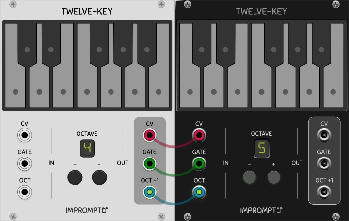
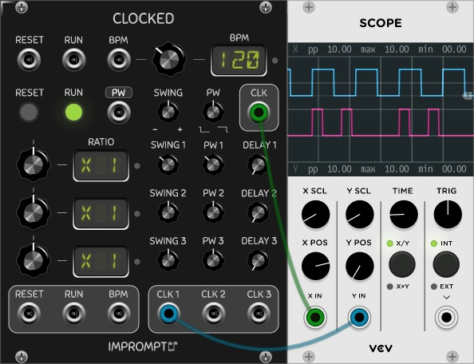
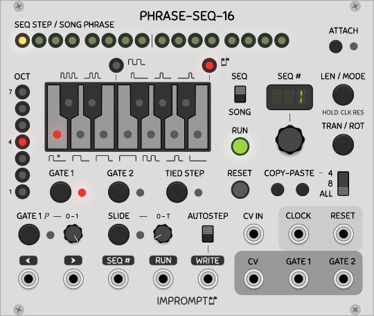
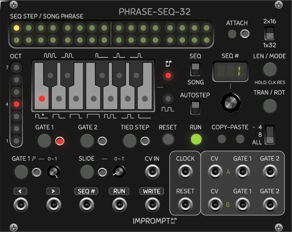
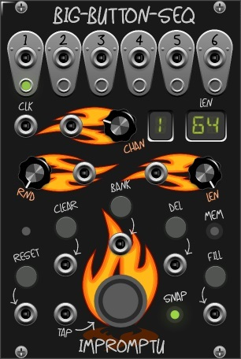
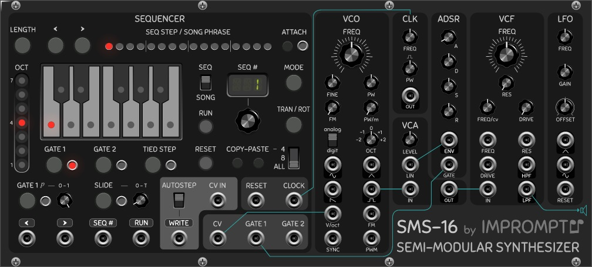
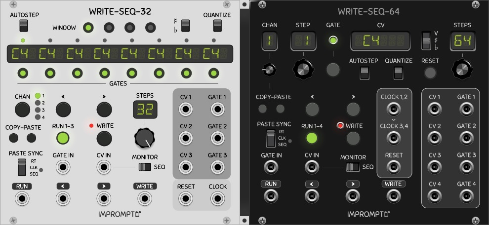

Modules for [VCV Rack](https://vcvrack.com), available in the [plugin manager](https://vcvrack.com/plugins.html).

Version 0.6.9

[//]: # (!!!!!UPDATE VERSION NUMBER IN MAKEFILE ALSO!!!!!   120% Zoom for jpgs)

## License

Based on code from the Fundamental and Audible Instruments plugins by Andrew Belt and graphics from the Component Library by Wes Milholen. See ./LICENSE.txt for all licenses (and ./res/fonts/ for font licenses).

## Acknowledgements
Impromptu Modular is not a single-person endeavor:

* Thanks to **Nigel Sixsmith** for the many fruitful discussions and numerous design improvements that were suggested for the modules, for the concept proposal and development of GateSeq64, for detailed testing/bug-reports, and also for the in-depth presentation of PhraseSeq16 and TwelveKey in Talking Rackheads [epsiode 8](https://www.youtube.com/watch?v=KOpo2oUPTjg), as well as PhraseSeq32 and GateSeq64 in [episode 10](https://www.youtube.com/watch?v=bjqWwTKqERQ) and Clocked in [episode 12](https://www.youtube.com/watch?v=ymfOh1yCzU4). 
* Thanks to **Xavier Belmont** for suggesting improvements to the modules, for testing/bug-reports, for the concept design of the SMS16 module and the blank panel, and for graciously providing the dark panels of all modules. 
* Thanks to **Steve Baker** for many fruitful discussions regarding the BPM Detection method in Clocked, testing and improvements that were suggested for that module. 
* Thanks to **Omri Cohen** for testing and suggesting improvements to the modules, and for the [PhraseSeq16/32 tutorial](https://www.youtube.com/watch?v=N8_rMNzsS7w).
* Thanks also to **Latif Fital**, **Alfredo Santamaria**, **Nay Seven**, **Alberto Zamora**, **Clément Foulc** for suggesting improvements to the modules, bug reports and testing.

# Modules 

Each module is available in light (Classic) or dark (Dark-valor) panels, selectable by right-clicking the module in Rack.

* [Tact](#tact): A touch-like controller module with dual CV outputs and variable rate of change.

* [TwelveKey](#twelve-key): Chainable one-octave keyboard controller.

* [Clocked](#clocked): Chainable clock module with swing, clock delay and pulse width control.

* [PhraseSeq16](#phrase-seq-16): 16-phrase sequencer with 16 steps per sequence, with onboard keyboard and CV input for easy sequence programming.

* [PhraseSeq32](#phrase-seq-32): 32-phrase sequencer with 32 steps per sequence, with onboard keyboard and CV input for easy sequence programming (can be configured as 1x32 or 2x16).

* [GateSeq64](#gate-seq-64): 16-phrase gate sequencer with 64 steps per sequence and per-step gate probability control, perfect for adding controlled randomness to your drum patterns (can be configured as 1x64, 2x32 or 4x16).

* [BigButtonSeq](#big-button-seq): 6-channel 64-step trigger sequencer based on the infamous BigButton by Look Mum No Computer.

* [Semi-Modular Synth 16](#sms-16): Internally pre-patched all in one synthesizer for quickly getting sounds and learning the basics of modular synthesis.

* [WriteSeq32/64](#write-seq): Multi-channel 32/64-step sequencers with CV inputs for easy sequence programming.

Details about each module are given below. Feedback and bug reports (and [donations!](https://www.paypal.me/marcboule)) are always appreciated!

## Known issues 
For sequencers and clock modules, it is advisable to have a core audio module added to your patch and assigned to a sound card in order for the timing and response delays in the user interface to be of the proper duration. This is a [known artifact](https://github.com/VCVRack/Rack/issues/919) in VCV Rack.

## General Concepts 

Many Impromptu Modular sequencers feature a CV input for entering notes into the sequencers in a quick and natural manner when using, for example:

* a physical midi keyboard connected via the Core MIDI-1 module in VCV Rack;
* a software midi keyboard (such as [VMPK](http://vmpk.sourceforge.net/)) via the Core MIDI-1 module (a software midi loopback app may be required); 
* a keyboard within VCV Rack such as the Autodafe keyboard or [TwelveKey](#twelve-key). 

Such sequencers have two main inputs that allow the capturing of (pitch) CVs, as follows: The edge sensitive **WRITE** control voltage is used to trigger the writing of the voltage on the **CV IN** jack into the CV of the current step. Any voltage between -10V and 10V is supported, and when a sequencer displays notes via a built-in keyboard or a display showing note letters, non-quantized CVs are mapped to the closest note but are correctly stored in the sequencer.

When **AUTOSTEP** is activated, the sequencer automatically advances one step right on each write. For example, to automatically capture the notes played on a keyboard, send the midi keyboard's CV into the sequencer's CV IN, and send the keyboard's gate signal into the sequencer's Write input. With Autostep activated, each key-press will be automatically entered in sequence. An alternative way of automatically stepping the sequencer each time a note is entered is to send the gate signal of the keyboard to both the write and ">" inputs. 

When Run is activated, the sequencer automatically starts playing in the current step position, provided **RESET on RUN** is not checked in the right-click menu; sequencers will start at the first step when this option is checked. All edge sensitive inputs have a threshold of 1V. In all sequencers, the duration of the gates corresponds to the pulse width (high time) of the clock signal.

Many modules feature an **Expansion panel** to provide additional CV inputs for the module (available in the right-click menu of the module). An extra 4 HP is added on the right side of the module, thus it is advisable to first make room in your Rack for this.

## Tact 

A touch-like controller module with dual CV outputs and variable rate of change. With a fast rate of change, the controller offers an alternative to knobs for modulating parameters, and with a slow rate of change it can be used to automate in-out fades, for example, freeing the performer to work elsewhere in the patch.

**RATE**: Transition time of CV, from 0 (instant transition) to 4 seconds per volt. Transition time is the inverse of slew rate. This knob can be turned in real time to affect the rate of change of a transition already under way.

**LINK**: Both controls are linked and will be synchronized to the same value. Useful when controlling stereo sounds. Only the left side controls have an effect in this mode; however, both touch pads can be used to change the single CV (which is sent to both output jacks).

**STORE**: memorize the current CV to later be recalled when a trigger is sent to the Recall CV input.

**RECALL and ARROW Inputs**: CV inputs for setting the CVs to their stored/top/bottom position. These are edge sensitive inputs with a 1V threshold.

**SLIDE**: determines whether the recall operation is instantaneous or transitions according to the current rate knob's setting.

**ATTV**: Typical attenuverter to set the maximum CV range output by the module. At full right, a 0 to 10V CV is produced, and at full left, a 0 to -10V CV is produced.

**EXP**: Produces an exponential slide (top position) instead of a linear slide (bottom position).

**EOC**:  EOC is an end-of-cycle trigger that is emitted when a slide is completed (to signal its end); this can be used for more automation, for example, by triggering or chaining other operations when a fade in/out completes. The EOC triggers upon the end of any slide event, whether the end position is at the top/bottom or not.

A 0V CV is initially stored in the CV memory and the slide switches are in the off position, thereby allowing the Recall to act as a **Reset** by default. 

([Back to module list](#modules))

## TwelveKey 

A chainable keyboard controller for your virtual Rack. When multiple TwelveKey modules are connected in series from left to right, only the octave of the left-most module needs to be set, all other down-chain modules' octaves are set automatically. The aggregate output is that of the right-most module. To set up a chain of TwelveKey modules, simply connect the three outputs on the right side of a module to the three inputs of the next module beside it (typically to the right).

For a brief tutorial on setting up the controller, please see [this segment](https://www.youtube.com/watch?v=KOpo2oUPTjg&t=874s) or [this segment](https://www.youtube.com/watch?v=hbxlK07PQAI&t=4614s) of Nigel Sixsmith's Talking Rackheads series.

* **CV**: The CV output from the keyboard or its CV input, depending on which key was last pressed, i.e. an up-chain key (from a module to the left) or a key of the given keyboard module.

* **GATE**: Gate output signal from the keyboard or its gate input.

* **OCTAVE -/+**: Buttons to set the base octave of the module. These buttons have no effect when a cable is connected to the OCT input.

* **OCT**: CV input to set the base octave of the module. The voltage range is 0V (octave 0) to 9V (octave 9). Non-integer voltages or voltages outside this range are floored/clamped. 

* **OCT+1**: CV output for setting the voltage of the next down-chain TwelveKey module. This corresponds to the base octave of the current module incremented by 1V.

([Back to module list](#modules))

## Clocked 

A chainable master clock module with swing, clock delay and pulse width controls, with master BPM from 30 to 300 and all mult/div ratios up to 16, including 1.5 and 2.5, and with additional ratios spanning prime numbers and powers of two up to 64. The clock can produce waveforms with adjustable pulse widths for use with envelope generators or sequencers that use the clock pulse to produce their gate signals. The clock can also be synchronized to an external clock source.

For a tutorial on Clocked regarding chaining, clock multiplications and divisions, swing and clock delay features, please see Nigel Sixsmith's [Talking Rackheads episode 12](https://www.youtube.com/watch?v=ymfOh1yCzU4). 

**SWING**: The clock swing is loosely based on the [Roger Linn method](https://www.attackmagazine.com/technique/passing-notes/daw-drum-machine-swing/). For a given clock, all even clocks pulses are offset forward/backward according to the setting of the Swing knob; at 0 (top) everything is aligned as normal. At -100, all even clocks would coincide with odd clocks preceding them, and at +100 they would line up with subsequent clock pulses). The knob thus goes from -99 to +99 such that no beats are missed. In its extreme positions, the timing is tighter than 99 percent of a clock period (the 99 value is only a rough indication). 

**PW**: Pulse width is dependent on the swing knob, but can be used to control the general duration of the clock pulse. In the worst-case knob settings, the pulse width is guaranteed to be a minimum of 1ms, with a minimum 1ms pause between pulses. 

**DELAY**: Clock delay can be used to offset a sub-clock relative to the master clock, and is expressed in fractions of the clock period of the given sub-clock. Using the right click menu, the delay value can also be displayed in notes where one quarter note corresponds to a clock period. 

In place of a detailed explanation of these three main controls, it is recommended to connect the outputs to a scope or a logic analyzer, such as the Fundamental Scope (pictured above) or the SubmarineFree LA-108, to observe the effects of the different controls.

The PW and Swing **CV inputs** (some are available in the expansion panel) are 0-10V signals, and when using these inputs, the corresponding knobs should be in their default position. When this is the case, no-swing and normal-pulse-width correspond to 5V on the CV inputs.

### External synchronization 

By default, the clock's BPM input is level sensitive and follows [Rack standards for BPM CVs](https://vcvrack.com/manual/VoltageStandards.html#pitch-and-frequencies). For synchronizing Clocked an external clock signal, an optional setting is available in the right-click menu called "Use **BPM Detection** (as opposed to **BPM CV**)". When using this option in a chain of Clocked modules, all modules must have the option checked. The green LED to the right of the main BPM display will light up when this mode is enabled and a cable is connected to the BPM input. 

When using BPM detection, Clocked syncs itself to the incoming clock pulse, and will stay synchronized, as opposed to just calculating the BPM from the external source. This means that it will not drift (or that it will drift in time with the incoming pulses if they drift), and it should stay perfectly synchronized over time; it also allows for latency compensation. Here are a few points to keep in mind when using BPM Detection.

1. When using the BPM detection mode, Clocked can not be manually turned on, it will autostart on the first pulse it receives.
1. Clocked will automatically stop when the pulses stop, but in order to detect this, it take a small amount of time. To stop the clock quickly, you can simply send a pulse to the RUN CV input, and if the clock is running, it will turn off.
1. The external clock must be capable of sending clocks at a minumum of 4 pulses per quarter note (PPQN) and should not have any swing.
1. For low clock BPMs, synchronization may take some time if the external clock changes markedly from the last BPM it was synchronized to. Making gradual tempo changes is always recommended, and increasing the PPQN setting may also help. An other method is to first prime Clocked with is correct BPM to let it learn the new BPM, so that all further runs at that BPM will sync perfectly.

([Back to module list](#modules))

## PhraseSeq16 

A 16 phrase sequencer module, where each phrase is an index into a set of 16 sequences of 16 steps (maximum). CVs can be entered via a CV input when using an external keyboard controller or via the built-in keyboard on the module itself. If you need a 256-step sequence in a single module, this is the sequencer for you! With two separate gates per step, gate 2 is perfect for using as an accent if desired. When notes are entered with the *right mouse button* instead of the left button, the sequencer automatically moves to the next step.

The following block diagram shows how sequences and phrases relate to each other to create a song. In the diagram, a 12-bar blues pattern is created by setting the song length to 12, the step lengths to 8 (not visible in the figure), and then creating 4 sequences. The 12 phrases are indexes into the 4 sequences that were created. (Not sure anyone plays blues in a modular synth, but it shows the idea at least!)

Familiarity with the Fundamental SEQ-3 sequencer is recommended, as some operating principles are similar in both sequencers. For an in depth review of the sequencer's capabilities, please see Nigel Sixsmith's [Talking Rackheads episode 8](https://www.youtube.com/watch?v=KOpo2oUPTjg) or Omri Cohen's [PhraseSeq tutorial](https://www.youtube.com/watch?v=N8_rMNzsS7w).

* **SEQ/SONG**: This is the main switch that controls the two major modes of the sequencer. Seq mode allows the currently selected sequence to be played/edited. In this mode, all controls are available (run mode, transpose, rotate, copy-paste, gates, slide, octave, notes) and the content of a sequence can be modified even when the sequencer is running. Song mode allows the creation of a series of sequence numbers (called phrases). In this mode, only the run mode and length of the song and the sequence index numbers themselves can be modified (whether the sequence is running or not); the other aforementioned controls are unavailable and the actual contents of the sequences cannot be modified.

* **LENGTH**: When in Seq mode, this button allows the arrow buttons to select the length of sequences (number of steps), the default is 16. The sequences can have different lengths. When in Song mode, this button allows the arrow buttons to select the number of phrases in the song (the default is 4).

* **<, >**: These arrow buttons step the sequencer one step left or right. They have no effect when Attach is activated.

* **SEQ#**: In Seq mode, this number determines which sequence is being edited/played. In Song mode, this number determines the sequence index for the currently selected phrase; the selected phrase is shown in the 16 LEDs at the top of the module). When one of the Mode, Transpose, Rotate buttons is pressed, the display instead shows the current run mode (see Mode below), the amount of semi-tones to transpose, and the number of steps to rotate respectively. The SEQ# control voltage can be used to select the active sequence (Seq mode only), whereby a 0 to 10V input is proportionally mapped to the 1 to 16 sequence numbers. This can be used to externally control the playing order of the sequences.

* **ATTACH**: Allows the edit head to follow the run head (Attach on). The position of the edit head is shown with a red LED, and the position of the run head is shown with a green LED. When in Seq mode, the actual content of the step corresponding to the edit head position (i.e. note, oct, gates, slide) can be modified in real time whether the sequencer is running or not. The edit head automatically follows the run head when Attach is on, or can manually positioned by using the < and > buttons when Attach is off.

* **MODE**: This controls the run mode of the sequences and the song (one setting for each sequence and one for the song). The modes are: FWD (forward), REV (reverse), PPG (ping-pong, also called forward-reverse), BRN (Brownian random), RND (random), FW2 (forward, play twice), FW3 (play three times) and FW4 (four times). For example, setting the run mode to FWD for sequences and to RND for the song will play the phrases that are part of a song randomly, and the probability of a given phrase playing is proportional to the number of times it appears in the song. For sequences, the FW2, FW3 and FW4 modes can be used to repeat sequences more easily without consuming additional phrases in the song. These last three modes are not available for the song's run mode however.

* **TRAN/ROT**: Transpose/Rotate the currently selected sequence up-down/left-right by a given number of semi-tones/steps. The main knob is used to set the transposition/rotation amount. Only available in Seq mode.

* **COPY-PASTE**: Copy and paste the CVs, gates, slide and tied attributes of a part or all of a sequence into another sequence. When ALL is selected, run mode and length are also copied. Only available in Seq mode.

* **OCT and keyboard**: When in Seq mode, the octave LED buttons and the keyboard can be used to set the notes of a sequence. The octave and keyboard LEDs are used for display purposes only in Song mode with attach on.

* **GATE 1, 2 buttons and probability knob**: The gate buttons control whether the gate of a current step is active or not. The probability knob controls the chance that when gate 1 is active it is actually sent to its output jack. In the leftmost position, no gates are output, and in the rightmost position, gates are output exactly as stored in a sequence. This knob's probability setting is not memorized for each step and applies to the sequencer as a whole.

* **SLIDE**: Portamento between CVs of successive steps. Slide can be activated for a given step using the slide button. The slide duration can be set using the slide knob. The slide duration can range from 0 to T seconds, where T is the duration of a clock period (the default is 10% of T). This knob's setting is not memorized for each step and applies to the sequencer as a whole.

* **TIED STEP**: When CVs are intended to be held across subsequent steps, this button can be used to tie the CV of the previous step to the current step; when tied, the gates of the current step are automatically turned off. If the CV of the head note changes, all consecutive tied notes are updated automatically.

([Back to module list](#modules))

## PhraseSeq32 

A 32 phrase sequencer module, where each phrase is an index into a set of 32 sequences of 32 steps (maximum). This sequencer is very similar to [PhraseSeq16](#phrase-seq-16), but with an added configuration switch allowing the sequencer to output dual 16 step sequences (**2x16**) instead of single 32 step sequences (**1x32**).

Step/phrase selection is done by directly clicking the 32 steps at the top, instead of cursor buttons as used in PhraseSeq16. When running in the 2x16 configuration and in Seq mode, with **ATTACH** activated, simply click any step in a given row to attach the edit head to that row. 

Sequence lengths can be set clicking the **LEN/MODE** button once, and then either turning the main knob below the main display or clicking the desired length directly in the steps (the second method is the recommended way since the display will automatically return to its default state one second after the click of the step). The run modes can be set by clicking the LEN/MODE button twice starting from its initial state. The **TRAN/ROT** button can be used to transpose or rotate a sequence in Seq mode. When the 2x16 configuration is selected, only the row corresponding to the edit head's position is transposed or rotated.

When the 1x32 configuration is selected, only the top channel outputs are used (labeled A), and when the 2x16 configuration is selected, the top row is sent to the top outputs (CV and gates A), whereas the bottom row of steps is sent to the bottom outputs (CV and gates B). Other than these characteristics, the rest of PhraseSeq32's functionality is identical to that of PhraseSeq16.

([Back to module list](#modules))

## GateSeq64 

A 64 step gate sequencer with the ability to define **probabilities** for each step. A configuration switch allows the sequencer to output quad 16 step sequences, dual 32 step sequences or single 64 step sequences. To see the sequencer in action and for a tutorial on how it works, please see [this segment](https://www.youtube.com/watch?v=bjqWwTKqERQ&t=6111s) of Nigel Sixsmith's Talking Rackheads episode 10.

When activating a given step by clicking it once, it will turn green showing that the step is on. Clicking the step again turns it yellow, and the main display shows the probability associated with this step. While the probability remains shown, the probability can be adjusted with the main knob, in 0.02 increments, between 0 and 1. When a yellow step is selected, clicking it again will turn it off.

This sequencer also features the song mode found in [PhraseSeq16](#phrase-seq-16); 16 phrases can be defined, where a phrase is an index into a set of 16 sequences. In GateSeq64, the song steps are shown using the fourth row of steps, overlapped with the actual sequence progression in lighter shades in the lights. 

The **SEQ** CV input and run **MODES** are identical to those found in PhraseSeq16, and selecting sequence lengths is done in the same manner as described in [PhraseSeq32](#phrase-seq-32). Copy-pasting **ALL** also copies the run mode and length of a given sequence, along with gate states and probabilities, whereas only gates and probabilities are copied when **ROW** is selected.

When running in the 4x16 configuration, each of the four rows is sent to the four **GATE** output jacks (jacks 1 to 4, with jack 1 being the top-most jack). In the 2x32 configuration, jacks 1 and 3 are used, and in the 1x64 configuration, only jack 1 is used (top-most jack). The pulse width of the gates emitted corresponds to the pulse width of the clock.

Although no **write** capabilities appear in the main part of the module, automatically storing patterns into the sequencer can be performed using the CV inputs in the **expansion panel**. A write cursor is implicitly stepped forward on each write, and can be repositioned at the first step by pressing the reset button, or at an arbitrary step by simply clicking that given step.

([Back to module list](#modules))

## BigButtonSeq 

A 6-channel 64-step trigger sequencer based on the infamous [BigButton](https://www.youtube.com/watch?v=6ArDGcUqiWM) by [Look Mum No Computer](https://www.lookmumnocomputer.com/projects/#/big-button/). The sequencer is mainly for live uses. Although this is not a direct port of the original module, the intent was to keep it as faithful as possible, while adding a few minor extras such as CV inputs. For two-handed control of the knobs and buttons, connect the sequencer to a midi control surface using Rack's Core MIDI-CC module. To see more examples of what the sequencer can do, please see the following videos:

* [BigButton VCV Rack Module test](https://www.youtube.com/watch?v=uN2l2t5SCyE) by Alberto Zamora;

* [Small impromptu VCV jam](https://www.youtube.com/watch?v=wm5JEH5spbc) by Matt Tyas;

* [lookmom](https://www.youtube.com/watch?v=Jcdok8jJ5hQ) and [bbs](https://www.youtube.com/watch?v=j5ejGH5XgFg) by Clément Foulc.

Here are a few more details on some of the uses of the buttons. The sequencer uses has two types of pushbuttons, namely trigger buttons and state buttons. Trigger buttons react to the change in a button's state as it's being pressed, while state buttons react to the position of the push-button, i.e. pressed or not pressed.

**CHAN**: channel select button (can be changed in real time). All state buttons will have an effect immediately when the channel is changed.

**BIG BUTTON**: trigger-type button to set the trigger at the current step in the current channel (when pressing on a step that has a trigger, nothing is done).

**CLK**: clock input. The sequencer is always running. To stop it, the clock has to be stopped.

**RND**: a 0 to 1 probability knob, used to randomly change the state of a step. The probability is applied to the trigger of the next step being reached at every clock pulse, in the current channel. A 0 value means no change, 1 means the state of the trigger will be toggled (useful for inverting a pattern). The RND CV input's voltage is divided by 10 and added to the value of the knob to yield the actual probablility. For example, with the knob at full right, the CV input has no effet, and with the knob at full left, an value of 10V on the CV input gives a probability of 1.  

**CLEAR**: state-type button that turns of all triggers of the current channel.

**BANK**: trigger-type button that toggles between two possible banks (i.e. sequences) for the current channel.

**DEL**: state-type button that clears the trigger at the current step. The button can be held to clear multiple steps.

**FILL**: plays continuous triggers for the given channel as long as the button is kept pressed. By default the fills are not written to memory and are only for playback; however, an option to allow the writing of fill steps to memory is available in the right-click menu.

([Back to module list](#modules))

## Semi-Modular Synth 16

An all-in-one pre-patched semi-modular synthesizer. Based on the [Fundamental](https://vcvrack.com/Fundamental.html) modules by VCV and the [PhraseSeq16](#phrase-seq-16) sequencer (above). Please see those links for the respective manuals, while keeping in mind that not all features of the Fundamental modules were implemented in Semi-Modular Synth 16 (SMS16). A typical signal flow is internally patched by default, as shown by the interconnecting lines on the faceplate of the module. The majority of the internal connections can be overridden by any cables patched into those related jacks. 

This module can be used for quickly exploring ideas for sequences, and is also useful for those new to modular synthesis before learning how to fill the screen with cables! Also note that the final output is the low-pass output of the VCF module (Voltage Controlled Filter). The VCF is purposely placed after the VCA (Voltage Controlled Amplifier) in the signal flow, such that the VCF can be lightly saturated, producing a thicker sound, especially when the Drive knob is turned up.

Extra controls were also added to the LFO (Low Frequency Oscillator), namely **GAIN** and **OFFSET**, to be able to easily modulate any other on-board parameter. With maximum gain, the LFO produces a 10V peak-to-peak signal (i.e. 5V amplitude). The offset knob is automatically scaled such that with maximum (minimum) offset, the signal's maximum (minimum) voltage is +10V (-10V). That is, with the gain set to 0, the offset value spans -10V to +10V, and with the gain set to maximum, the offset value spans -5V to +5V. Also note that the clock LFO is automatically reset on every reset event in the sequencer.

([Back to module list](#modules))

## WriteSeq32/64 

WriteSeq32 is a three-channel 32-step writable sequencer module. Although the display shows note names (ex. C4#, D5, etc.), any voltage within the -10V to 10V range can be stored/played in the sequencer, whether it is used as a pitch CV or not, and whether it is quantized or not. Gate states and window selection can be done by pressing the 8 and 4 LED buttons respectively located below and above the main display. Familiarity with the Fundamental SEQ-3 sequencer is recommended, as some operating principles are similar in both sequencers.

* **WINDOW**: LED buttons to display/select the active 8-step window within the 32 step sequence (hence four windows). No effect on channels 1 to 3 when the sequencer is running.

* **QUANTIZE**: Quantizes the CV IN input to a regular 12 semi-tone equal temperament scale. Since this quantizes the CV IN, some channels can have quantized CVs while others do not. 

* **Main display**: Shows the note names for the 8 steps corresponding to the active window. When a stored pitch CV has not been quantized, the display shows the closest such note name. For example, 0.03 Volts is shown as C4, whereas 0.05 Volts is shown as C4 sharp or D4 flat. Octaves above 9 or below 0 are shown with a top bar and an underscore respectively.

* **GATES**: LED buttons to show/modify the gates for the 8 steps in the current window. Gates can be toggled whether the sequencer is running or not.

* **CHAN**: Selects the channel that is to be displayed/edited in the top part of the module. Even though this is a three-channel sequencer, a fourth channel is available for staging a sequence while the sequencer is running (or not).

* **COPY-PASTE**: Copy and paste the CVs and gates of a channel into another channel. All 32 steps are copied irrespective of the Steps knob setting.

* **PASTE SYNC**: Determines whether to paste in real time (RT), on the next clock (CLK), or at the start of the next sequence (SEQ). Pending pastes are shown by a red LED beside CLK/SEQ, and if the selected channel changes, the paste operation will be performed in the channel that was selected when the paste button was pressed. Paste operations into the staging area (channel 4) are always done in real time, irrespective of the state of the paste sync switch. To cancel a pending paste, press the Copy button again.

* **<, >**: These buttons step the sequencer one step left or right. No effect on channels 1 to 3 when the sequencer is running. A rising edge on the </> control voltage inputs triggered at 1V will also step the sequencer left/right by one step.

* **RUN 1-3**: Start/stop the sequencer. When running, the sequencer responds to rising edges of the clock input and will step all channels except the staging area (channel 4). A rising edge on the RUN input will also toggle the run mode.

* **GATE IN**: Allows the gate of the current step/channel to also be written during a Write (see [General Concepts](#general-concepts) above). If no wire is connected, the input is ignored and the currently stored gate is unaffected. No effect on channels 1 to 3 when the sequencer is running.

* **STEPS**: Sets the number of steps for all the sequences (sequence length).

* **MONITOR**: This switch determines which CV will be routed to the currently selected channel's CV output when the sequencer is not running. When the switch is in the right-most position, the CV stored in the sequencer at that step is output; in the left-most position, the CV applied to the CV IN jack is output.

WriteSeq64 is a four-channel 64-step writable sequencer module. This sequencer is more versatile than WriteSeq32 since each channel has its own step position and maximum number of steps (length). Sequences of different lengths can be created, with different starting points. A fifth channel is available to be used as a staging area. 

WriteSeq64 has dual clock inputs, where each controls a pair of channels. When no wire is connected to **CLOCK 3,4**, the **CLOCK 1,2** signal is used internally as the clock for channels 3 and 4. 

Ideas: The first part of the famous [Piano Phase](https://en.wikipedia.org/wiki/Piano_Phase) piece by Steve Reich can be easily programmed into the sequencer by entering the twelve notes into channel 1 with a keyboard, setting STEPS to 12, copy-pasting channel 1 into channel 3, and then driving each clock input with two LFOs that have ever so slightly different frequencies. Exercise left to the reader!

([Back to module list](#modules))
