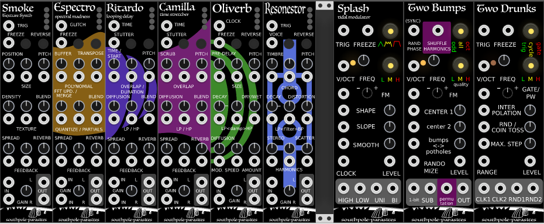

# southpole-vcvrack

Southpole Parasites 0.6.0 - Modules for [VCV Rack](https://vcvrack.com/)

A personal collection of modules with faceplates I've always wanted for my workflow.

- This branch contains reskins of MI modules with alternative firmware (check the main branch for all other modules), based on:

- [Mutable Instruments](https://mutable-instruments.net/)
- [Audible Instruments](https://github.com/VCVRack/AudibleInstruments/)
- [ArableInstruments](https://github.com/adbrant/ArableInstruments/)
- [Aepelzens Parasites](https://github.com/Aepelzen/AepelzensParasites)

- Slug is "Southpole Parasites" for parasites firmware based modules

## Building

Compile Rack SDK from source, following the instructions at https://github.com/VCVRack/Rack.

After checking out in the `plugins/` directory, get external dependencies with

	git submodule update --init --recursive

There is a build script

	./scripts/make_all.sh

WARNING: Overwrites existing Southpole-parasites directories from eg. a regular download, inspect script before use		

## Modules copied from Audible Instruments / Arable Instruments / Aepelzens Parasites
  
### Splash - Tidal Modulator

- [Tides Parasites](https://mqtthiqs.github.io/parasites/tides.html) Two Bumps, Two Drunks

### Smoke - Texture Synthesizer

Based on [Clouds](https://mutable-instruments.net/modules/clouds), [Manual](https://mutable-instruments.net/modules/clouds/manual/)

- Smoke, extra skins for additional modes: Espectro, Ritardo, Camilla
- [Clouds Parasites](https://mqtthiqs.github.io/parasites/clouds.html) Oliver, Resonestor

