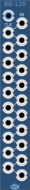

# Bucket Brigade Sample and Hold
### [Part of the Digital Suite](DS.md)
#### BB-120 20-Stage Bucket Brigade Sample and Hold

## Basic Operation

The BB-120 provides a 20-stage bucket brigade of sample and hold latches. On the rising edge of each clock pulse the input signal is sampled and output to the first output port; the output will remain at this level until the next clock puls. At the same time, the previous level at the first output port is transferred to the second output port, the previous value at the second port is transferred to the third, etc. The BB-120 is designed to take a digital clock, but it will happily accept analog signals. 

## Signal Range

The voltage range of the digital gates can be configured from the context menu. The device will output at the full range of the configured settings. The inputs will measure a logical high signal anywhere above the midpoint of the configured range.

## Normalling

If the clock input is not connected, the BB-120 will sample and shift outputs once per engine sample. This is useful for delaying signals by just a few samples to compensate for propagation delays in other parts of your patch, for example to ensure that the start of a signal passes through a gate, you can delay the signal by one or two samples while the gate cv gets to where it needs to be. Note that with no clock input connected, the BB-120 will operate faster at faster engine sample rates; this is by design.

The Initialize context menu option will empty all the buckets in the BB-120. Each bucket will revert to 0v.

The Randomize context menu option will randomly set the value of every bucket in the BB-120. The value will lie within the range of the expected voltage range set on the context menu.
