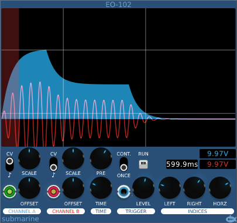

# Envelope Oscilloscope
#### EO-102 2-Channel Envelope Oscilloscope

## Basic Operation

The envelope oscilloscope takes up to 2 input signals which it will trace out on the scope screen. It is optimised for displaying envelopes.
Each of the two channels has a control for the scaling of the trace on the screen, and the vertical offset. Each channel also has
a switch to indicate whether the input is an envelope CV or an audio signal.

CV inputs are displayed using a single line. Audio inputs are rectified and displayed using a solid shape. In addition, the rectified audio signal displayed is the maximum signal value across a small window of samples, showing the peak signal at each point.

## Trigger

By default the first input channel (Channel A) is used as a trigger to synchronise the scope display. An external trigger input is also provided and this signal (which is not displayed on the screen) will be used to synchronise the display if anything is connected to it.

The trigger operates on a rising edge, and the trigger point can be adjusted using the LEVEL knob.

A small blue led between the external trigger input and the LEVEL knob will flash every time the scope is triggered. If it is not flashing, this is either because the signal is not rising past the appropriate LEVEL, or the RUN button is turned off.

## One-shot Tracing

In normal operation, the analyser traces continuously. If you wish to stop the trace and leave the last traced signal displayed on the screen, press the RUN button so that the light is extinguished. In addition, the CONT/ONCE switch allows it to be put into a one-shot mode, which will make one sweep and then hold the display. To use one-shot mode, set the CONT/ONCE switch to 'ONCE'. 
and press the RUN button. The RUN button will illuminate and the analyser will wait until the next trigger event. When it receives an appropriate edge on the selected trigger input, it will record one trace, the RUN button led will extinguish
and the display will not change again.

To make another trace, press the RUN button again and wait for the next trigger edge.

To return to continuous operation set the CONT/ONCE switch to 'CONT'

## Time

The TIME knob will adjust the time resolution of the scope, showing a longer or shorter period of time in a single sweep.

## Indices

There are two vertical indices provided, these are displayed as vertical white lines on the scope display. They can be adjusted using the L and R INDEX knobs. The time span between the two indices is displayed above the INDEX knobs in the white display. 

There is a single horizontal index provided. This is displayed as a horizontal white line on the scope display. It can be adjusted using the HORZ INDEX knob. The voltage at the index level is displayed in the blue and red displays above the HORZ INDEX knob. 

Alternatively using both indices and the time span display will allow you to measure the length of a pulse or event in a trace,  Or by setting the indices to a known time span, you can adjust other devices in your rack until a signal is of the desired duration.

## Pre-trigger Buffer

The PRE. knob controls the display of the content of the pre-trigger buffer. This 100-sample buffer is constantly filled by the scope and is available to display the up to 100 samples prior to the trigger point. By adjusting the PRE. knob you can adjust how much of this buffer is displayed. The trigger point is indicated by a vertical red line on the display.
