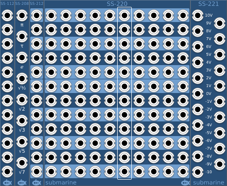

# Sources and Sinks - Lightweight voltage sources 
#### SS-112 - 12 Voltage Sinks
#### SS-208 - 8 Irrational Voltage Sources
#### SS-212 - 12 Chromatic Voltage Sources
#### SS-220 - 120 Chromatic Voltage Sources
#### SS-221 - 21 Voltage Sources

## Basic Operation

The SS-xxx range of modules provide lightweight voltage sources and sinks. In each case designed to use as little processing power as possible to do the job.

The SS-112 provides 12 input sockets which do absolutely nothing. The device is designed to use a minimum of processing power to provide you with somewhere to connect any device which requires an output to be connected for it to behave as you wish.

The SS-208 provides 8 fixed voltage outputs; each with a different commonly occuring irrational value. The values provided are PI, TAU, e, Square Root of One Half, Square Root of Two, Square Root of Three, Square Root of Five and Square Root of Seven. 

The SS-212 provides 12 fixed voltages in 1/12 volt increments, suitable for use as a chromatic scale input to devices which respect the 1V/oct standard. The context menu allows you to select the octave which is output.

The SS-220 provides 120 fixed voltages in 1/12 volt increments. The voltages range from -5V to +4.92V suitable for use as 10 octaves of chromatic scale input to devices which respect the 1V/oct standard.

The SS-221 provides 21 fixed voltages in 1 volt increments, ranging from -10V to +10V.

These outputs are useful not only as Pitch CV for oscillators, but also to select specific voltage values for any CV input.
