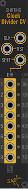

# SynthKit

            

A series of modules for VCVRack.  This are meant to be basic building blocks
of synthesis, that will help you create bigger and more complicated
synthesizers.

Full documentation is [available](docs/README.md).

## Building

Building requires [SynthDevKit](https://github.com/JerrySievert/SynthDevKit),
which will be checked out as part of the build initialization.

```
$ git clone https://github.com/JerrySievert/SynthKit
$ cd SynthKit
$ git submodule init
$ git submodule update
$ make
```

Special thanks to @jonheal (Jon Heal), who designed and provided the look and
feel of SynthKit.  His hard work is what made this a cohesive set of useful
modules.
