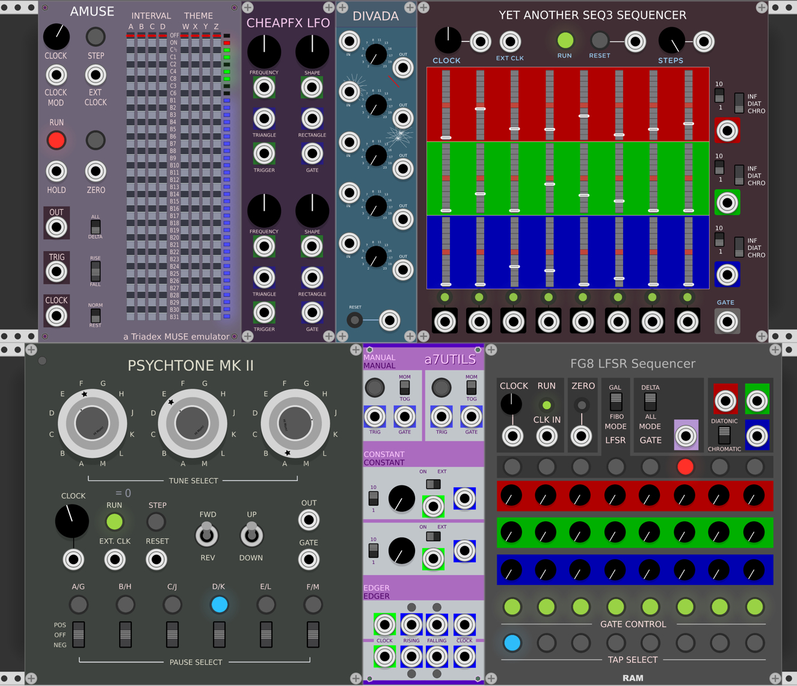

# LFSR
## Linear Feedback Shift Register sequencers
**served with a few hors-d'ouevres.**  

These are modules for [VCV Rack](https://vcvrack.com/). I present them for your enjoyment and exploitation, musically or however. As with all synthesizer modules, experimentation will unlock whatever potential lurks.  

All the source code is here. You are welcome to use it, but be warned I am neither a C++ programmer nor a musician. *It may not be the best place to start for making your own progress or answering questions*. But I do encourage you to dare ascend the learning curve laid out on VCV Rack's github site. I am quite surprised at how rapidly all this makes a certain level of incompetence in module-making possible. Hats off to Rack. It's all there if you look hard enough.

  
**Now playing:**  
FG8, an 8 bit LFSR-based sequencer  
PSYCHTONE Mk II, an emulation of the 1970s "Music Composer-Synthesier"  
AMUSE, a Triadex MUSE emulator 

**The hors-d'ouevres:**  
a7UTILS - some hand-control and clock helpers  
DIVADA - ridiculous clock divider  
CHEAP F/X - tool for exlporing cheap sound effects  
YASeq3 - my take on the Fundamental SEQ-3  

**Planned:**  

FG16 a 16 bit LFSR sequencer  
S357 counting/LFSR sequencer  

## FG8

This is an 8 stage linear feedback shift register sequencer. See [Wikipedia](https://en.wikipedia.org/wiki/Linear-feedback\_shift\_register) for the math.

The output channels are weighted sums. Any column of the shift register that is ON adds the knob value to the row output.

The tap select buttons (blue at bottom) choose the feedback bits. The gate is active if the gate select button is on (green) and the shift register bit is high in a given column.  

The LFSR MODE switch selects from two kinds of LFSR feedback methods. Again, wikipedia and google are your friends. While both Fibo(nacci) and Gal(ois) configurations produce the same bit stream falling off the end, the state of the shift register whilst doing is different.

The GATE MODE switch allows suppression of output changes if there is no gate generated. 

Disclaimer: I found this quote "LFSRs aren't so musically interesting that we're writing them up, but they are still cool." I'm slowly coming to agree with this, but… :-)

I made this by shamelessly hacking up SEQ-3 from the Fundamental group of plugins. I changed the sequencing logic, which essentially shifts a '1' bit along N stages, to instead make the calculation of an LFSR. I changed the knobs to "snap" type to lock in a chromatic/diatonic switching effect - you could leave that off for wildness, I suppose. My ear isn't good enough/I don't have the patience to dial in exact frequencies.

 It isn't that interesting in the end, but a trio made with three VCOs can get a bit entertaining. I recommend trying out Michael Hetrick's ASR sequencer also.

## Psychtone

This is a re-creation of Don Lancaster's 1971 kit "Music Composer-Synthesizer", or the note selection part of it anyway. I'm still ironing out some details but it is usable at this stage and a bit of play can end up with some nice results. Be sure to turn up the "weight" mini-pots that are concentric with the "tune select" knobs. The shift register bits can be set/cleared by clicking on the LEDs like the FG8. I'm sure I don't hear the distinction between forward, reverse, up and down, but the toggle switches select from four different fixed feedback arrangements, all maximal (63 steps).

## AMUSE

This is an virtual Triadex MUSE, that breakthrough composer/synthesizer of the 1970s. Google it. The addition of a counting section with factors of 2 and 3 to a straight-ahead LFSR makes the MUSE very capable of creating pleasant music. I found it a bit tricky to get going, but worth figuring out. Compositions are documented and shared by listing the postions of the 8 40-position slide switches. Here are a few "patches" that serve as a starting point. Read the patch as the settings of the sliders from left to right.

Wire OUT to the V/OCT input of a VCO. Set the trigger select switches to ALL-FALL-NORM.  Hit the RESET lamp/button after you change the sliders to start a sequence from scratch. Use the RUN lamp/button to make sure it is going, or if not running the STEP lamp/button will advance the tune and you can see exactly what's going on, er, step by step.

Simple scale: **C1 C2 C4 OFF&nbsp; &nbsp; &nbsp;OFF OFF OFF OFF**. This just shows the counting nature. 'A' shifts by one note, 'B' by two, 'C' by four. Hook these to a binary counter C1/C2/C4 and you have a scale.  

Two octave scale:  **C1 C2 C4 C8&nbsp; &nbsp; &nbsp;OFF OFF OFF OFF**. Adding 'D' (which shifts by 8, or one octave, when active) gives a two octave counting scale. Observe that the middle tone is repeated - MUSE counts 0-7, so there are two codes for the middle note.  

Staying within the counting section, move the INTERVAL sliders around and see what you come up with. Note the C1/2 counting bit, it is unusual in that it toggles on both edges of the clock to give a higher-speed modulation to the tune.  

Now the LFSR part: set up  **C1 B6 B8 C8&nbsp; &nbsp; &nbsp;B14 B15 C4 OFF** and hit ZERO. Now you hear a mix of counting logic and pseudo-random steps. The LFSR is controlled by tapping the counting chain and a 31-bit shift register. It is possible to configure themes that take millions of steps to repeat, while the counting section defines a local character.  

This emulator was reverse engineered after some amount of googling, using three other emulators I found doing, watching youtube videos and decrypting plausible block diagrams and schematics. I am not sure this re-creates precisely what a real instrument would produce. Anyone who has one is free to send it to me and I will endeavour to correct any flaws I observe. 

## COMING SOON, or later:

These are really just warm-up exercises. I will expand the FG8 to the obvious FG24, folding in ideas and improvements that I hope aren't all mine. The Triadex counter section concept is leading me to explore a sequencer with an expanded counting area using prime numbers, wait for the S357 sequencer without holding your breath.

***those hors-d'ouevres I mentioned:***   
In the process of figuring out how to make the three LFSR modules, I had to do quite a bit of experimentation. Once in a while these experiments led to little tools that I found useful, perhaps you will too. Other times I needed something I thought would be quicker to code up for myself than to find. I did learn that I am very bad at estimating how long it takes me to create even a simple tool. But I like programming better than googling and testing downloads of other people's stuff! Spend the time where you derive joy, while you are alive. Often I did find good source code, gotta love open source and the generosity of this community, but to fully understand something I need to make it my own in some way. For example, my take on the SEQ-3 evolved from getting it to compile and play nice with Rack unaltered all the way to what I offer here.

## DIVADA
### Self explanatory…
I kept looking at clock dividers and it seemed like it could be easier. So I tried. That may mean this divider is deficient in some way not apparent to my ears. I am exploring the use of prime numbers in generative patches, hence the odd stepped choices of division ratio. There is no normalizing, but nothing would keep a person from feeding an out to another in for mutiple divisions.

## a7UTILS
### Manual clock and voltage control, clock edge detector and inverter.
In working up my own modules and playing with others, I kept needing a simple push button level/trigger, a source of constant, hand-adjustable CVs, and inverted clock signals and triggers on rising and falling edges. These can all be done w/o "yet another" module, of course, but I wanted these and only these functions along with knowing exactly what was happening. These three are very simple code once you get a space cleared. As usual, it all starts with Template and reverse engineering real programmer's code. 

## CHEAPFX
### Toy sound effects controller
I overheard a guy in a bar say "An astonishing variety of sound effects can be generated from a simple model: switch between two audio frequency square waves with a low frequency square wave or positive- or negative-going 
sawtooth."  
   
True that! After messing around with the two audio frequencies and the switching waveform and rate I had to make this module, which helps by: Fade-switching to eliminate clicks, syncrhonizing the low-frequency control waveform to a start trigger and holding the effect until the finish of the low-frequency waveform.  
 
If you want it continuously, just wire up the trigger to a constant. Otherwise, re-triggering during a cycle will give you another cycle. The FREQUENCY knob and CV control the switch rate. The SHAPE knob and CV control the TRIANGLE  output, moving from +sawtooth to triangle to -sawtooth. Also the RECTANGLE wave output duty cycle. Plug either output to a VCO FM input to control the depth. You'll hear lotsa things from ambulances to phasers to telephone ringers. Experiment!

## YASeq-3
Okay, I know. But it is a right (or would that be rite) of passage. After Template, SEQ-3 from the Fundamental group of modules is a wealth of how-to information. Once you get this, it is hard not to make ones own. I've changed pots to sliders for a graphic effect, and I added a built-in quantizer for chromatic and diatonic scale output. In INF mode, it's basically the SEQ-3 sequencer. I added a scale switch to tame the range of the sliders. I highly recommend that you make a SEQ-3 variant of your own that does just what you want if no one else has! I hacked quite a few things and I reiterate that it may not be the best way to see how things are done - I am totally faking it here and proceeding mostly by pattern matching and eliminating compile-time errors one by one until I get something flying. You can do better.  

**You are welcome and thanks in advance:**  

If you get anywhere with these modules and find errors or missing features I would be very happy to hear how I might fix or improve this modest offering.  

**alto777**

