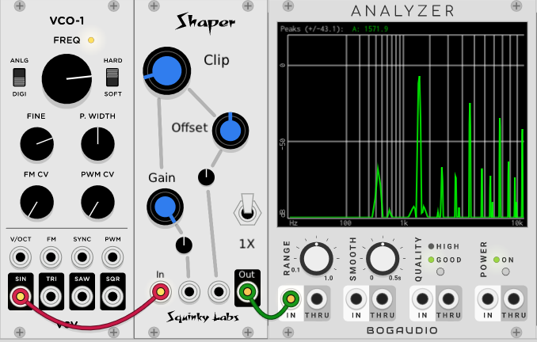
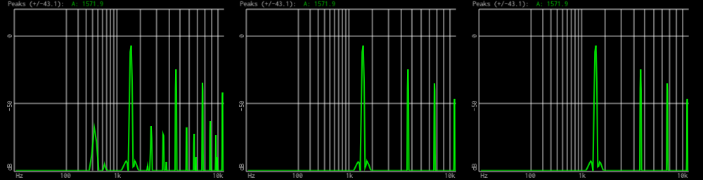

# Some information about aliasing

We’ve been thinking about aliasing a lot lately. It has been a major issue in many of our recent projects. With Fundamental VCO-1 we wanted to be sure that after we re-designed the anti-alias filters to use less CPU that the aliasing was still good. So we spent a lot of time writing unit tests to compare the two.

With EV3, we wanted to add sync to the VCO without adding aliasing. It took us way longer than it should have to figure out exactly how to do that. Then with Shaper it was clear that it would generate a lot of aliasing if we didn’t oversample it. So we borrowed the oversampler from Fundamental VCO-1.

Aliasing in digital audio happens when an algorithm attempts to create frequencies that are impossible to represent. You probably know that the highest frequency that can be contained in a digital signal is one-half the sampling rate. So at the standard 44,100 sample rate, the highest frequency that can be encoded is 22,050 Hz.

If a DSP algorithm, like a VCV module, attempts to generate frequencies higher than than this, they will appear at a frequency below 22,050. In fact they will “fold back” - increasing frequencies alias and manifest themselves as decreasing frequencies below fs/2.

Most people find that aliasing sounds terrible. Unlike harmonic distortion, which occurs at harmonic multiples of the pitch, the alias frequencies are not related to the non-aliased frequencies in a harmonious way. As an extreme example: if you play a high-pitched note and bend it up, the alias frequencies will bend in the opposite direction, so you hear you main signal bending up in pitch, with some “ghost tones” bending down in pitch.

For more information on aliasing, especially how it sounds, there is a wealth of information on the internet. Spoiler alert: most people think if sounds bad and most commercial digital audio equipment goes to some lengths to suppress it.

Now if you are new to this, and paying attention, you might be perplexed by the statement above that aliasing happens when a DSP algorithm attempts to generate sounds above 22,050. Why would any algorithm try to do this? Well, a simple example is a square wave. An analog square wave has an infinite number of harmonics going up to infinite frequencies (look it up if you don’t believe us). So a naive attempt to make a square wave VCO is going to generate a ton of aliasing. Similarly, a distortion or waveshaper module that does hard clipping will tend to create square waves and a lot of aliasing.

Luckily for VCV Rack users it is easy to see if a particular module is aliasing. Pick a spectrum analyzer module. Our favorite is the Bogaudio one. To examine a VCO, just patch the VCO output to the analyzer’s input. To examine a waveshaper, patch a sine wave from a VCO into the input of the shaper, then patch the output of the shaper to the spectrum analyzer.

Aliasing is far more severe at high frequencies, so set the VCO for somewhere between 1 kHz and 2kHz. At lower frequencies it might not be visible (or audible). If you set it at an exact division of the sampling rate the aliasing will blend in with the harmonics and you won’t see it. 1k and 2k are very close to exact divisions of 44,100, so pick something in between. Then adjust the VCO frequency up and down until you see the worst aliasing. You may see new frequency lines appear in between real harmonics. Or you may see that as you raise the pitch some of the lines go down - those are the alias frequencies folding over.

This excellent video by the author of the Vult modules shows how to do it: [Can you hear the alias?](https://www.youtube.com/watch?v=LSIO5R0fuoU&feature=youtu.be&fbclid=IwAR1_wsaqiuLiYNO7Tn0c5smP3mLnwxgYJmD8MXcn7eNuhlb6To_XwzR3Kzc)

As an example we will show the effect of changing the oversample rate in our “Shaper” module using the “Clip” setting. The gain is up pretty high.

This image shows the output of Shaper on the spectrum analyzer at 1X (left), 4X, and 16X (on the right). You can easily see the alising in the 1X image. At this setting there is no visible difference between 4X and 16X. No doubt there would be if the analyzer were more sensitive, but it’s worth noting here that at 1X the alias components are getting pretty high compared to the harmonics in the 10k region. But down in the 1-2k  area the alias is below the fundamental by a bit more than 50 db. Also notice that there are alias components below the fundamental frequency.

This next image is the same test, but with the “Folder” setting. Again, the gain is pretty high, and there is some offset to bring in even harmonics.

Not surprisingly, this highly folded sine wave shows a **lot** of aliasing at 1X. Notice the line at 2 kHz - that’s an alias component that is louder than the fundamental. And now you can see many more alias components below the fundamental.

Moving right to the 4X image, clearly most of the aliasing is gone. But there are still alias components adjacent to the harmonics, and they are only perhaps 25 db down from the good signal. Then in the 16X image things are as they should be. The lines are all at even multiples of 1.5 k, so they are harmonics, not aliasing. Note that the level of the harmonics is not falling off at all with increasing frequency. That is why this shape brings out so much aliasing.

We hope you have learned how easy it is to evaluate the aliasing of a VCV module. Next time you are experimenting with a new module, why not take a look at the aliasing? Make your own opinion about aliasing. Your are fortunate to have the tools already.
