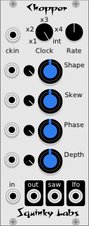

# Chopper tremolo / programmable LFO 

In its simplest use, Chopper produces a very wide range of **tremolo** effects. The built-in LFO can produce a wide range of waveforms that cover many of the waveforms produced by the tremolo circuits built into **vintage guitar amplifiers**.

The LFO is sent to an output so that it may modulate other modules.

There is also a **clock synchronizer** and multiplier.

To use Chopper as a tremolo, send a signal to the *in* jack, and listen to the *out* jack. Leave the *clock* control at the default *int* setting. Most of the knob settings will now affect the tremolo effect.

## Chopper LFO

To understand all the LFO settings, it helps to watch the outputs on a scope.

The LFO starts as **skewed** sawtooth. In the middle position it is a symmetric triangle wave, at one end a positive sawtooth and at the other a negative sawtooth. The signal is sent to the **saw** output.

The skewed saw then goes to a **waveshaper**. As the shape control is increased the LFO is gradually rounded and then flattened. The shaped LFO is send to the *lfo* output, and used internally to modulate the audio input.

LFO Controls:

* **Shape** Flattens the LFO waveform.
* **Skew** Dials in the amount of asymmetry in the LFO.
* **Depth** Shifts and scales the LFO.

When used as a tremolo effect, you will hear **more tremolo** when these controls are turned up.

## Chopper clock

The LFO in Chopper may be synchronized with the ckin signal. There is a built-in **clock multiplier**. To use the synchronization, patch a clock to the ckin, and select x1 from the **clock** knob. To run at a multiple of the input clock, select x2, x3, or x4.

When Chopper is being synched, the **Phase** control sets the phase difference between the external clock and the synchronized LFO. This may be used to "dial in" the tremolo so that it sounds exactly on the beat (or off the beat).

There is also an internal LFO that is controlled by the **Rate** control. Set the clock control to *int* to use the internal clock.
