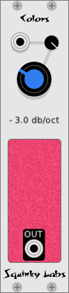

# Colors variable slope noise generator

Colors is a colored noise generator. It can generate all the common **"colors"** of noise, including white, pink, red, blue, and violet. It can also produce all the colors in between, as it has a **continuously variable slope**.

Colors has a single control, "slope." This is the slope of the noise spectrum, from -8 dB/octave to +8 dB/octave.

The slope of the noise is quite accurate in the mid-band, but at the extremes we flatten the slope to keep from boosting super-low frequencies too much, and to avoid putting out enormous amounts of highs. So the slope is flat below 40hz, and above 6kHz.
