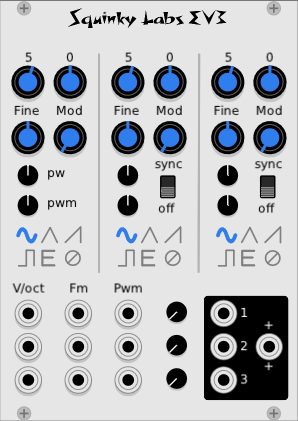
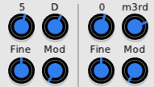

# EV3 triple VCO

## About EV3

EV3 is made from the sound generating part of Befaco’s EvenVCO, replicated three times. We added sync, which was never implemented in the EvenVCO. Then we did our usual overhaul to reduce CPU usage.

The result is a module containing three VCOs that together use about the same amount of CPU as a single instance of EvenVCO.

While the waveform generation and alias suppression is lifted directly from EvenVCO, the control selection and response of EV3 is our own design. The three VCOs are easiest to use together, but they may be used completely independently.

EvenVCO remains an excellent choice for a VCO, but there are definitely some cases where you might choose EV3 instead:

* It is very easy to make giant stacked oscillator patches, like we did in the old days.

* One EV3  uses less panel space and CPU than three separate instances of EvenVCO.

* The sync feature is a welcome addition.

* The semitone pitch offset can inspire patches and harmonies that you might not find with the standard controls on most VCOs.

* It is easy to patch up chords with EV3.

That said, EV3 only offers one waveform output at a time per VCO, whereas EvenVCO makes them all available at the same time.

 ## Using EV3

The Initial pitch is controlled by a stepped octave control, a stepped semitone control, and a fine tune. The octave and semitone are displayed as an octave number and either a named pitch or a musical interval (more on that later).

VCO 2 and 3 have an option for hard sync. The sync input is always the saw output of VCO 1.

There are independent outputs for each VCO, as well as a 3-to-1 mixer driving a mixed output.

The CV connections are a bit unusual. If you patch one of the top inputs (VCO 1 inputs) it will drive all three. Each VCO will pick up its input from the first patched input. So, for example, VCO 2 will get its input from the second row, but if nothing is patched to this input it will pick up input from the first row (VCO 1).

This applies to all the CV inputs: Pitch (Volts/Octave), PWM, and FM.

This patch "normalization" makes for much less patching when stacking two or three VCO sections in a single voice.

## Pitch display

When a VCO has a signal patched to its V/Oct input, it will always display pitch as octave and named pitch, like "4 A" for the note A in the fourth octave.

If the VCO does not have a patch cable connected to its V/Oct, then it will use the previously patch VC input, and will display its pitch as a diatonic interval offset from the patched VCO.

For example:

In this illustration VCO-1 is patched to a CV, so it displays absolute pitch. It's tuned up two semitones to D, at the default octave (5).

VCO-2 is has no patch to its V/Oct input, so it will track VCO-1. It is set up five semitones from the default C, so it is tuned to F. Since VCO-2 is tracking VCO-1, its pitch is displayed relative to VCO-1. Since VCO-1 is tuned to 5:D, and VCO-2 is tuned to 5:F, VCO-1 displays 0:m3rd, since 5:F is a minor third higher than 5:D.

Notes are always "spelled" with sharps, so the semitone between C and D is displayed as C#, never D flat.

When displaying intervals, EV3 also has some fixed spellings:

* One semitone up is called minor second, although some would call it a flat second.
* Six semitones up is called Diminished fifth, although it could be called an augmented fourth or a tritone.
* No transposition is displayed as zero, although it would be more correct to call it P1, or perhaps unison.

## The controls in depth

The octave knob is at the top left. It is unlabeled, but does have the octave number displayed on top of it. It has a 10 octave range, just like EvenVCO.

The semitone knob just to the right will add or subtract up to 12 semitones.

The fine control transposes the VCO pitch up and down up to a semitone.

The mod knob controls the amount of pitch modulation applied to the Fm input CV. This is of course exponential pitch modulation, suitable for pitch bending and vibrato, but not so much for FM synthesis which works linear FM.

Below the blue knobs are two small black knobs to control the pulse width and pulse width modulation depth. These only have an effect when the square wave output is selected. Although they are only labeled on VCO1, they function just the same on VCO 2 and 3.

The switches below the knobs are radio buttons that select the waveform for each VCO. The waveforms are sine, triangle, saw-tooth, square, even, and off. The even waveform is what gave the original EvenVCO its name. It is an unusual waveform that has only even harmonics, and not odd ones (not counting the fundamental, which is there). Selecting “no waveform” can be useful when you are patching and want to hear each VCO by itself – like a mute button on a mixing console.

The CV inputs are at the bottom. The top row is for VCO1, the next for VCO2, and the last row is for VCO3.

V/Oct is where the main pitch CV is patched, and sets the overall pitch of the VCO. Fm is a less sensitive pitch input used to modulate the pitch. As noted above, the sensitivity of this input is controlled by the Mod knob. The last column of CV inputs is for pulse width modulation. This only has an effect when the square wave is selected. It works in conjunction with the PW and PWM knobs.

The output section has a column of three output level controls, one for each VCO. Then there are the three jack, one for each VCO output, and a mixed output.

Note that if all three VCOs were mixed at full volume, the output would go well beyond the 10-v p-p standard of VCV. So we normalize the volumes. If any one VCO is turned all the way up the output will be 10V. If more VCOs are mixed in, the output stays at 10V, but the relative volumes are preserved. If the total of all three is below 10V, then there is no normalization and the output will be less than 10.

When the normalization is in effect, the '+' (plus signs) on the panel turn green.

## More on VCO sync

Oscillator sync requires two VCOs. The master sets the pitch of the slave. Adjusting the pitch offset of the slave does not change its pitch, but it changes the timbre quite a lot.

In EV3, VCO 1 is always the master. Turning on the sync switch for VCO 3 will slave VCO 3 to VCO1.

All of then fun involves the relationship between the pitch settings of the master and the slave. Usually the slave needs to be set higher than the master. Often some changing CV is used to move the slave pitch offset to create dynamic timbres. ADSR is always a good modulation source, although anything can be used.

There is more information on sync below.

## Further information

Wikipedia article on VCO Sync: [Oscillator sync](https://en.wikipedia.org/wiki/Oscillator_sync)

Here is a nice video on VCO sync. While it is not for VCV, the principles are the same: [Roland SE-02 - Hard Sync Lead Tutorial](https://www.youtube.com/watch?v=l1lqAcZg2sY)

We have an informational article that talks more about aliasing. It shows you how to compare different modules using a spectrum analyzer. [Aliasing Story](./aliasing.md).

If you would like some information on how we reduced the CPU usage of EvenVCO, you can [find it here](../docs/vco-optimization.md).