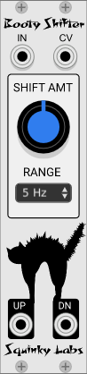

# Booty Shifter frequency shifter 

**Booty Shifter** is a frequency shifter inspired by the Moog/Bode frequency shifter module.

The name "Booty Shifter" is a nod to the classic analog module, as well as to a black cat named Booty.

Booty Shifter  will take an audio input and shift the frequencies up or down. This is not like a pitch shift where harmonics will remain in tune; it is an absolute frequency shift in Hz, so in general **harmonics will go way out of tune.** It is similar to a ring-modulator, but less extreme and more versatile.

When the original module was released long ago it cost around $1000. More recent Eurorack frequency shifters are still very expensive, because the frequency shifter requires a large number of components, and must be carefully calibrated.

## Getting good sounds from Booty Shifter

Feed in music and shift the frequency a good amount.

Feed in **speech or radio** and shift it.

Feed the CV from a **sequencer** to sequence the mayhem.

Shift **drums** up or down a little bit to re-tune them without the usual pitch-shifting artifacts.

Small shifts in conjunction with delays can make a chorus-like effect to thicken music.

## Inputs and outputs

* **IN** is the audio input.
* **CV** is the pitch shift control voltage. -5V will give minimum shift, +5 will give maximum.
* **DN** is the down-shifted output.
* **UP** is the up-shifted output.

## Controls

**RANGE** sets the total shift range in Hz. For example, the 50 Hz setting means that the minimum shift is 50 Hz down, and the maximum is 50 Hz up.

Range value **Exp is different**. Here minimum shift is 2 Hz, maximum is 2 kHz, with an exponential response of one volt per octave.

Shift **AMT** is added to the control voltage, with a range of -5..5.

## Oddities and limitations

If you shift the frequency up too far, it will alias. There is no anti-aliasing, so if the highest input frequency + shift amount > sample_rate / 2, you will get aliasing. Of course the Bode analog original did not alias.

If you shift the input down a lot, frequencies will go **below zero and wrap around**. Taken far enough this will completely **reverse the spectrum** of the input. This was a prized feature of the Bode original.

As you shift the input down, you may start to generate a lot of subsonic energy. A **High Pass filter** may clean this up.

The down shift **frequency fold-over**, while true to the original, does cause problems when trying to pitch drum tracks down a lot. High pass filtering the input before it is down-shifted can control this.

## More information

Here is a video by Dave Phillips using Booty Shifter to process FM radio: [Topographical Radio](https://www.youtube.com/watch?v=bDmFuiaf_YQ)

Here is a video by Artem Leonov with some unusual uses of Booty Shifter: [Using Frequency Shifter in Modular Synth [Booty Shifter in VCV Rack]](https://www.youtube.com/watch?v=F1SPYgkXkfg)

Here is a real Moog frequency shifter processing a drum loop: 
[Moog 1630 Bode Frequency Shifter test](https://www.youtube.com/watch?v=12wCo0GeApg)
